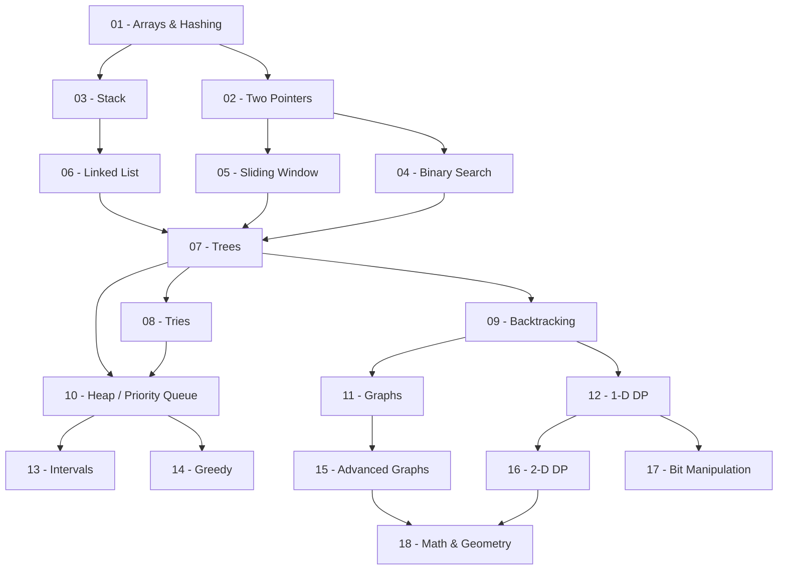

# 📚 LeetCode DSA Roadmap - Java Clean Code

## Tổng quan

Bộ tài liệu này hướng dẫn luyện tập **Data Structures & Algorithms** theo lộ trình NeetCode, viết bằng Java theo chuẩn **clean code** của LeetCode.

## 🗺️ Roadmap



## 📁 Cấu trúc thư mục

| # | Chủ đề | Thư mục | Số bài |
|---|--------|---------|--------|
| 01 | Arrays & Hashing | `01-arrays-hashing/` | 3 |
| 02 | Two Pointers | `02-two-pointers/` | 3 |
| 03 | Stack | `03-stack/` | 3 |
| 04 | Binary Search | `04-binary-search/` | 3 |
| 05 | Sliding Window | `05-sliding-window/` | 3 |
| 06 | Linked List | `06-linked-list/` | 3 |
| 07 | Trees | `07-trees/` | 3 |
| 08 | Tries | `08-tries/` | 2 |
| 09 | Backtracking | `09-backtracking/` | 3 |
| 10 | Heap / Priority Queue | `10-heap-priority-queue/` | 3 |
| 11 | Graphs | `11-graphs/` | 3 |
| 12 | 1-D DP | `12-one-d-dp/` | 3 |
| 13 | Intervals | `13-intervals/` | 3 |
| 14 | Greedy | `14-greedy/` | 3 |
| 15 | Advanced Graphs | `15-advanced-graphs/` | 3 |
| 16 | 2-D DP | `16-two-d-dp/` | 3 |
| 17 | Bit Manipulation | `17-bit-manipulation/` | 3 |
| 18 | Math & Geometry | `18-math-geometry/` | 3 |

## 🎯 Cách sử dụng

1. **Đọc `theory.md`** của mỗi topic trước để nắm vững lý thuyết và các pattern cốt lõi của chủ đề.
2. **Đọc `solutions_explained.md`** để xem phân tích chi tiết, thuật toán tối ưu, Dry Run và code Java mẫu cho từng bài toán cụ thể thuộc chủ đề đó.
3. **Tự giải bài** trên LeetCode để tự rèn luyện kỹ năng code thực tế.
4. **Tham khảo `Solutions.java`** để so sánh cách cài đặt, đối chiếu với code chuẩn clean code của LeetCode.
5. **Học theo thứ tự** từ topic 01 → 18 theo roadmap để xây dựng nền tảng vững chắc.

## 📐 Chuẩn Clean Code LeetCode

```java
// ✅ Chuẩn LeetCode: class Solution + method signature rõ ràng
class Solution {
    // Tên method mô tả rõ mục đích
    // Comment giải thích approach
    // Time: O(n), Space: O(1)
    public int[] twoSum(int[] nums, int target) {
        Map<Integer, Integer> map = new HashMap<>();
        for (int i = 0; i < nums.length; i++) {
            int complement = target - nums[i];
            if (map.containsKey(complement)) {
                return new int[]{map.get(complement), i};
            }
            map.put(nums[i], i);
        }
        return new int[]{};
    }
}
```

### Quy tắc:
- Mỗi bài là 1 `class Solution` riêng biệt
- Method signature khớp với LeetCode
- Comment: approach + complexity bằng tiếng Việt
- Biến đặt tên có nghĩa, không viết tắt mập mờ
- Ưu tiên giải pháp tối ưu nhất
