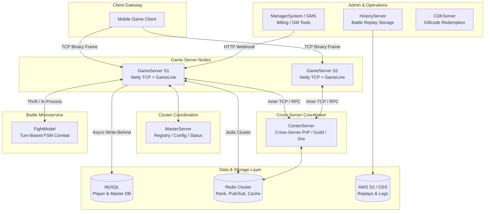
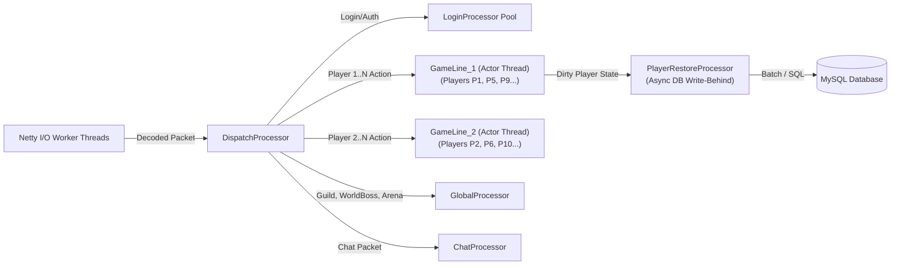
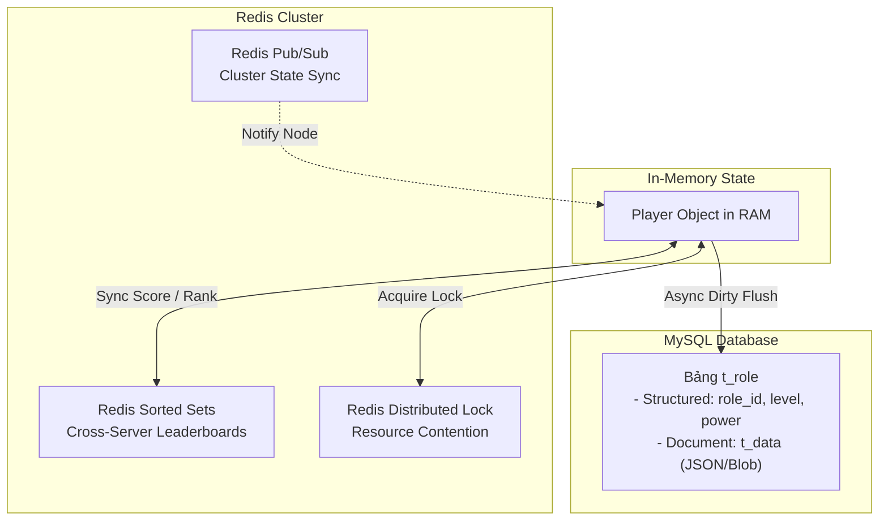

# 🎮 TÀI LIỆU REVIEW KIẾN TRÚC HỆ THỐNG G29 GAME SERVER & CẨM NANG PHỎNG VẤN BACKEND

> **Dự án:** G29 Distributed Game Server Cluster (MMO / Turn-Based RPG / Real-time PvP)  
> **Tech Stack:** Java Core, Netty 4.1, Custom Binary Protocol (PTC), MySQL + MyBatis, Redis Cluster, Apache Thrift / gRPC, AWS S3, Asynchronous Event-Driven Architecture.

---

## 📑 MỤC LỤC
1. [Tổng Quan Kiến Trúc Hệ Thống (System Architecture)](#1-tổng-quan-kiến-trúc-hệ-thống-system-architecture)
2. [Mô Hình Đa Luồng & Concurrency (Actor / GameLine Model)](#2-mô-hình-đa-luồng--concurrency-actor--gameline-model)
3. [Giao Tiếp Mạng & Giao Thức (Netty, PTC, Binary Stream, RPC)](#3-giao-tiếp-mạng--giao-thức-netty-ptc-binary-stream-rpc)
4. [Kiến Trúc Dữ Liệu & Lưu Trữ (MySQL + Redis Cluster)](#4-kiến-trúc-dữ-liệu--lưu-trữ-mysql--redis-cluster)
5. [Combat Engine & Tính Tất Định (FightModel & Deterministic Replay)](#5-combat-engine--tính-tất-định-fightmodel--deterministic-replay)
6. [Hệ Thống Mở Rộng: Dynamic Script Hot-Reloading & Object Pooling](#6-hệ-thống-mở-rộng-dynamic-script-hot-reloading--object-pooling)
7. [Đề Xuất Hiện Đại Hóa Hệ Thống (Modernization Roadmap)](#7-đề-xuất-hiện-đại-hóa-hệ-thống-modernization-roadmap)
8. [Bộ Câu Hỏi Phỏng Vấn Thực Chiến Chuyên Sâu (Interview Q&A Cheatsheet)](#8-bộ-câu-hỏi-phỏng-vấn-thực-chiến-chuyên-sâu-interview-qa-cheatsheet)

---

## 1. TỔNG QUAN KIẾN TRÚC HỆ THỐNG (SYSTEM ARCHITECTURE)

Dự án là một cụm **Distributed Stateful Game Server Cluster** chịu tải cao, phục vụ hàng chục ngàn người chơi đồng thời (High CCU) với độ trễ thấp (< 50ms).



### Các Node và vai trò chức năng:
* **`GameServer`**: Node xử lý logic gameplay chính, quản lý kết nối TCP Socket qua Netty, chia luồng theo cơ chế **GameLine** cho từng người chơi.
* **`CenterServer`**: Node trung tâm điều phối các tính năng **liên server (Cross-Server)**: Đấu trường liên server (`CrossServerArena`), Tranh đoạt mỏ khoáng (`CrossServerMineral` / `SGrabOre`), Bang chiến (`GuildBattle`), Đấu trường vinh dự (`GloryArena`), Không gian hư vô (`VoidSpace`).
* **`MasterServer`**: Service Registry quản lý metadata cụm server, danh sách máy chủ, tình trạng tải, trạng thái mở/đóng/bảo trì và danh sách IP Whitelist.
* **`FightModel`**: Combat Simulation Engine tính toán chiến đấu theo lượt (Turn-based FSM). Có thể chạy in-process hoặc tách thành Microservice độc lập qua Thrift/gRPC RPC.
* **`Message`**: Module định nghĩa Protocol / PTC (Packet/Struct definitions), chịu trách nhiệm tuần tự hóa/giải tuần tự hóa nhị phân trực tiếp trên Netty `ByteBuf`.
* **`GameCore`**: Framework cốt lõi chứa Base Processor (Actor thread model), Netty Codecs, Redis Cluster Client, Timer Wheel, Dynamic Script Loader.
* **`ManagerSystem` / `GMS`**: Web Admin Dashboard quản lý vận hành, duyệt sự kiện, webhook xử lý nạp thẻ/thanh toán (Recharge callbacks), gửi lệnh GM (Game Master).
* **`CDKServer` / `HistoryServer` / `MergeGameServer`**: Các dịch vụ phụ trợ kích hoạt Giftcode, lưu trữ replay trận đấu dài hạn lên AWS S3, và công cụ gộp server.

---

## 2. MÔ HÌNH ĐA LUỒNG & CONCURRENCY (ACTOR / GAMELINE MODEL)

Trong Game Server thời gian thực, không thể dùng mô hình *Thread-per-Request* của Web thông thường vì sẽ gây ra lock contention, deadlock và giảm hiệu năng nghiêm trọng. Dự án sử dụng mô hình **Partitioned Single-Threaded Processing (Actor Pattern)**.



### Chi tiết các luồng xử lý:
1. **`GameLine` (Partitioned Actor Thread):**
   - Server khởi tạo một tập hợp các `GameLine` (`gameLineProcessor_0`, `gameLineProcessor_1`, ...). Mỗi GameLine là một Single-Thread Executor đi kèm một `LinkedBlockingQueue`.
   - Mỗi người chơi (`Player`) khi đăng nhập được gán cố định vào một `GameLine`.
   - **Lợi ích kiến trúc:** Toàn bộ logic cá nhân (Túi đồ, Pet, Nâng cấp trang bị, Phó bản, Nhiệm vụ) của một người chơi đều được đẩy vào cùng 1 GameLine thread. Do đó, **hoàn toàn không cần dùng lock/`synchronized`** trên dữ liệu cá nhân -> **Lock-Free Execution**, đạt throughput cực đại và không bao giờ gặp race condition.
2. **`GlobalProcessor`:**
   - Xử lý các nghiệp vụ mang tính chất chia sẻ dữ liệu giữa nhiều người chơi trong cùng một server: Bang hội (`Guild`), Đấu trường local (`Arena`), Boss thế giới (`WorldBoss`), Xếp hạng (`Rank`), Sự kiện toàn server (`SpecialActivity`).
3. **`DispatchProcessor`:**
   - Đóng vai trò Router phân phối gói tin từ tầng mạng Netty I/O sang đúng Processor đích dựa trên `FunctionId` của Message.
4. **`PlayerRestoreProcessor` (Async Write-Behind Persistence):**
   - Gameplay chạy hoàn toàn trên RAM (In-Memory State). Khi có thay đổi, dữ liệu người chơi được đánh dấu bẩn (Dirty Flag) và đẩy sang `PlayerRestoreProcessor` để lưu xuống MySQL bất đồng bộ. Luồng logic của người chơi không bao giờ bị nghẽn bởi Disk I/O.

---

## 3. GIAO TIẾP MẠNG & GIAO THỨC (NETTY, PTC, BINARY STREAM, RPC)

### 1. Netty Pipeline & Framing:
* Sử dụng **Netty 4.1.x** với mô hình I/O phi chặn (Non-blocking I/O).
* **Cấu trúc khung dữ liệu nhị phân (Binary Frame Protocol):**
  ```
  +------------------+------------------+------------------+------------------------+
  |  Length (4 Bytes)| MsgId (4 Bytes)  | Checksum (2 Bytes| Payload (Byte Stream)  |
  +------------------+------------------+------------------+------------------------+
  ```
* Bộ giải mã `ExternalTcpDecoder` và `ExternalTcpEncoder` đảm bảo phòng chống phân mảnh gói tin (TCP Fragmentation/Sticky Packets), xác thực Checksum và chống tấn công tràn bộ nhớ (Max Packet Size).

### 2. Custom Binary Protocol (PTC / `BinaryMessageStruct`):
* Mọi Message DTO đều kế thừa từ `BinaryMessageStruct`.
* **Cơ chế:** Đọc/ghi trực tiếp các kiểu nguyên thủy (`readInt`, `readLong`, `readUTF`, `writeBytes`) trên `ByteBuf` của Netty.
* **So sánh với JSON/Protobuf:**
  * So với JSON: Tiết kiệm **70 - 80%** băng thông mạng, tốc độ tuần tự hóa nhanh hơn **5 - 10 lần**, giảm thiểu việc tạo String object giúp hạn chế GC Pause.
  * Tương đương cơ chế Protobuf nhưng được tối ưu hóa riêng cho bộ nhớ đệm Zero-Copy của Netty.

### 3. Giao tiếp liên server & RPC:
* **Inner TCP:** Kênh TCP chuyên dụng giữa `GameServer` $\leftrightarrow$ `CenterServer` $\leftrightarrow$ `MasterServer` qua `InnerTcpDecoder`/`InnerTcpEncoder`.
* **Apache Thrift / gRPC:** Hỗ trợ gọi thủ tục từ xa (RPC) cho module tính toán chiến đấu (`FightService`) khi tách thành Microservice độc lập.

---

## 4. KIẾN TRÚC DỮ LIỆU & LƯU TRỮ (MYSQL + REDIS CLUSTER)



### 1. MySQL + MyBatis (Hybrid Relational-Document Schema):
* **Bảng `t_role`:**
  * **Structured Columns:** Lưu các trường phục vụ index/query như `t_role_id`, `t_user_id`, `t_name`, `t_level`, `t_fight_power`, `t_vip_level`.
  * **Document Column (`t_data` Text/BLOB/JSON):** Chứa toàn bộ trạng thái chi tiết của các sub-module (Túi đồ, Pet, Trang bị, Skill, Nhiệm vụ...).
  * **Ưu điểm thiết kế:** Khi update tính năng gameplay mới, **không cần chạy migration `ALTER TABLE`** trên các bảng hàng chục triệu bản ghi, loại bỏ rủi ro lock bảng và downtime.

### 2. Redis Cluster Integration:
* **Bảng xếp hạng Real-time (Leaderboards):** Sử dụng **Redis Sorted Sets (ZSET)** (`ZADD`, `ZREVRANGE`) để xếp hạng liên server (Chiến lực, Cấp độ, Đấu trường) với độ phức tạp thuật toán tối ưu $O(\log N)$.
* **Distributed Locking:** Sử dụng cơ chế khóa phân tán Redis để đồng bộ tranh chấp tài nguyên liên server (ví dụ: mỏ khoáng `GrabOre`, tránh 2 người chơi cùng chiếm một mỏ tại cùng 1 miligiây).
* **Redis Pub/Sub:** Broadcast thông báo sự kiện khẩn cấp, đồng bộ config nóng trên toàn bộ các node server.

---

## 5. COMBAT ENGINE & TÍNH TẤT ĐỊNH (FIGHTMODEL & DETERMINISTIC REPLAY)

1. **Finite State Machine (FSM):**
   * Quản lý chuỗi trạng thái chiến đấu theo lượt:
     $$\text{Init} \longrightarrow \text{TurnStart} \longrightarrow \text{SkillTrigger} \longrightarrow \text{AttackCalculate} \longrightarrow \text{Buff/Effect} \longrightarrow \text{TurnEnd} \longrightarrow \text{Settle}$$
2. **Deterministic Simulation (Tính tất định):**
   * Sử dụng bộ sinh số ngẫu nhiên có hạt giống (`RandomWithSeed`).
   * Cùng một bộ dữ liệu đầu vào (Đội hình + Chỉ số + Seed + Action Logs) sẽ **luôn luôn cho ra một kết quả chiến đấu duy nhất giống nhau 100%**.
3. **Replay System tối ưu dung lượng:**
   * Thay vì lưu video dung lượng lớn (MBs), server chỉ cần lưu file log hành động và Seed (vài KBs) lên `HistoryServer` / AWS S3. Client chỉ cần tải file text nhẹ này về và mô phỏng lại trận đánh 3D mượt mà.

---

## 6. HỆ THỐNG MỞ RỘNG: DYNAMIC SCRIPT HOT-RELOADING & OBJECT POOLING

1. **Hot-Reloading Logic không cần Restart (`CScriptManager`):**
   * Sử dụng Dynamic ClassLoader để biên dịch và nạp lại các script Java/Groovy trong thư mục `/scripts` ngay tại runtime.
   * Cho phép vá lỗi logic khẩn cấp, update công thức tính toán hoặc mở sự kiện mà không cần gián đoạn dịch vụ của người chơi.
2. **Quản lý Vòng Đời & Dọn Rác Bộ Nhớ (GC Optimization):**
   * Áp dụng **Object Pooling** (`HandlerFactory`, `SMessageFactory`) để tái sử dụng các instance thay vì cấp phát `new` liên tục trên Heap.
   * Giảm thiểu áp lực Garbage Collection (GC pauses), giữ cho độ trễ server luôn ở mức thấp ổn định.
3. **Graceful Shutdown:**
   * Cài đặt JVM Shutdown Hook (`addShutdownHook`). Khi nhận tín hiệu tắt server (`SIGTERM`), hệ thống dừng tiếp nhận kết nối mới, đợi xử lý hết hàng đợi message và flush toàn bộ dữ liệu người chơi trên RAM (`saveAllPlayer()`) xuống MySQL trước khi tiến trình kết thúc.

---

## 7. ĐỀ XUẤT HIỆN ĐẠI HÓA HỆ THỐNG (MODERNIZATION ROADMAP)

Bảng so sánh kiến trúc hiện tại và phương án nâng cấp hiện đại chuẩn Cloud-Native:

| Tiêu chí | Kiến trúc G29 hiện tại | Kiến trúc hiện đại đề xuất (Cloud-Native / Spring Boot 3) |
| :--- | :--- | :--- |
| **Framework** | Pure Java Core + Custom Base Server | **Spring Boot 3.x + Spring Data JPA / MyBatis-Flex** |
| **Concurrency** | Custom ThreadPool (`BaseHandlerProcessor`) | **Java 21 Virtual Threads (Project Loom)** giúp scale hàng triệu lightweight threads |
| **Network & RPC** | Custom Netty TCP + Apache Thrift | **Netty Reactor / RSocket / gRPC (HTTP/2 with Protobuf 3)** |
| **Caching & State** | Jedis + Direct Redis Connection | **Spring Data Redis + Redisson (Distributed Locks/RMapCache)** |
| **Protocol** | Custom PTC Generator | **Google Protocol Buffers v3 (Protobuf)** đa ngôn ngữ (C++, C#, Java, Go, Rust) |
| **Deployment** | Chạy script `.bat` / `.sh` trên Bare-metal/VM | **Docker + Kubernetes (K8s) + Agones** (Game Server Orchestration trên K8s) |
| **Observability** | Log4j2 File Logs | **Prometheus + Grafana + OpenTelemetry** giám sát Realtime TPS và Packet Latency |

---

## 8. BỘ CÂU HỎI PHỎNG VẤN THỰC CHIẾN CHUYÊN SÂU (INTERVIEW Q&A CHEATSHEET)

### ❓ Câu 1: *Bạn giải quyết bài toán Concurrency và Data Consistency giữa hàng ngàn người chơi như thế nào?*
> **Trả lời:**
> Em áp dụng mô hình **Partitioned Actor-like GameLine**. Mỗi người chơi khi đăng nhập được hash/gán cố định vào 1 GameLine Processor (chạy single-thread với một `LinkedBlockingQueue`). Tất cả packet/thao tác cá nhân của người chơi đó đều được tuần tự hóa trên luồng này, loại bỏ hoàn toàn lock contention và race condition mà không cần dùng `synchronized`.
> Đối với tài nguyên dùng chung toàn server (Bang hội, Boss thế giới), em phân phối vào `GlobalProcessor`. Đối với tài nguyên tranh chấp liên server, em sử dụng **Redis Distributed Lock** để đảm bảo tính nhất quán dữ liệu.

---

### ❓ Câu 2: *Tại sao không ghi trực tiếp vào MySQL mỗi khi người chơi thay đổi vật phẩm/tiền tệ?*
> **Trả lời:**
> Ghi trực tiếp xuống MySQL sau mỗi thao tác sẽ gây nghẽn cổ chai I/O đĩa (Disk I/O Bottleneck) và tăng độ trễ packet từ vài ms lên hàng trăm ms. Em áp dụng chiến lược **In-Memory State + Async Write-Behind**:
> 1. Mọi biến động tài sản được update ngay lập tức trên RAM của Server.
> 2. Đánh dấu cờ bẩn (Dirty Flag) cho đối tượng người chơi.
> 3. Định kỳ (Flush Interval) hoặc khi người chơi offline, luồng `PlayerRestoreProcessor` gom dữ liệu và ghi xuống MySQL bất đồng bộ.
> 4. Khi server tắt, JVM Shutdown Hook sẽ kích hoạt cơ chế Graceful Shutdown, flush toàn bộ dữ liệu trên RAM xuống DB trước khi tiến trình tắt hoàn toàn, đảm bảo không thất thoát dữ liệu.

---

### ❓ Câu 3: *Tại sao dự án chọn Custom Binary Protocol (PTC) thay vì JSON qua WebSocket / HTTP REST API?*
> **Trả lời:**
> Game online đòi hỏi tần suất trao đổi packet rất cao (tick rate liên tục) và độ trễ cực thấp (< 50ms):
> 1. **Bandwidth:** Custom Binary Protocol chỉ mã hóa các byte thô (Raw bytes), không chứa metadata hay key names lặp lại như JSON, giảm kích thước payload tới **70-80%**.
> 2. **CPU & Memory:** Đọc/ghi trực tiếp vào Netty `ByteBuf` (Direct Memory), tránh phân tích chuỗi String và hạn chế cấp phát đối tượng trên Heap, từ đó giảm thiểu tối đa các đợt tạm dừng do Garbage Collection (GC Pause/Stop-The-World).

---

### ❓ Câu 4: *Làm thế nào để hệ thống duy trì tính năng Replay trận đấu mà không làm tốn dung lượng lưu trữ?*
> **Trả lời:**
> Em thiết kế Engine chiến đấu `FightModel` theo hướng **Deterministic State Machine (Máy trạng thái tất định)**:
> - Sử dụng Random có Seed (`RandomWithSeed`).
> - Khi lưu trận đấu, chỉ cần lưu: *Đội hình ban đầu*, *Chỉ số gốc*, *Seed ngẫu nhiên* và *Danh sách hành động (Action Logs)* với dung lượng chỉ vài KB.
> - Khi xem lại, máy client hoặc server nạp lại đúng các tham số này và chạy lại mô phỏng sẽ ra kết quả giống hệt 100%, không cần phải quay video màn hình hay lưu từng frame.

---

### ❓ Câu 5: *Nếu nâng cấp hệ thống này lên Spring Boot 3 và Java 21 hiện đại, bạn sẽ cải tiến những gì?*
> **Trả lời:**
> Em sẽ tập trung vào 4 điểm then chốt:
> 1. **Java 21 Virtual Threads (Project Loom):** Thay thế hoặc kết hợp với thread pool truyền thống cho các tác vụ I/O blocking (gọi Payment gateway, SDK thứ ba, HTTP Webhooks) để tối ưu hóa tài nguyên phần cứng.
> 2. **Spring Boot 3 + Redisson:** Quản lý cấu hình tập trung, chuẩn hóa Distributed Lock và Cache patterns với Redisson thay vì tự viết logic Jedis thủ công.
> 3. **Google Protobuf v3 + gRPC:** Thay thế Thrift và custom binary struct bằng Protobuf chính quy để dễ dàng tương thích đa nền tảng client (Unity C#, Unreal C++, WebAssembly).
> 4. **Containerization & K8s Agones:** Đóng gói Docker, triển khai cụm Game Server lên Kubernetes sử dụng framework **Agones** để tự động scale và quản lý vòng đời Dedicated Game Server theo tải người chơi.

---

*(Tài liệu được tổng hợp tự động dựa trên phân tích toàn diện mã nguồn dự án G29 Server)*
