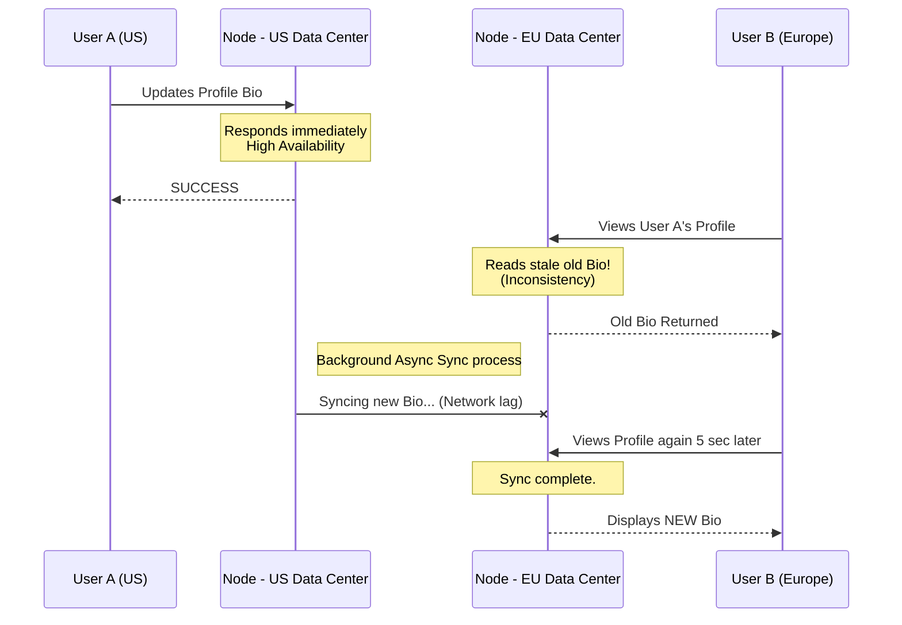

# Distributed Systems
# Hệ thống phân tán

## Concept Explanation
## Giải thích khái niệm
A distributed system is a computing environment in which various components are spread across multiple computers (or other computing devices) on a network. These devices split up the work, coordinating their efforts to complete the job more efficiently than if a single device had been responsible for the task.
Một hệ thống phân tán là một môi trường tính toán trong đó các thành phần khác nhau được trải rộng trên nhiều máy tính (hoặc các thiết bị tính toán khác) trên một mạng. Các thiết bị này chia nhỏ công việc, phối hợp các nỗ lực của chúng để hoàn thành công việc hiệu quả hơn so với khi một thiết bị duy nhất chịu trách nhiệm cho nhiệm vụ đó.

The modern internet is fundamentally an massive distributed system.
Internet hiện đại về cơ bản là một hệ thống phân tán khổng lồ.

### Core Fallacies of Distributed Computing
### Những sai lầm cốt lõi của tính toán phân tán
Developers moving from monolithic to distributed systems often assume:
Các nhà phát triển chuyển từ hệ thống nguyên khối sang hệ thống phân tán thường cho rằng:
1. The network is reliable. (Network partitions happen constantly).
1. Mạng là đáng tin cậy. (Các phân vùng mạng xảy ra liên tục).
2. Latency is zero. (Information takes time to cross the globe).
2. Độ trễ bằng không. (Thông tin cần thời gian để đi khắp toàn cầu).
3. Bandwidth is infinite.
3. Băng thông là vô hạn.
4. The network is secure.
4. Mạng là an toàn.
5. Transport cost is zero.
5. Chi phí vận chuyển bằng không.

### The CAP Theorem
### Định lý CAP
Formulated by Eric Brewer, the CAP theorem states that a distributed data store can simultaneously provide only two of the following three guarantees:
Được xây dựng bởi Eric Brewer, định lý CAP nói rằng một kho dữ liệu phân tán có thể đồng thời chỉ cung cấp hai trong ba đảm bảo sau:
- **Consistency (C)**: Every read receives the most recent write or an error. (All nodes see the same data at the exact same moment).
- **Tính nhất quán (C)**: Mọi lần đọc đều nhận được bản ghi gần đây nhất hoặc một lỗi. (Tất cả các nút đều thấy cùng một dữ liệu tại cùng một thời điểm).
- **Availability (A)**: Every request receives a (non-error) response, without the guarantee that it contains the most recent write.
- **Tính khả dụng (A)**: Mọi yêu cầu đều nhận được một phản hồi (không có lỗi), không có đảm bảo rằng nó chứa bản ghi gần đây nhất.
- **Partition Tolerance (P)**: The system continues to operate despite an arbitrary number of messages being dropped/delayed by the network between nodes.
- **Khả năng chịu phân vùng (P)**: Hệ thống tiếp tục hoạt động mặc dù có một số lượng thông báo tùy ý bị bỏ/trì hoãn bởi mạng giữa các nút.

**Because networking (Partitions) cannot be guaranteed to be 100% reliable, you MUST choose P in a distributed system. Therefore, you must trade off between Consistency and Availability (CP vs AP).**
**Bởi vì mạng (Phân vùng) không thể được đảm bảo là đáng tin cậy 100%, bạn PHẢI chọn P trong một hệ thống phân tán. Do đó, bạn phải đánh đổi giữa Tính nhất quán và Tính khả dụng (CP và AP).**

## Examples of CAP Implementations
## Ví dụ về việc triển khai CAP

1. **CP Systems (Consistency over Availability)**:
1. **Hệ thống CP (Tính nhất quán hơn Tính khả dụng)**:
   - *Example*: MongoDB, Redis, traditional RDBMS like Postgres.
   - *Ví dụ*: MongoDB, Redis, RDBMS truyền thống như Postgres.
   - *Behavior*: If a network partition occurs, the system will block changes (Return Errors / Reject Writes) to ensure that stale data isn't read later.
   - *Hành vi*: Nếu xảy ra phân vùng mạng, hệ thống sẽ chặn các thay đổi (Trả về Lỗi / Từ chối Ghi) để đảm bảo rằng dữ liệu cũ không được đọc sau này.

2. **AP Systems (Availability over Consistency)**:
2. **Hệ thống AP (Tính khả dụng hơn Tính nhất quán)**:
   - *Example*: Cassandra, DynamoDB.
   - *Ví dụ*: Cassandra, DynamoDB.
   - *Behavior*: If a network partition occurs, the system will accept writes on both sides of the partitioned network. This creates conflicting data, but provides high availability. The conflicts are resolved later when the network heals (Eventual Consistency).
   - *Hành vi*: Nếu xảy ra phân vùng mạng, hệ thống sẽ chấp nhận ghi ở cả hai phía của mạng bị phân vùng. Điều này tạo ra dữ liệu xung đột, nhưng cung cấp tính khả dụng cao. Các xung đột được giải quyết sau khi mạng được chữa lành (Tính nhất quán cuối cùng).

## System Design Diagram: Eventual Consistency
## Sơ đồ thiết kế hệ thống: Tính nhất quán cuối cùng

## Exercises
## Bài tập
1. What is a "Vector Clock" and how do AP systems like Dynamo use them to resolve data conflicts?
1. "Đồng hồ véc tơ" là gì và các hệ thống AP như Dynamo sử dụng chúng để giải quyết xung đột dữ liệu như thế nào?
2. If you are building an ATM banking application, do you prefer a CP or an AP system when the network between the ATM and the central bank goes down?
2. Nếu bạn đang xây dựng một ứng dụng ngân hàng ATM, bạn thích một hệ thống CP hay AP hơn khi mạng giữa ATM và ngân hàng trung ương bị sập?
3. Design a simple system to generate Unique IDs in a massively distributed environment (like Twitter Snowflake). Why can't you just use `AUTO_INCREMENT`?
3. Thiết kế một hệ thống đơn giản để tạo ID duy nhất trong một môi trường phân tán lớn (như Twitter Snowflake). Tại sao bạn không thể chỉ sử dụng `AUTO_INCREMENT`?

## Interview Preparation Notes
## Ghi chú chuẩn bị phỏng vấn
- The CAP theorem is the most critical theory question in System Design interviews. Ensure you can explain it flawlessly in under two minutes with an example (like the ATM or a cart checkout).
- Định lý CAP là câu hỏi lý thuyết quan trọng nhất trong các cuộc phỏng vấn Thiết kế hệ thống. Đảm bảo bạn có thể giải thích nó một cách hoàn hảo trong vòng chưa đầy hai phút với một ví dụ (như ATM hoặc thanh toán giỏ hàng).
- Understand "Two-Phase Commit" (2PC) and the "Saga Pattern" for handling distributed transactions across multiple microservices.
- Hiểu "Cam kết hai pha" (2PC) và "Mẫu Saga" để xử lý các giao dịch phân tán trên nhiều vi dịch vụ.
