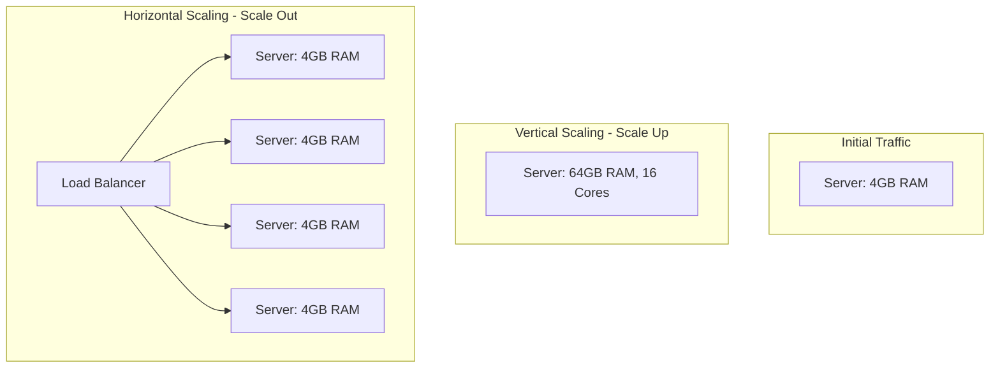

# Horizontal vs Vertical Scaling

## Concept Explanation

When a system handles increased load, it must scale. There are two fundamental ways to scale a system: Vertical (Scaling Up) and Horizontal (Scaling Out).

### Vertical Scaling (Scaling Up)
Adding more power (CPU, RAM, Storage) to your existing single machine or server.
- **Pros**: 
  - Extremely simple to implement (click a button in AWS to upgrade instance type).
  - No code changes are required.
  - No distributed system complexity.
- **Cons**: 
  - There is a hard hardware limit (you can only get a server so big).
  - Subject to Single Points of Failure (if the big machine dies, the app goes down).
  - Requires downtime during the upgrade process (usually).
- **Use cases**: Small to medium databases (SQL usually prefers vertical initially), stateful monolithic applications.

### Horizontal Scaling (Scaling Out)
Adding more machines or servers to your pool of resources.
- **Pros**: 
  - Virtually infinite scalability.
  - Highly available and fault-tolerant.
- **Cons**: 
  - High architectural complexity (Load balancers are required).
  - Application must be written statelessly (session data must be shared in Redis, not in local RAM).
  - Data consistency issues across multiple databases.
- **Use cases**: Web servers, stateless APIs, Microservices, NoSQL databases (Cassandra/Mongo).

## System Design Diagram

## Exercises
1. In the context of Horizontal Scaling, why are "Sticky Sessions" considered an anti-pattern? 
2. If your PostgreSQL database reaches 100% CPU utilization, what is usually the very first and easiest scaling approach before attempting complex horizontal sharding?
3. What is an Auto-Scaling Group (ASG) in AWS, and how does it relate to horizontal scaling?

## Interview Preparation Notes
- Always understand that scaling out is almost universally preferred for computational workloads (App servers), but scaling up is often a sensible first step for relational databases.
- "Statelessness" is the absolute prerequisite for effectively scaling frontend and backend application servers horizontally. Be able to explain why.
