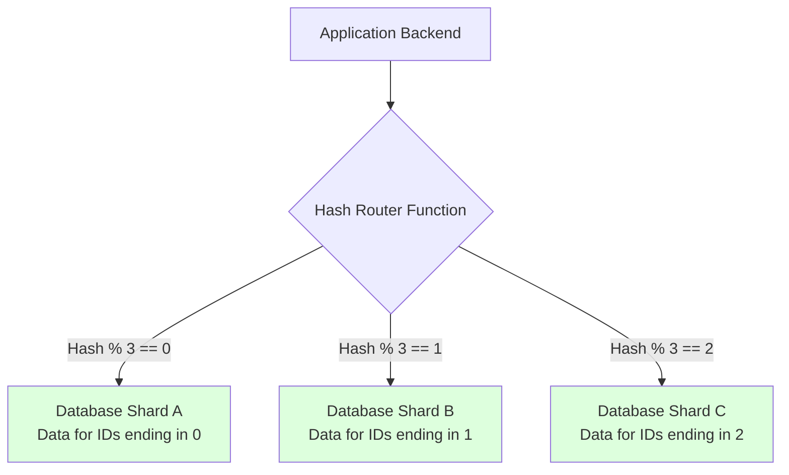

# Database Sharding

## Concept Explanation
Sharding is a data tier architecture in which a single dataset is partitioned horizontally into multiple chunks, dividing it across multiple distinct databases (shards). Each shard is held on a separate database server instance, spreading the load.

Unlike vertical partitioning (putting the `Users` table in one DB, and the `Products` table in another), horizontal partitioning (sharding) splits the same table vertically. For example, `Users` 1-1,000,000 go to Shard A; `Users` 1,000,001-2,000,000 go to Shard B.

### Sharding Strategies (The Shard Key)
The choice of the Shard Key is the most critical decision in a distributed database.
1. **Range-based Sharding**: Based on ranges of values.
   - *Example*: User ID 1-100 (Shard 1), 101-200 (Shard 2).
   - *Problem*: Sequential data (like insert IDs or dates) will cause hotspots where one shard receives all the new writes.
2. **Hash-based Sharding**: Apply a hash function to an ID or email, and take modulo the number of servers.
   - *Example*: `Hash(user_id) % 4` dictates which of 4 servers stores the data.
   - *Problem*: If you add a 5th server, the modulo changes (`% 5`), invalidating the entire hash ring, requiring massive data migration. (This is solved by "Consistent Hashing").
3. **Directory/Lookup Sharding**: Maintain a lookup table (e.g., in Redis) mapping exactly where every key lives.

## System Design Diagram

## Problems with Sharding
Sharding solves the physical limit of vertical scaling but introduces immense complexity:
- **Distributed Queries**: Querying `SELECT COUNT(*)` requires hitting every single shard and aggregating the responses in memory.
- **Joins**: You cannot perform a SQL JOIN between User and Address if the User is on Shard A, but the Address row was placed on Shard B.
- **Rebalancing**: Moving data around when shards get unevenly full.

## Exercises
1. What is "Consistent Hashing" and how does it solve the problem of scaling up/down hash-sharded databases?
2. Consider a "Tenancy" based sharding strategy for B2B applications (e.g., Slack). Company A's data all goes to Shard 1. Company B goes to Shard 2. What happens if Company A becomes a mega-corporation with 100x the data of B? What is this called? (Hint: The Celebrity Problem / Hotspot).

## Interview Preparation Notes
- Sharding is the absolute **last resort** for relational databases. You should first exhaust: Indexing -> Query Optimization -> Vertical Scaling -> Read Replicas (for read scaling) -> Caching.
- Understand how NoSQL databases like Cassandra and MongoDB handle sharding natively out-of-the-box compared to Postgres/MySQL where it requires extensive manual management.
