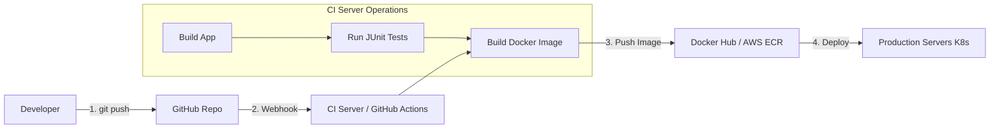

# CI/CD (Continuous Integration / Continuous Deployment)
# CI/CD (Tích hợp liên tục / Triển khai liên tục)

## Concept Explanation
## Giải thích khái niệm
CI/CD is a method to frequently deliver apps to customers by introducing automation into the stages of app development. 
CI/CD là một phương pháp để thường xuyên cung cấp ứng dụng cho khách hàng bằng cách đưa tự động hóa vào các giai đoạn phát triển ứng dụng.

### Continuous Integration (CI)
### Tích hợp liên tục (CI)
Developers merge their code changes back into a central repository (Git) multiple times a day.
Các nhà phát triển hợp nhất các thay đổi mã của họ trở lại một kho lưu trữ trung tâm (Git) nhiều lần trong ngày.
- **Goal**: Find and address bugs quicker, improve software quality.
- **Mục tiêu**: Tìm và giải quyết lỗi nhanh hơn, cải thiện chất lượng phần mềm.
- **Process**: Code Commit -> Trigger Git Hook -> Build the App -> Run Unit Tests -> Run Linting. If anything fails, the team is notified immediately and the merge is blocked.
- **Quy trình**: Cam kết mã -> Kích hoạt Git Hook -> Xây dựng ứng dụng -> Chạy kiểm tra đơn vị -> Chạy Linting. Nếu có bất kỳ lỗi nào, nhóm sẽ được thông báo ngay lập tức và việc hợp nhất sẽ bị chặn.

### Continuous Delivery / Deployment (CD)
### Phân phối / Triển khai liên tục (CD)
Automating the release of validated code to a repository, and eventually deploying it to production.
Tự động hóa việc phát hành mã đã được xác thực vào một kho lưu trữ và cuối cùng triển khai nó vào sản xuất.
- **Continuous Delivery**: Code is automatically built, tested, and pushed to a staging environment. A human clicks a button to deploy to production.
- **Phân phối liên tục**: Mã được tự động xây dựng, kiểm tra và đẩy đến môi trường dàn dựng. Một người nhấp vào một nút để triển khai vào sản xuất.
- **Continuous Deployment**: Every change that passes all tests goes straight to production automatically with no human intervention.
- **Triển khai liên tục**: Mọi thay đổi vượt qua tất cả các bài kiểm tra sẽ được đưa thẳng vào sản xuất một cách tự động mà không có sự can thiệp của con người.

## Pipeline Flow Diagram
## Sơ đồ luồng đường ống


## Practical Example: GitHub Actions for Java Maven Project
## Ví dụ thực tế: Hành động GitHub cho dự án Java Maven

Create a file at `.github/workflows/ci.yml` in your repository:
Tạo một tệp tại `.github/workflows/ci.yml` trong kho lưu trữ của bạn:

```yaml
name: Java CI with Maven

# Run on every push to the main branch
# Chạy trên mỗi lần đẩy vào nhánh chính
on:
  push:
    branches: [ "main" ]
  pull_request:
    branches: [ "main" ]

jobs:
  build:
    runs-on: ubuntu-latest # The virtual environment
    
    steps:
    - name: Check out the code
      uses: actions/checkout@v3
    
    - name: Set up JDK 17
      uses: actions/setup-java@v3
      with:
        java-version: '17'
        distribution: 'temurin'
        cache: maven
        
    - name: Build and run tests with Maven
      run: mvn -B package --file pom.xml
      
    - name: Build Docker Image
      run: docker build . --file Dockerfile --tag my-java-app:latest
      
    # Following steps would be pushing the image to a registry and applying to a prod server
    # Các bước sau sẽ là đẩy hình ảnh vào một sổ đăng ký và áp dụng nó vào một máy chủ sản xuất
```

## Exercises
## Bài tập
1. What is the role of a "Runner" in Jenkins, GitLab CI, or GitHub Actions?
1. Vai trò của một "Runner" trong Jenkins, GitLab CI hoặc GitHub Actions là gì?
2. Set up a free GitHub Account, create a sample Node.js or Java project with one failing unit test. Setup basic GitHub actions. Verify the pipeline turns red. Fix the test, push, and verify the pipeline turns green.
2. Thiết lập một Tài khoản GitHub miễn phí, tạo một dự án Node.js hoặc Java mẫu với một bài kiểm tra đơn vị không thành công. Thiết lập các hành động GitHub cơ bản. Xác minh rằng đường ống chuyển sang màu đỏ. Sửa lỗi kiểm tra, đẩy và xác minh rằng đường ống chuyển sang màu xanh lá cây.
3. Why is IaC (Infrastructure as Code) like Terraform or Ansible closely tied to modern CI/CD processes?
3. Tại sao IaC (Cơ sở hạ tầng dưới dạng mã) như Terraform hoặc Ansible lại gắn liền với các quy trình CI/CD hiện đại?

## Interview Preparation Notes
## Ghi chú chuẩn bị phỏng vấn
- Be prepared to design a CI/CD pipeline verbally for a standard web application.
- Hãy chuẩn bị để thiết kế một đường ống CI/CD bằng lời nói cho một ứng dụng web tiêu chuẩn.
- Explain Blue/Green Deployments and Canary Releases as deployment strategies to minimize downtime and risk during Continuous Deployment.
- Giải thích Triển khai xanh/lam và Phát hành Canary là các chiến lược triển khai để giảm thiểu thời gian ngừng hoạt động và rủi ro trong quá trình Triển khai liên tục.
