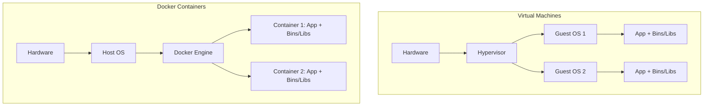

# Docker Basics
# Khái niệm cơ bản về Docker

## Concept Explanation
## Giải thích khái niệm
Docker is a platform for developing, shipping, and running applications in containers.
Docker là một nền tảng để phát triển, vận chuyển và chạy các ứng dụng trong các bộ chứa.

### What is a Container?
### Bộ chứa là gì?
A container is a standard unit of software that packages up code and all its dependencies so the application runs quickly and reliably from one computing environment to another. 
Một bộ chứa là một đơn vị phần mềm tiêu chuẩn đóng gói mã và tất cả các phụ thuộc của nó để ứng dụng chạy nhanh chóng và đáng tin cậy từ một môi trường máy tính này sang môi trường máy tính khác.

Unlike Virtual Machines (VMs), which virtualize the entire hardware including the Guest OS, containers virtualize only the Operating System (specifically the kernel). They are extremely lightweight and fast to start (seconds instead of minutes).
Không giống như Máy ảo (VM), ảo hóa toàn bộ phần cứng bao gồm cả hệ điều hành khách, các bộ chứa chỉ ảo hóa Hệ điều hành (cụ thể là hạt nhân). Chúng cực kỳ nhẹ và khởi động nhanh (vài giây thay vì vài phút).

### Key Docker Concepts
### Các khái niệm chính của Docker
1. **Dockerfile**: A text file with instructions on how to build a Docker Image.
1. **Dockerfile**: Một tệp văn bản với các hướng dẫn về cách xây dựng một Hình ảnh Docker.
2. **Image**: A read-only template with instructions for creating a Docker container (like a blueprint বা a Class).
2. **Hình ảnh**: Một mẫu chỉ đọc với các hướng dẫn để tạo một bộ chứa Docker (giống như một bản thiết kế hoặc một Lớp).
3. **Container**: A runnable instance of an Image. Think of it as an isolated process (like an Object instantiated from a Class).
3. **Bộ chứa**: Một phiên bản có thể chạy được của một Hình ảnh. Hãy coi nó như một quy trình bị cô lập (giống như một Đối tượng được khởi tạo từ một Lớp).
4. **Docker Hub (Registry)**: A cloud repository where you can push or pull generic/custom images (e.g., pulling the official `redis` image).
4. **Docker Hub (Sổ đăng ký)**: Một kho lưu trữ đám mây nơi bạn có thể đẩy hoặc kéo các hình ảnh chung/tùy chỉnh (ví dụ: kéo hình ảnh `redis` chính thức).

## Practical Example: Dockerizing a Node.js API
## Ví dụ thực tế: Docker hóa một API Node.js

**1. Create a `Dockerfile`**
**1. Tạo một `Dockerfile`**
```dockerfile
# 1. Start from the official Node.js Base Image
# 1. Bắt đầu từ Hình ảnh cơ sở Node.js chính thức
FROM node:18-alpine

# 2. Set the working directory inside the container
# 2. Đặt thư mục làm việc bên trong bộ chứa
WORKDIR /usr/src/app

# 3. Copy package.json and install dependencies
# 3. Sao chép package.json và cài đặt các phụ thuộc
COPY package*.json ./
RUN npm install --production

# 4. Copy the rest of your app's source code
# 4. Sao chép phần còn lại của mã nguồn ứng dụng của bạn
COPY . .

# 5. Expose the port the app runs on
# 5. Hiển thị cổng mà ứng dụng chạy trên đó
EXPOSE 8080

# 6. Define the command to start the application
# 6. Xác định lệnh để khởi động ứng dụng
CMD [ "node", "server.js" ]
```

**2. Basic Docker Commands**
**2. Các lệnh Docker cơ bản**
```bash
# Build the image from the Dockerfile in the current directory, tagging it 'my-node-app'
# Xây dựng hình ảnh từ Dockerfile trong thư mục hiện tại, gắn thẻ nó là 'my-node-app'
docker build -t my-node-app .

# Run the container in detached mode (-d), mapping port 8080 on localhost to 8080 in the container
# Chạy bộ chứa ở chế độ tách rời (-d), ánh xạ cổng 8080 trên localhost đến 8080 trong bộ chứa
docker run -p 8080:8080 -d my-node-app

# List active containers
# Liệt kê các bộ chứa đang hoạt động
docker ps

# Stop a container
# Dừng một bộ chứa
docker stop <container_id>
```

## System Design Diagram: VM vs Container
## Sơ đồ thiết kế hệ thống: VM và Bộ chứa


## Exercises
## Bài tập
1. Install Docker Desktop. Pull the official Nginx image (`docker pull nginx`) and run it so you can view the default Nginx page on `http://localhost:80`.
1. Cài đặt Docker Desktop. Kéo hình ảnh Nginx chính thức (`docker pull nginx`) và chạy nó để bạn có thể xem trang Nginx mặc định trên `http://localhost:80`.
2. What does `.dockerignore` do and why is it essential to prevent your local `node_modules` from being copied during the `COPY . .` step?
2. `.dockerignore` làm gì và tại sao nó cần thiết để ngăn các `node_modules` cục bộ của bạn bị sao chép trong bước `COPY . .`?
3. Write a simple Docker Compose (`docker-compose.yml`) file that spins up a PostgreSQL database and a Node.js backend together.
3. Viết một tệp Docker Compose (`docker-compose.yml`) đơn giản để khởi động một cơ sở dữ liệu PostgreSQL và một backend Node.js cùng nhau.

## Interview Preparation Notes
## Ghi chú chuẩn bị phỏng vấn
- Why are containers better than VMs for Microservices? (Less overhead, faster startup, portable).
- Tại sao các bộ chứa tốt hơn các máy ảo cho các vi dịch vụ? (Ít chi phí hơn, khởi động nhanh hơn, di động).
- Understand how Docker achieves isolation in Linux using namespaces and cgroups.
- Hiểu cách Docker đạt được sự cô lập trong Linux bằng cách sử dụng các không gian tên và các nhóm c.
