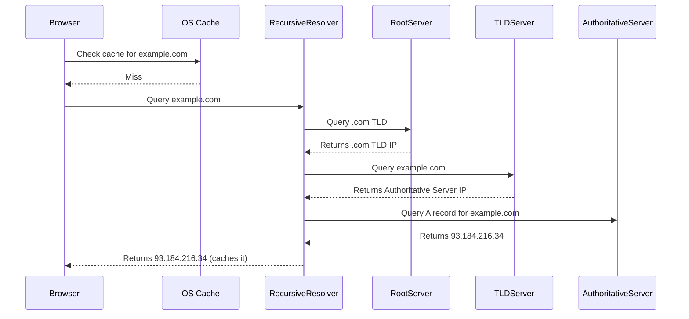

# DNS (Domain Name System)
# DNS (Hệ thống tên miền)

## Concept Explanation
## Giải thích khái niệm
DNS (Domain Name System) is often referred to as the phonebook of the internet. Humans access information online through domain names, like `google.com`. Web browsers interact through Internet Protocol (IP) addresses. DNS translates domain names to IP addresses so browsers can load internet resources.
DNS (Hệ thống tên miền) thường được gọi là danh bạ của internet. Con người truy cập thông tin trực tuyến thông qua các tên miền, như `google.com`. Các trình duyệt web tương tác thông qua các địa chỉ Giao thức Internet (IP). DNS dịch tên miền thành địa chỉ IP để trình duyệt có thể tải các tài nguyên internet.

### How DNS Works
### Cách hoạt động của DNS
When you type a web address into your browser, a DNS lookup occurs.
Khi bạn nhập một địa chỉ web vào trình duyệt của mình, một tra cứu DNS sẽ xảy ra.
1. **Requesting OS**: The browser checks its cache, then the OS cache.
1. **Hệ điều hành yêu cầu**: Trình duyệt kiểm tra bộ nhớ cache của nó, sau đó là bộ nhớ cache của hệ điều hành.
2. **Resolver (Recursive DNS)**: If not found, the OS queries the configured DNS resolver (usually from your ISP).
2. **Trình phân giải (DNS đệ quy)**: Nếu không tìm thấy, hệ điều hành sẽ truy vấn trình phân giải DNS đã được định cấu hình (thường là từ ISP của bạn).
3. **Root Server**: The resolver queries a Root DNS server.
3. **Máy chủ gốc**: Trình phân giải truy vấn một máy chủ DNS gốc.
4. **TLD Server**: The resolver asks the Top-Level Domain server (like `.com` or `.org`).
4. **Máy chủ TLD**: Trình phân giải hỏi máy chủ tên miền cấp cao nhất (như `.com` hoặc `.org`).
5. **Authoritative Name Server**: Finally, it asks the authoritative server which holds the specific A record for the domain.
5. **Máy chủ tên có thẩm quyền**: Cuối cùng, nó hỏi máy chủ có thẩm quyền chứa bản ghi A cụ thể cho tên miền.



## Practical Example
## Ví dụ thực tế
You can use command-line tools like `dig` or `nslookup` (or `Resolve-DnsName` in PowerShell) to perform DNS lookups.
Bạn có thể sử dụng các công cụ dòng lệnh như `dig` hoặc `nslookup` (hoặc `Resolve-DnsName` trong PowerShell) để thực hiện tra cứu DNS.

Code equivalent in Java (Spring Boot context, checking via standard Java API):
Mã tương đương trong Java (ngữ cảnh Spring Boot, kiểm tra qua API Java tiêu chuẩn):

```java
import java.net.InetAddress;
import java.net.UnknownHostException;

public class DnsExample {
    public static void main(String[] args) {
        String domain = "roadmap.sh";
        try {
            InetAddress address = InetAddress.getByName(domain);
            System.out.println("IP Address for " + domain + " is: " + address.getHostAddress());
        } catch (UnknownHostException e) {
            System.err.println("Could not resolve domain: " + domain);
        }
    }
}
```

## Exercises
## Bài tập
1. Look up the IP address of `github.com` using the terminal (`ping`, `nslookup`, or `dig`).
1. Tra cứu địa chỉ IP của `github.com` bằng cách sử dụng terminal (`ping`, `nslookup` hoặc `dig`).
2. Write a Node.js script utilizing the `dns` module (`dns.lookup`) to find both the IPv4 and IPv6 addresses for a given domain name.
2. Viết một tập lệnh Node.js sử dụng mô-đun `dns` (`dns.lookup`) để tìm cả địa chỉ IPv4 và IPv6 cho một tên miền nhất định.
3. **Advanced**: Explain the difference between an A record, a CNAME record, and an MX record.
3. **Nâng cao**: Giải thích sự khác biệt giữa bản ghi A, bản ghi CNAME và bản ghi MX.

## Interview Preparation Notes
## Ghi chú chuẩn bị phỏng vấn
- Be prepared to explain the step-by-step DNS lookup process.
- Hãy chuẩn bị để giải thích quy trình tra cứu DNS từng bước.
- Understand DNS caching and TTL (Time to Live).
- Hiểu về bộ nhớ đệm DNS và TTL (Thời gian tồn tại).
- Know what happens when DNS goes down.
- Biết điều gì xảy ra khi DNS ngừng hoạt động.
