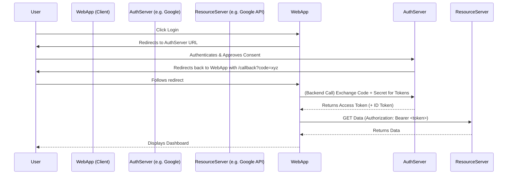

# OAuth 2.0 / OIDC

## Concept Explanation
## Giải thích khái niệm
**OAuth 2.0** is an industry-standard *authorization* protocol. It allows third-party applications to grant limited access to an HTTP service, either on behalf of a resource owner or by allowing the third-party application to obtain access on its own behalf.
**OAuth 2.0** là một giao thức *ủy quyền* tiêu chuẩn ngành. Nó cho phép các ứng dụng của bên thứ ba cấp quyền truy cập hạn chế vào một dịch vụ HTTP, thay mặt cho chủ sở hữu tài nguyên hoặc bằng cách cho phép ứng dụng của bên thứ ba tự mình có được quyền truy cập.
*Analogy:* Getting a valet key for your car. The valet can drive the car (restricted action), but cannot open the glove box or keep the car permanently.
*Tương tự:* Lấy chìa khóa cho người phục vụ cho xe của bạn. Người phục vụ có thể lái xe (hành động bị hạn chế), nhưng không thể mở hộp đựng găng tay hoặc giữ xe vĩnh viễn.

**OIDC (OpenID Connect)** is a simple identity layer on top of the OAuth 2.0 protocol. While OAuth provides *authorization* (access), OIDC provides *authentication* (identity - who the user is).
**OIDC (OpenID Connect)** là một lớp nhận dạng đơn giản trên đầu giao thức OAuth 2.0. Mặc dù OAuth cung cấp *ủy quyền* (quyền truy cập), OIDC cung cấp *xác thực* (danh tính - người dùng là ai).

### Key Terminology
### Thuật ngữ chính
- **Resource Owner**: The user authorizing access.
- **Chủ sở hữu tài nguyên**: Người dùng ủy quyền truy cập.
- **Client**: The application requesting access (e.g., your web app).
- **Máy khách**: Ứng dụng yêu cầu quyền truy cập (ví dụ: ứng dụng web của bạn).
- **Authorization Server**: The server issuing access tokens (e.g., Google or Auth0).
- **Máy chủ ủy quyền**: Máy chủ cấp mã thông báo truy cập (ví dụ: Google hoặc Auth0).
- **Resource Server**: The server hosting the protected resources.
- **Máy chủ tài nguyên**: Máy chủ lưu trữ các tài nguyên được bảo vệ.

### The Authorization Code Flow (Most Common)
### Luồng mã ủy quyền (phổ biến nhất)
1. User clicks "Login with Google".
1. Người dùng nhấp vào "Đăng nhập bằng Google".
2. Client redirects the browser to Google's Authorization Server.
2. Máy khách chuyển hướng trình duyệt đến Máy chủ ủy quyền của Google.
3. User logs into Google and grants permissions (Scope).
3. Người dùng đăng nhập vào Google và cấp quyền (Phạm vi).
4. Google redirects back to the Client with an **Authorization Code**.
4. Google chuyển hướng trở lại Máy khách bằng một **Mã ủy quyền**.
5. Client's *Backend* makes a secure Server-to-Server call to Google, exchanging the Code + Client Secret for an **Access Token** (and optionally an ID Token for OIDC).
5. *Backend* của máy khách thực hiện một lệnh gọi Máy chủ-Máy chủ an toàn tới Google, trao đổi Mã + Bí mật máy khách để lấy **Mã thông báo truy cập** (và tùy chọn là Mã thông báo ID cho OIDC).
6. Client uses the Access Token to fetch data from the Resource Server.
6. Máy khách sử dụng Mã thông báo truy cập để tìm nạp dữ liệu từ Máy chủ tài nguyên.

## System Design Diagram
## Sơ đồ thiết kế hệ thống



## Practical Example
## Ví dụ thực tế
Setting up OAuth requires registering an application with a provider (like Google Cloud Console or GitHub Developer Settings) to get a `Client ID` and `Client Secret`.
Việc thiết lập OAuth yêu cầu đăng ký một ứng dụng với một nhà cung cấp (như Google Cloud Console hoặc Cài đặt nhà phát triển GitHub) để nhận `ID máy khách` và `Bí mật máy khách`.

Because full OAuth requires redirects, the pseudo-code for the Backend exchange (Step 5) looks like this in Java/Spring Boot:
Vì OAuth đầy đủ yêu cầu chuyển hướng, mã giả cho việc trao đổi Backend (Bước 5) trông như thế này trong Java/Spring Boot:
Many developers use `spring-boot-starter-oauth2-client` which handles the entire flow automatically.
Nhiều nhà phát triển sử dụng `spring-boot-starter-oauth2-client` xử lý toàn bộ luồng tự động.

```java
import org.springframework.security.core.annotation.AuthenticationPrincipal;
import org.springframework.security.oauth2.core.user.OAuth2User;
import org.springframework.web.bind.annotation.GetMapping;
import org.springframework.web.bind.annotation.RestController;

@RestController
public class SocialLoginController {

    // Spring Security intercepts the request, redirects to Google, handles the callback, 
    // Spring Security chặn yêu cầu, chuyển hướng đến Google, xử lý lệnh gọi lại,
    // exchanges the code for a token, and injects the User object here.
    // trao đổi mã để lấy mã thông báo và chèn đối tượng Người dùng vào đây.
    @GetMapping("/user-info")
    public String getUserInfo(@AuthenticationPrincipal OAuth2User principal) {
        String name = principal.getAttribute("name");
        String email = principal.getAttribute("email");
        return "Hello " + name + " (" + email + ")!";
    }
}
```

## Exercises
## Bài tập
1. What is the difference between OAuth 2.0 and SAML?
1. Sự khác biệt giữa OAuth 2.0 và SAML là gì?
2. Why does the "Authorization Code Flow" use a temporary code that the backend must exchange for a token, instead of just sending the token directly to the browser? (Hint: Security of Client Secrets and URL fragments).
2. Tại sao "Luồng mã ủy quyền" sử dụng một mã tạm thời mà backend phải trao đổi để lấy mã thông báo, thay vì chỉ gửi mã thông báo trực tiếp đến trình duyệt? (Gợi ý: Bảo mật của Bí mật máy khách và các đoạn URL).
3. Read about the "Implicit Flow" and why it is now considered deprecated/insecure for Single Page Applications (SPAs). (The modern replacement is Authorization Code Flow with PKCE).
3. Đọc về "Luồng ngầm" và tại sao nó hiện được coi là không dùng nữa/không an toàn cho các Ứng dụng một trang (SPA). (Sự thay thế hiện đại là Luồng mã ủy quyền với PKCE).

## Interview Preparation Notes
## Ghi chú chuẩn bị phỏng vấn
- Clearly distinguish between Authentication (Identity/OIDC) and Authorization (Access/OAuth).
- Phân biệt rõ ràng giữa Xác thực (Danh tính/OIDC) và Ủy quyền (Truy cập/OAuth).
- Understand the role of "Scopes" (e.g., `read:email`, `write:repo`).
- Hiểu vai trò của "Phạm vi" (ví dụ: `read:email`, `write:repo`).
- Know what PKCE (Proof Key for Code Exchange) is and why mobile apps and SPAs use it.
- Biết PKCE (Khóa chứng minh để trao đổi mã) là gì và tại sao các ứng dụng di động và SPA lại sử dụng nó.
