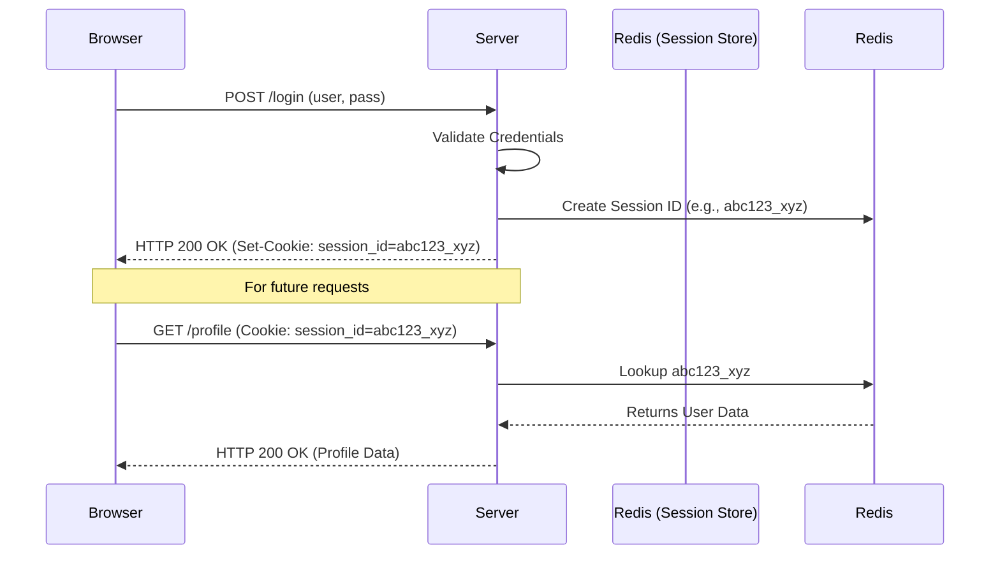

# Session-based Authentication
# Xác thực dựa trên phiên

## Concept Explanation
## Giải thích khái niệm
Session-based authentication (also known as Stateful Authentication) is a traditional way to manage user logins. The server is responsible for keeping track of active sessions.
Xác thực dựa trên phiên (còn được gọi là Xác thực có trạng thái) là một cách truyền thống để quản lý đăng nhập của người dùng. Máy chủ chịu trách nhiệm theo dõi các phiên hoạt động.

### How it Works
### Cách hoạt động
1. **Login**: Client sends username and password.
1. **Đăng nhập**: Máy khách gửi tên người dùng và mật khẩu.
2. **Server Validation**: Server verifies credentials against the DB.
2. **Xác thực máy chủ**: Máy chủ xác minh thông tin đăng nhập so với DB.
3. **Session Creation**: Server creates a "Session" object in memory (or a fast DB like Redis), generating a unique `Session ID`.
3. **Tạo phiên**: Máy chủ tạo một đối tượng "Phiên" trong bộ nhớ (hoặc một DB nhanh như Redis), tạo một `ID phiên` duy nhất.
4. **Cookie Assignment**: Server returns an HTTP Response with a `Set-Cookie` header containing the `Session ID`.
4. **Gán cookie**: Máy chủ trả về một Phản hồi HTTP với một tiêu đề `Set-Cookie` chứa `ID phiên`.
5. **Subsequent Requests**: The browser automatically includes the Cookie in all subsequent requests. The server looks up the ID in its session store to identify the user.
5. **Các yêu cầu tiếp theo**: Trình duyệt tự động bao gồm Cookie trong tất cả các yêu cầu tiếp theo. Máy chủ tra cứu ID trong kho lưu trữ phiên của nó để xác định người dùng.



### Pros and Cons
### Ưu và nhược điểm
- **Pros**: Easy to revoke a session (just delete it on the server), simple implementation, highly secure if Cookies are configured correctly (`HttpOnly`, `Secure`).
- **Ưu điểm**: Dễ dàng thu hồi một phiên (chỉ cần xóa nó trên máy chủ), triển khai đơn giản, bảo mật cao nếu Cookie được định cấu hình chính xác (`HttpOnly`, `Secure`).
- **Cons**: Scalability challenges. If you have 5 load-balanced servers, they must share a central Session Store (like Redis). Otherwise, a session created on Server A won't be recognized by Server B (unless you use sticky sessions).
- **Nhược điểm**: Thách thức về khả năng mở rộng. Nếu bạn có 5 máy chủ được cân bằng tải, chúng phải chia sẻ một Kho lưu trữ phiên trung tâm (như Redis). Nếu không, một phiên được tạo trên Máy chủ A sẽ không được Máy chủ B nhận ra (trừ khi bạn sử dụng các phiên dính).

## Practical Example (Spring Boot Controller & HttpSession)
## Ví dụ thực tế (Spring Boot Controller & HttpSession)

```java
import org.springframework.boot.SpringApplication;
import org.springframework.boot.autoconfigure.SpringBootApplication;
import org.springframework.http.HttpStatus;
import org.springframework.http.ResponseEntity;
import org.springframework.web.bind.annotation.*;
import jakarta.servlet.http.HttpSession;
import java.io.Serializable;

@SpringBootApplication
public class SessionAuthApplication {
    public static void main(String[] args) {
        SpringApplication.run(SessionAuthApplication.class, args);
    }
}

// User session data DTO
class UserSession implements Serializable {
    private Long id;
    private String username;

    public UserSession(Long id, String username) {
        this.id = id;
        this.username = username;
    }
    // Getters and setters omitted for brevity
    public String getUsername() { return username; }
}

class LoginRequest {
    private String username;
    private String password;
    
    public String getUsername() { return username; }
    public String getPassword() { return password; }
}

@RestController
@RequestMapping("/api")
public class AuthController {

    // Login Endpoint
    // Điểm cuối đăng nhập
    @PostMapping("/login")
    public ResponseEntity<String> login(@RequestBody LoginRequest request, HttpSession session) {
        if ("admin".equals(request.getUsername()) && "password123".equals(request.getPassword())) {
            // Lưu thông tin người dùng vào Session
            UserSession user = new UserSession(1L, "admin");
            session.setAttribute("user", user);
            // Cấu hình thời gian hết hạn (ví dụ: 3600 giây = 1 giờ)
            session.setMaxInactiveInterval(3600);
            return ResponseEntity.ok("Logged in!");
        }
        return ResponseEntity.status(HttpStatus.UNAUTHORIZED).body("Unauthorized");
    }

    // Protected Endpoint
    // Điểm cuối được bảo vệ
    @GetMapping("/dashboard")
    public ResponseEntity<String> dashboard(HttpSession session) {
        // Kiểm tra xem UserSession có tồn tại trong Session không
        UserSession user = (UserSession) session.getAttribute("user");
        if (user != null) {
            return ResponseEntity.ok("Welcome to your dashboard, " + user.getUsername());
        }
        return ResponseEntity.status(HttpStatus.UNAUTHORIZED).body("Please log in first");
    }
}
```

## Exercises
## Bài tập
1. Explain the difference between `HttpOnly`, `Secure`, and `SameSite` cookie flags. How do they protect against XSS and CSRF?
1. Giải thích sự khác biệt giữa các cờ cookie `HttpOnly`, `Secure` và `SameSite`. Chúng bảo vệ chống lại XSS và CSRF như thế nào?
2. Implement a `POST /logout` endpoint in the Spring Boot app above to invalidate the session (Hint: `session.invalidate()`).
2. Triển khai một điểm cuối `POST /logout` trong ứng dụng Spring Boot ở trên để hủy phiên (Gợi ý: `session.invalidate()`).
3. Compare the scalability of Session-based auth backed by memory vs backed by Redis.
3. So sánh khả năng mở rộng của xác thực dựa trên phiên được hỗ trợ bởi bộ nhớ và được hỗ trợ bởi Redis.

## Interview Preparation Notes
## Ghi chú chuẩn bị phỏng vấn
- Understand the difference between Authentication (who are you?) and Authorization (what are you allowed to do?).
- Hiểu sự khác biệt giữa Xác thực (bạn là ai?) và Ủy quyền (bạn được phép làm gì?).
- Know how CSRF (Cross-Site Request Forgery) attacks work. Because browsers send cookies automatically, Session Auth is vulnerable to CSRF unless protected by anti-CSRF tokens or `SameSite` cookie attributes.
- Biết các cuộc tấn công CSRF (Giả mạo yêu cầu trên nhiều trang web) hoạt động như thế nào. Vì các trình duyệt gửi cookie tự động, Xác thực phiên dễ bị tấn công bởi CSRF trừ khi được bảo vệ bởi các mã thông báo chống CSRF hoặc các thuộc tính cookie `SameSite`.
