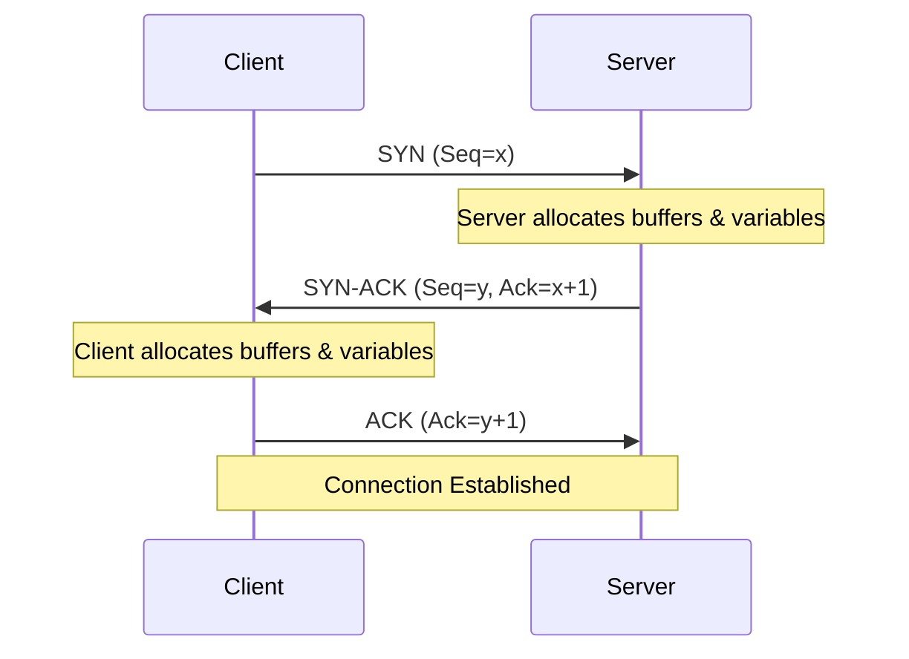

# TCP/IP (Transmission Control Protocol / Internet Protocol)
# TCP/IP (Giao thức điều khiển truyền vận / Giao thức Internet)

## Concept Explanation
## Giải thích khái niệm
The Internet Protocol suite (TCP/IP) is the conceptual model and set of communications protocols used in the Internet and similar computer networks.
Bộ giao thức Internet (TCP/IP) là mô hình khái niệm và tập hợp các giao thức truyền thông được sử dụng trên Internet và các mạng máy tính tương tự.

### The 4 Layers of the TCP/IP Model
### 4 lớp của mô hình TCP/IP
1. **Application Layer**: Where applications create user data and communicate the data to other applications (HTTP, FTP, SMTP, DNS).
1. **Lớp ứng dụng**: Nơi các ứng dụng tạo dữ liệu người dùng và giao tiếp dữ liệu với các ứng dụng khác (HTTP, FTP, SMTP, DNS).
2. **Transport Layer**: Provides host-to-host communication services (TCP, UDP).
2. **Lớp giao vận**: Cung cấp dịch vụ giao tiếp từ máy chủ đến máy chủ (TCP, UDP).
   - **TCP**: Connection-oriented, reliable, guarantees delivery and ordering. Uses a 3-way handshake.
   - **TCP**: Giao thức Hướng kết nối, đáng tin cậy, đảm bảo gửi và sắp xếp. Sử dụng bắt tay 3 bước.
   - **UDP**: Connectionless, best-effort, fast but unreliable. Good for video streaming or gaming.
   - **UDP**: Giao thức Không kết nối, nỗ lực tối đa, nhanh nhưng không đáng tin cậy. Tốt cho truyền phát video hoặc chơi game.
3. **Internet Layer**: Puts packets on the network and routes them to the destination (IP, ICMP).
3. **Lớp Internet**: Đặt các gói tin lên mạng và định tuyến chúng đến đích (IP, ICMP).
4. **Network Access Layer**: Translates IP packets into frames for transmission over the wire/wifi (Ethernet, Wi-Fi).
4. **Lớp truy cập mạng**: Dịch các gói IP thành các khung để truyền qua dây/wifi (Ethernet, Wi-Fi).

### TCP 3-Way Handshake
### Bắt tay 3 bước TCP
To establish a connection, TCP uses a 3-way handshake:
Để thiết lập kết nối, TCP sử dụng bắt tay 3 bước:
1. **SYN**: Client sends a SYN (Synchronize) packet to the server.
1. **SYN**: Máy khách gửi một gói SYN (Đồng bộ hóa) đến máy chủ.
2. **SYN-ACK**: Server responds with a SYN-ACK (Synchronize-Acknowledge).
2. **SYN-ACK**: Máy chủ trả lời bằng một SYN-ACK (Đồng bộ hóa-Xác nhận).
3. **ACK**: Client replies with an ACK (Acknowledge). Connection established.
3. **ACK**: Máy khách trả lời bằng một ACK (Xác nhận). Kết nối được thiết lập.



## Practical Example
## Ví dụ thực tế
Let's see a simple multi-threaded TCP Server in Java, going below HTTP to work directly with TCP sockets using `java.net.ServerSocket`.
Hãy xem một Máy chủ TCP đa luồng đơn giản trong Java, đi xuống dưới HTTP để làm việc trực tiếp với các socket TCP sử dụng `java.net.ServerSocket`.

```java
import java.io.BufferedReader;
import java.io.InputStreamReader;
import java.io.PrintWriter;
import java.net.ServerSocket;
import java.net.Socket;

public class SimpleTcpServer {
    public static void main(String[] args) {
        int port = 8080;
        try (ServerSocket serverSocket = new ServerSocket(port)) {
            System.out.println("TCP server listening on port " + port);
            
            while (true) {
                // Chấp nhận kết nối từ Client
                Socket clientSocket = serverSocket.accept();
                System.out.println("Client connected: " + clientSocket.getRemoteSocketAddress());
                
                // Xử lý mỗi Client trên một Thread riêng biệt
                new Thread(() -> handleClient(clientSocket)).start();
            }
        } catch (Exception e) {
            e.printStackTrace();
        }
    }

    private static void handleClient(Socket socket) {
        try (
            BufferedReader in = new BufferedReader(new InputStreamReader(socket.getInputStream()));
            PrintWriter out = new PrintWriter(socket.getOutputStream(), true)
        ) {
            out.println("Welcome to the generic TCP server!");
            
            String line;
            while ((line = in.readLine()) != null) {
                System.out.println("Received: " + line);
                out.println("Server Echo: " + line);
            }
        } catch (Exception e) {
            System.out.println("Client connection error: " + e.getMessage());
        } finally {
            try {
                socket.close();
                System.out.println("Client disconnected");
            } catch (Exception e) {
                e.printStackTrace();
            }
        }
    }
}
```

You can test this using `telnet localhost 8080` (or `nc localhost 8080`).
Bạn có thể kiểm tra điều này bằng cách sử dụng `telnet localhost 8080` (hoặc `nc localhost 8080`).

## Exercises
## Bài tập
1. Build a basic TCP client in Java using `java.net.Socket` to connect to the Java TCP server provided above and send a message.
1. Xây dựng một máy khách TCP cơ bản bằng Java sử dụng `java.net.Socket` để kết nối với máy chủ TCP Java được cung cấp ở trên và gửi một tin nhắn.
2. Explain the difference between TCP and UDP to a non-technical person.
2. Giải thích sự khác biệt giữa TCP và UDP cho một người không chuyên về kỹ thuật.
3. What is the process of terminating a TCP connection? (Hint: 4-way teardown).
3. Quá trình chấm dứt kết nối TCP là gì? (Gợi ý: tháo dỡ 4 bước).

## Interview Preparation Notes
## Ghi chú chuẩn bị phỏng vấn
- Be ready to explain the OSI model vs the TCP/IP model.
- Hãy sẵn sàng giải thích mô hình OSI so với mô hình TCP/IP.
- Know the TCP 3-way handshake thoroughly.
- Biết kỹ về bắt tay 3 bước TCP.
- Understand the difference between TCP and UDP, and when to use which (e.g., streaming video vs financial transactions).
- Hiểu sự khác biệt giữa TCP và UDP và khi nào nên sử dụng cái nào (ví dụ: truyền phát video so với giao dịch tài chính).
