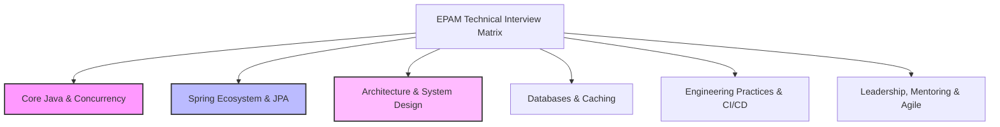
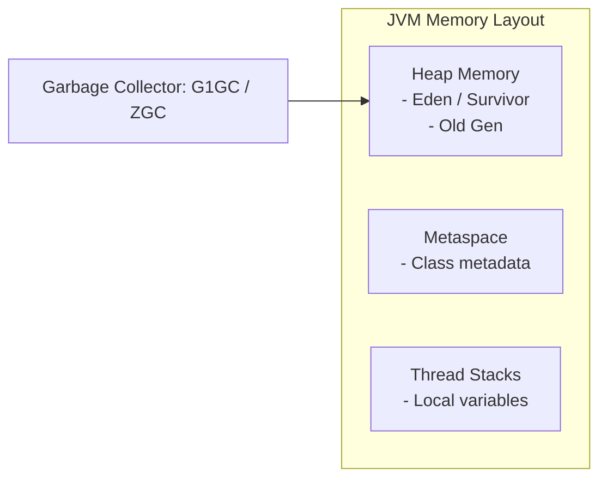
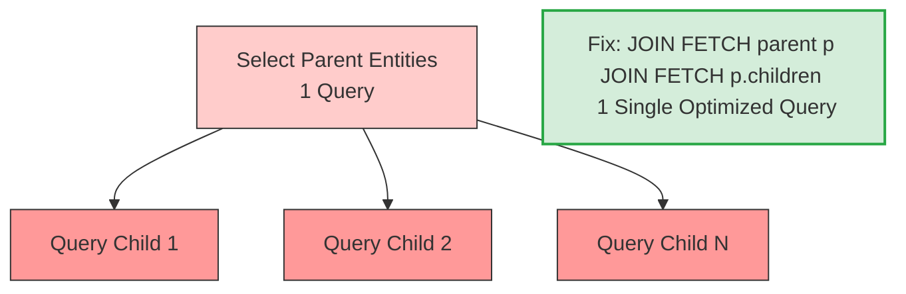
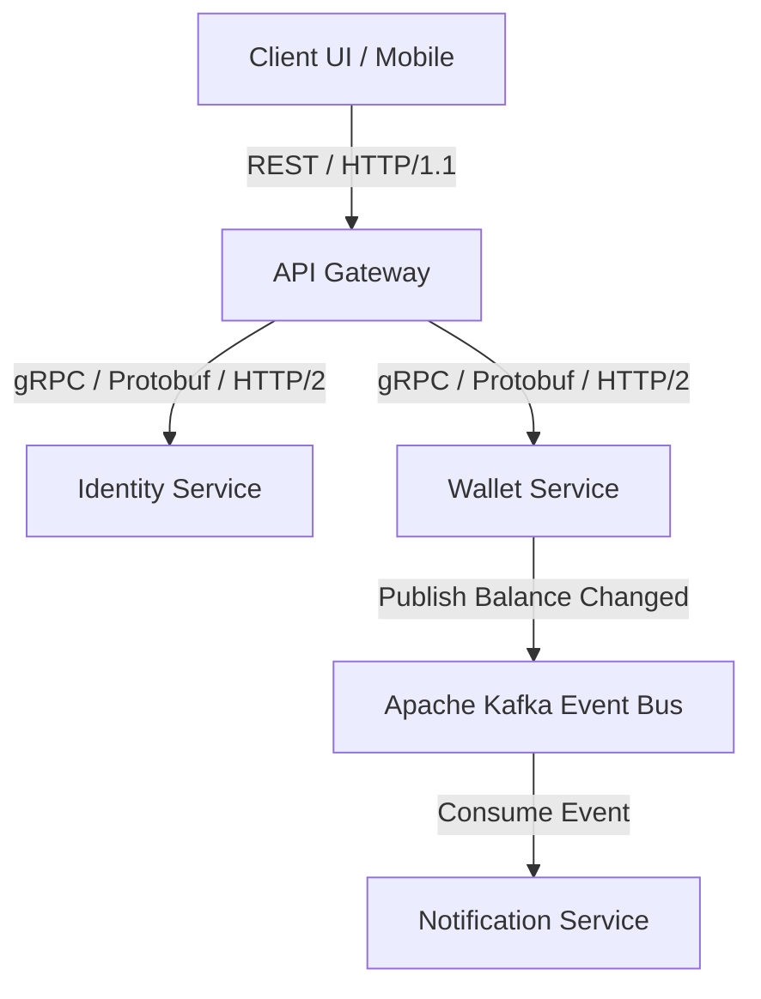
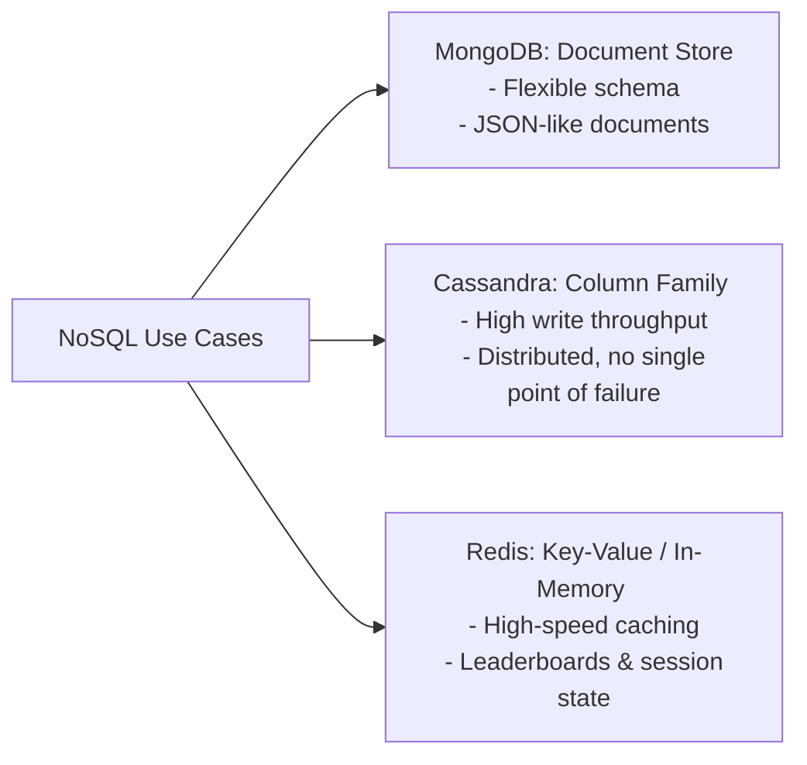
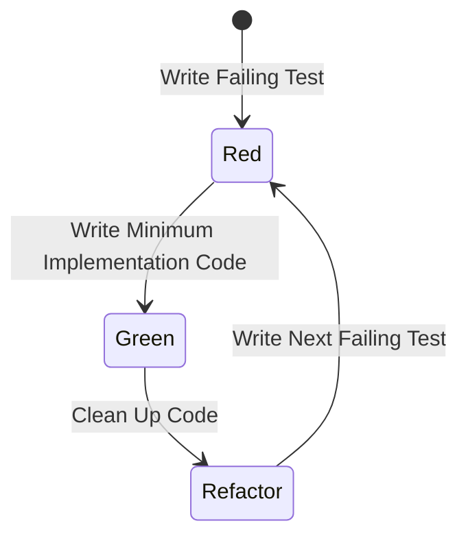
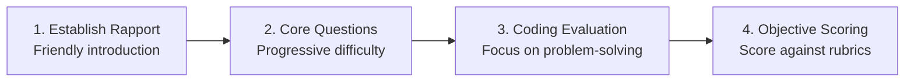

# 🏆 EPAM Senior Java Backend Engineer Interview Preparation Guide

This preparation guide is customized specifically for **Dang Trong Phuc** to pass the EPAM Senior Systems Engineer (L3) interview. 

It maps your unique professional background—combining **high-concurrency C++ game server engineering** and **advanced Java/Spring Boot microservices (including your 10-service FPM architecture)**—directly to the requirements of the EPAM Senior JD.

---

## 🗂️ Table of Contents
1. [Strategic Positioning: Bridging the "3 Years vs 5+ Years" Gap](#1-strategic-positioning-bridging-the-3-years-vs-5-years-gap)
2. [EPAM Interview Process & Assessment Rubric](#2-epam-interview-process--assessment-rubric)
3. [Module 1: High Concurrency, JVM & Java 21 Deep Dive](#3-module-1-high-concurrency-jvm--java-21-deep-dive)
4. [Module 2: Spring Ecosystem, JPA & Security Architecture](#4-module-2-spring-ecosystem-jpa--security-architecture)
5. [Module 3: Microservices, Event-Driven & Resilience Architecture](#5-module-3-microservices-event-driven--resilience-architecture)
6. [Module 4: Databases (SQL/NoSQL) & Caching Strategies](#6-module-4-databases-sqlnosql--caching-strategies)
7. [Module 5: Engineering Practices (TDD/BDD, CI/CD, Git)](#7-module-5-engineering-practices-tddbdd-cicd-git)
8. [Module 6: Senior Competencies (Mentorship, Code Review, Estimation, Troubleshooting)](#8-module-6-senior-competencies-mentorship-code-review-estimation-troubleshooting)
9. [Module 7: Performing Technical Interviews for EPAM](#9-module-7-performing-technical-interviews-for-epam)
10. [English Communication, Key Vocabulary & Recovery Phrases](#10-english-communication-key-vocabulary--recovery-phrases)

---

## 1. Strategic Positioning: Bridging the "3 Years vs 5+ Years" Gap

The JD asks for **at least 5 years of experience**, whereas your CV shows **3+ years (since mid-2022)**. To pass as a Senior (L3) at EPAM, you must demonstrate **Senior-level technical depth, architectural ownership, and leadership maturity**.

### 💡 Your Core Strengths to Leverage:
*   **Dual Tech Stack (C++17 + Java):** You understand low-level memory management, thread-safe synchronization, and CPU/memory profiling better than most pure-Java developers. Highlight how C++ concepts (like lock contention, memory alignment, mutexes) make you write extremely performant Java code.
*   **High-Concurrency & Scale:** You have designed backends supporting **5,000+ concurrent sessions** and load-tested systems up to **10,000+ concurrent users** at Gihot Studio.
*   **The FPM Project (10-Service Cloud-Native System):** This is your ultimate weapon. It demonstrates knowledge of Java 21, Spring Boot 3.5, Spring Cloud, gRPC, Apache Kafka, RabbitMQ, Redis, API Gateway, shared libraries, and Resilience4j. You must talk about this project as if it were a production-grade enterprise system.
*   **Performance Optimization:** You have practical numbers on query optimization (reducing JPA/SQL execution time by **40%** at Hahalolo and reducing DB load by **30%** via Redis at Gihot).

### ⚠️ Common Senior Traps to Avoid:
*   *Trap:* Giving simple, textbook answers. 
    *   *Solution:* Always explain the **why** behind a design, the **trade-offs** you made, and **how you verified it** (e.g., load testing, profiling).
*   *Trap:* Appearing as an individual contributor who only takes Jira tickets.
    *   *Solution:* Highlight your participation in technical analysis, designing APIs, mentoring juniors, defining code review checklists, and standardizing project codebases using shared libraries.

---

## 2. EPAM Interview Process & Assessment Rubric

EPAM uses a structured evaluation matrix. Interviewers score candidates from **None (0) to Strong (3)** across several competencies. To be hired at the Senior level, you need **Strong** in Core Java, Spring, and Architecture, and at least **Good** in databases, CI/CD, and soft skills.



### 📋 EPAM Core Grading Criteria

| Competency | Basic Expectation | Good (Mid) Expectation | Strong (Senior) Expectation |
| :--- | :--- | :--- | :--- |
| **Java Core** | Basic syntax, collections, OOP principles. | JVM memory model, Java 8 Stream API, basic multithreading. | GC tuning, memory dump analysis, Java 21 Virtual Threads, advanced Concurrency (`java.util.concurrent`). |
| **Spring Ecosystem** | Spring IoC, DI, writing basic REST Controllers. | Spring Boot autoconfiguration, Spring Data JPA, basic Spring Security. | Custom AOP, Transaction propagation internals, Security custom filters, Hibernate performance tuning (N+1, batch inserts). |
| **Architecture** | Simple MVC pattern, database relationships. | Designing standard REST APIs, understanding basic microservices (Eureka, Config Server). | Event-driven architecture (Kafka/RabbitMQ trade-offs), gRPC vs REST, distributed transactions (Saga, Outbox pattern), Resilience4j. |
| **Databases** | Writing SQL queries, basic joins. | Indexes (B-Tree), transaction isolation levels, JPA mappings. | Query optimization, explaining Execution Plans, database locking mechanisms, NoSQL database design (MongoDB vs Cassandra). |
| **Testing** | Writing JUnit tests, basic mocking. | Integration tests, Mockito usage, code coverage metrics. | TDD/BDD practices (Cucumber), Mocking complex scenarios, performance and load testing methodologies. |
| **Processes & CI/CD** | Basic Git commits, Maven builds. | Git branching (Gitflow), CI/CD pipelines (Jenkins), SonarQube quality gates. | Code review standards, mentoring junior engineers, writing technical proposals, task estimation techniques. |

---

## 3. Module 1: High Concurrency, JVM & Java 21 Deep Dive

### 🔑 Key Concepts to Master

#### 1. JVM Memory Model & Garbage Collection (GC)
*   **JVM Memory Areas:** Heap (Young Gen: Eden, S0, S1; Old Gen), Metaspace (off-heap metadata, replaced PermGen in Java 8), JVM Stacks (thread-local local variables, frame stacks), Program Counter (PC) Register, Native Method Stack.
*   **Garbage Collectors:**
    *   **G1GC (Garbage-First):** Default since Java 9. Divides heap into equal-sized regions. Incremental, compacting, aims for predictable pause times. Good for multi-gigabyte heaps.
    *   **ZGC (Z Garbage Collector):** Ultra-low latency collector introduced as production-ready in Java 15. Scales to terabytes of heap with pause times $< 1\text{ms}$. Performs all GC work concurrently with application threads.
*   **Memory Leaks in Java:** Can occur via static variables holding object references, unclosed resources (streams, connections), thread-local variables not removed, and custom caching configurations without eviction policies.



#### 2. Multithreading & Concurrency
*   **Thread Safety Mechanisms:**
    *   **synchronized block/method:** Reentrant monitor lock. Simple but can cause high thread contention.
    *   **ReentrantLock:** Explicit lock from `java.util.concurrent.locks`. Offers fair locking, tryLock, and interruptible locks.
    *   **Atomic classes (`AtomicInteger`, `AtomicReference`):** Use hardware-level **Compare-And-Swap (CAS)** operations. Lock-free and highly efficient under moderate contention.
    *   **Concurrent Collections:** `ConcurrentHashMap` (uses bucket-level locking or CAS, unlike thread-wide lock of `Hashtable`), `CopyOnWriteArrayList` (thread-safe, creates copy of array on write, excellent for read-heavy/write-rare scenarios).
*   **Thread Pools (`ThreadPoolExecutor`):** Key parameters to explain: `corePoolSize`, `maximumPoolSize`, `keepAliveTime`, `workQueue` (e.g., `LinkedBlockingQueue`, `SynchronousQueue`), and `RejectedExecutionHandler` policies (Abort, CallerRuns, Discard, DiscardOldest).

#### 3. Java 21 Features
*   **Virtual Threads (Project Loom):** Lightweight threads managed by the JVM rather than the OS. Enables the thread-per-request model to scale to millions of threads with minimal memory overhead. Perfect for I/O-bound applications.
*   **Record Classes:** Immutable data carriers with compiler-generated constructor, getters, `equals()`, `hashCode()`, and `toString()`.
*   **Pattern Matching for Switch:** Simplifies conditional logic based on object types.

---

### 💬 Sample Interview Q&A

**Q1: How does a `HashMap` work internally in Java 8+, and how is it different from `ConcurrentHashMap`?**
> *How to answer like a Senior:*
> "A `HashMap` works on the principle of hashing. It uses an array of Nodes (buckets), where each Node is a linked list (or a red-black tree in Java 8+ if the bucket size exceeds 8 and the total map capacity is $\ge 64$ to avoid $O(N)$ lookup degradation and secure against hash collision attacks, reducing lookup complexity to $O(\log N)$).
> 
> `HashMap` is not thread-safe. If multiple threads write to it concurrently, it can lead to race conditions, lost updates, or corrupted state.
> 
> To achieve thread-safety, we use `ConcurrentHashMap`. Unlike the legacy `Hashtable` which synchronizes the entire map, `ConcurrentHashMap` achieves high concurrency using segment/bucket-level locking in Java 8. For write operations, it locks only the head node of the specific bucket using `synchronized` blocks. For empty buckets, it uses lock-free **Compare-And-Swap (CAS)** operations to insert nodes. Read operations are lock-free and rely on volatile variables for immediate visibility of updates."

**Q2: You worked with high-concurrency game servers in C++ and Java. How did you eliminate race conditions and manage thread synchronization?**
> *How to answer like a Senior (referencing Gihot Studio experience):*
> "At Gihot Studio, we managed real-time room and player states supporting 5,000+ concurrent sessions. In game servers, state updates occur rapidly (e.g., movement, matchmaking, action processing). 
> 
> In C++, we used **mutex locks** and **atomic operations** to protect shared room states. In Java, to prevent race conditions and optimize thread performance, we designed a **thread-per-room** or **actor-like model** rather than having arbitrary threads read and write to the same state. Each room state was processed by a single dedicated execution thread from a task queue. 
> 
> For operations that crossed rooms (like matchmaking), we used lock-free data structures like `ConcurrentLinkedQueue` and atomic references to update player balances and match states. This minimized lock contention and prevented deadlocks, keeping our client-server round-trip time (RTT) under 50ms."

---

## 4. Module 2: Spring Ecosystem, JPA & Security Architecture

### 🔑 Key Concepts to Master

#### 1. Spring Framework & Spring Boot Core
*   **Inversion of Control (IoC) & Dependency Injection (DI):** Container manages object lifecycles and dependencies. Explain Constructor Injection (recommended for immutability and ease of testing) vs Field Injection (violates encapsulation, harder to write unit tests).
*   **Spring AOP (Aspect-Oriented Programming):** Cross-cutting concerns (logging, security, transaction management) decoupled via Aspects, Joins Points, Advice (`@Before`, `@After`, `@Around`), and Pointcuts. Uses JDK Dynamic Proxies (for interfaces) or CGLIB (for concrete classes).
*   **Spring Boot Autoconfiguration:** Uses `@EnableAutoConfiguration` (imported via `@SpringBootApplication`). It scans the classpath for jar dependencies and automatically registers beans based on `@ConditionalOnClass`, `@ConditionalOnMissingBean`, etc.

#### 2. Spring Data JPA & Hibernate Performance Tuning
*   **Entity States:** New (Transient), Managed (Persistent), Detached, Removed.
*   **The N+1 Query Problem:** Occurs when fetching a collection of child entities eagerly or lazily, causing Hibernate to run 1 query for the parent list and $N$ additional queries to fetch children for each parent.
    *   *Fixes:* Use `JOIN FETCH` in JPQL/HQL, specify `@EntityGraph`, or configure batch fetching using `@BatchSize`.
*   **First-Level Cache vs Second-Level Cache:** First-level is session-scoped (always enabled). Second-level is JVM/SessionFactory-scoped (requires configuration, e.g., using Ehcache or Redis).



#### 3. Spring Security & JWT Architecture
*   **Security Filter Chain:** A chain of Servlet Filters (e.g., `UsernamePasswordAuthenticationFilter`, `BasicAuthenticationFilter`) that intercept incoming requests to authenticate credentials, validate tokens, and enforce authorization rules.
*   **JWT (JSON Web Token):** Composed of Header (algorithm & type), Payload (claims, issuer, subject, expiration), and Signature (secret/public key hash). Stateless authentication.
*   **Defense-in-Depth Security:** Implementing security validation at multiple layers—validating tokens at the API Gateway (checking against a Redis blacklist for logged-out/revoked tokens) and re-validating roles and object-level ownership downstream.

---

### 💬 Sample Interview Q&A

**Q1: How do you configure and optimize JPA/Hibernate to handle high-throughput databases?**
> *How to answer like a Senior (referencing Hahalolo experience):*
> "To optimize the database layer at Hahalolo, where we reduced SQL execution times by ~40%, we applied several strategic techniques:
> 
> 1. **Fixed N+1 Queries:** We audited our endpoints and replaced default lazy-loading retrievals with custom JPQL queries using `JOIN FETCH` or JPA `@EntityGraph` for parent-child entities.
> 2. **Batch Processing:** We configured batch inserts and updates using properties like `spring.jpa.properties.hibernate.jdbc.batch_size=50` and `spring.jpa.properties.hibernate.order_inserts=true` to reduce database network round-trips.
> 3. **Read-Only Transactions:** We explicitly marked read-only service methods with `@Transactional(readOnly = true)`. This prompts Hibernate to disable dirty checking on managed entities, saving memory and CPU cycles.
> 4. **Query Profiling:** We used SQL logging to analyze the execution plans of long-running queries, ensuring they hit optimal composite indexes."

**Q2: Explain `@Transactional` propagation options. What happens if a method with `REQUIRED` calls a method with `REQUIRES_NEW`?**
> *How to answer like a Senior:*
> "Spring's `@Transactional` propagation controls how transactions behave when nested method calls occur:
> *   `REQUIRED` (Default): Joins the active transaction if one exists; otherwise, creates a new one.
> *   `REQUIRES_NEW`: Suspends the active transaction (if any) and creates a new, independent transaction.
> *   `NESTED`: Executes within a nested transaction using savepoints if a transaction is active. If the nested transaction rolls back, it rolls back only to the savepoint, keeping the outer transaction active.
> 
> If a method marked with `REQUIRED` calls a method with `REQUIRES_NEW`:
> The outer transaction starts. When the inner method is invoked, the outer transaction is suspended. A new connection is obtained from the pool, and a new transaction is started. If the inner transaction fails and throws an exception, it rolls back. If that exception propagates up to the outer method and is not caught, both transactions will roll back. However, if the outer method catches the exception (e.g., inside a try-catch block), the outer transaction can still commit successfully while the inner transaction remains rolled back."

---

## 5. Module 3: Microservices, Event-Driven & Resilience Architecture

### 🔑 Key Concepts to Master

#### 1. Communication Patterns
*   **REST API:** Synchronous, HTTP-based, payload in JSON. Great for client-to-service communication.
*   **gRPC:** High-performance, low-latency RPC framework. Uses **HTTP/2** (multiplexing requests over a single TCP connection, bidirectional streaming) and **Protocol Buffers** (binary serialization, smaller payloads than JSON). Ideal for inter-service communication.
*   **Event-Driven (Messaging):** Asynchronous, decoupled communication via brokers (Kafka, RabbitMQ). Great for background processing, transaction logs, and pub/sub notifications.



#### 2. Apache Kafka vs RabbitMQ
*   **Apache Kafka:**
    *   *Design:* Distributed commit log. Message ordering is guaranteed within a partition.
    *   *Mechanism:* Pull-based (consumers pull messages at their own pace). Retains messages on disk according to retention policies (not deleted immediately after consumption).
    *   *Best for:* High-throughput real-time streaming, event sourcing, log aggregation.
*   **RabbitMQ:**
    *   *Design:* Traditional message broker using AMQP (Exchanges, Queues, Routing Keys).
    *   *Mechanism:* Push-based. Messages are deleted once consumed and acknowledged.
    *   *Best for:* Complex routing (using topic/direct/headers exchanges), background task dispatching, processing requiring individual message acknowledgments and flexible retries with backoff.

#### 3. Microservice Resilience & Patterns
*   **API Gateway:** Single entry point that handles routing, rate limiting, and security validation (e.g., checking JWT signatures and blacklists).
*   **Service Discovery (Eureka):** Dynamically tracks instances of microservices, allowing services to discover each other's network locations without hardcoding.
*   **Circuit Breaker (Resilience4j):** Prevents cascading failures. If a downstream service fails repeatedly, the circuit breaker opens, immediately returning a fallback response without wasting threads waiting for timeouts.
*   **Anti-Corruption Layer (ACL):** A translation layer that prevents downstream microservices from being tightly coupled to legacy, third-party, or upstream domain models.

---

### 💬 Sample Interview Q&A

**Q1: In your personal project (FPM), you designed a dual-broker event-driven architecture using both Apache Kafka and RabbitMQ. Why did you choose to use both, and how did they coordinate?**
> *How to answer like a Senior:*
> "In the Financial Portfolio Manager (FPM) system, I designed a dual-broker architecture because the two systems have distinct performance profiles and messaging models that match different domains:
> 
> 1. **Apache Kafka** was used for high-throughput, sequential transaction streaming. In the transaction domain, transaction ledger entries must be processed in strict chronological order and stored persistently. I designed a Kafka cluster with 8 partitions, partitioning by `walletId` to guarantee that transactions for a specific user wallet were processed in order by the consumer group.
> 
> 2. **RabbitMQ** was selected for orchestrating domain events and system notifications (such as `wallet.created`, `balance.changed`, or `budget.alerts`). These events require flexible routing (e.g., sending budget alerts to email and push notification microservices simultaneously via a Fanout or Topic exchange) and reliable delivery. 
> 
> RabbitMQ's built-in support for dead-letter exchanges (DLX) and automatic retry mechanisms with exponential backoff made it perfect for transient system integration tasks, while Kafka served as the immutable source of truth for financial logs."

**Q2: How do you secure microservices in a production environment? Explain your JWT strategy in FPM.**
> *How to answer like a Senior:*
> "We implement a **defense-in-depth JWT security strategy** to secure inter-service communication:
> 
> 1. **Gateway Layer:** The API Gateway acts as the gatekeeper. It intercepts all incoming client requests, extracts the JWT from the `Authorization` header, validates its cryptographic signature (using a shared secret or public key), and checks the token signature against a **Redis blacklist** (to invalidate tokens immediately upon user logout or password reset).
> 
> 2. **Downstream Propagation:** Once validated, the Gateway strips the client credentials and forwards the request downstream, appending custom security headers such as `X-User-Id` and `X-User-Roles`.
> 
> 3. **Downstream Validation:** Each downstream service uses a shared internal security library (`fpm-security`) to parse these headers and enforce local authorization checks (using Spring Security's method security, like `@PreAuthorize`). This library also validates row-level ownership to prevent mass assignment or horizontal privilege escalation attacks, ensuring that a user cannot access or modify transaction data belonging to another user."

---

## 6. Module 4: Databases (SQL/NoSQL) & Caching Strategies

### 🔑 Key Concepts to Master

#### 1. Relational Database Performance Tuning
*   **Indexing Strategies:**
    *   **B-Tree Indexes:** Default index type. Excellent for equality (`=`) and range queries (`>`, `<`, `BETWEEN`).
    *   **Composite Indexes:** Index on multiple columns. Order of columns matters (must match the query's filter from left to right - the Leftmost Prefix Rule).
    *   **Index Scan vs Index Seek:** Scan reads the entire index tree. Seek traverses the tree directly to the target leaf nodes (much faster).
*   **Execution Plans (`EXPLAIN`):** The output generated by the database query optimizer showing how a query will be executed (e.g., table scans, index scans, nested loops, hash joins).
*   **Transaction Isolation Levels:**
    *   `READ UNCOMMITTED`: Allows dirty reads.
    *   `READ COMMITTED`: Prevates dirty reads, allows non-repeatable reads.
    *   `REPEATABLE READ`: Prevents non-repeatable reads, allows phantom reads (default in MySQL InnoDB).
    *   `SERIALIZABLE`: Prevents all anomalies; uses shared and exclusive locks.



#### 2. NoSQL & Caching Strategies
*   **Redis Caching Patterns:**
    *   **Cache-Aside (Lazy Loading):** Application queries the cache. If a cache miss occurs, it queries the database, writes the result to the cache, and returns it.
    *   **Write-Through:** Application writes to the cache, and the cache writes directly to the database.
    *   **Cache Eviction Policies:** `LRU` (Least Recently Used), `LFU` (Least Frequently Used), `TTL` (Time To Live).
*   **NoSQL Database Selection:**
    *   **MongoDB:** Document store. Ideal for catalog management, user profiles, or dynamic schemas.
    *   **Cassandra:** Partitioned wide-column store. Designed for write-heavy applications requiring linear scalability and high availability (e.g., time-series sensor data, financial logging).

---

### 💬 Sample Interview Q&A

**Q1: How do you identify and optimize a slow-running SQL query?**
> *How to answer like a Senior:*
> "To optimize a slow-running query, I follow a systematic approach:
> 
> 1. **Analyze with EXPLAIN:** I run `EXPLAIN` or `EXPLAIN ANALYZE` on the query to view its execution plan. I look for operations like Full Table Scans (`ALL`), high cost values, or large temp tables on disk.
> 2. **Check Index Coverage:** I check if the query filters (`WHERE` clauses) and join conditions (`ON` clauses) are utilizing existing indexes. If it is a composite query, I verify if the columns follow the leftmost prefix rule. If missing, I create targeted indexes.
> 3. **Eliminate Wildcards and Subqueries:** I rewrite queries to avoid leading wildcards (e.g., `LIKE '%value%'` which bypasses indexes) and replace slow correlated subqueries with optimized `JOIN` statements.
> 4. **Avoid SELECT \*:** I fetch only the specific columns required by the application. This reduces network load and allows the database to use covering indexes, where it can return results directly from the index tree without fetching the actual table blocks.
> 5. **Audit Database Statistics:** If the execution plan is using the wrong index, I run commands like `ANALYZE TABLE` to update database metadata, ensuring the query planner has accurate statistics."

---

## 7. Module 5: Engineering Practices (TDD/BDD, CI/CD, Git)

### 🔑 Key Concepts to Master

#### 1. Testing Methodologies (TDD / BDD)
*   **TDD (Test-Driven Development):** A development process where you write tests *before* writing the implementation code.
    *   *Lifecycle:* **Red** (write failing test) $\rightarrow$ **Green** (write minimum code to pass test) $\rightarrow$ **Refactor** (clean up code while keeping tests green).
*   **BDD (Behavior-Driven Development):** Extends TDD by writing tests in a natural language (English) that non-technical stakeholders can understand. Uses Gherkin syntax (**Given-When-Then**). Implemented in Java using Cucumber.
*   **Mockito Framework:** Mocking dependencies to isolate the class under test.
    *   `@Mock`: Creates a mock instance of a class.
    *   `@InjectMocks`: Instantiates the class under test and injects `@Mock` fields into it.
    *   `@Spy`: Wraps a real object, allowing you to stub specific methods while keeping the rest real.



#### 2. CI/CD & Code Quality Tools
*   **Maven Build Lifecycle:** `clean` $\rightarrow$ `validate` $\rightarrow$ `compile` $\rightarrow$ `test` $\rightarrow$ `package` $\rightarrow$ `verify` $\rightarrow$ `install` $\rightarrow$ `deploy`.
*   **Git Best Practices:**
    *   **Rebase vs Merge:** `git merge` combines branches by creating a new merge commit (preserving history). `git rebase` rewrites history by applying commits from one branch onto another, resulting in a clean, linear commit log.
    *   **Cherry-pick:** Applies the changes introduced by an individual commit from another branch onto the current branch.
*   **SonarQube & Quality Gates:** Static analysis tool to detect bugs, vulnerabilities, and code smells. Quality Gates define thresholds (e.g., minimum 80% test coverage, 0 blocker bugs, security rating A) that a build must pass before it can be merged.

---

### 💬 Sample Interview Q&A

**Q1: How do you implement TDD/BDD practices in a Spring Boot project?**
> *How to answer like a Senior:*
> "To implement TDD, I start by defining the class interface and writing failing unit tests in JUnit 5. For example, if I'm building a transfer service, I write tests for successful transfer, insufficient balance, and invalid account scenarios. The tests initially fail (Red). Then, I write the minimum implementation code in the service class to make the tests pass (Green). Finally, I refactor the code to improve readability and enforce DRY and SOLID design principles, running the tests continuously to ensure no regressions occur.
> 
> For BDD, we define user stories in feature files using Gherkin syntax. For example:
> ```gherkin
> Feature: Wallet Transfer
>   Scenario: Transferring money between wallets
>     Given the sender wallet has a balance of $100
>     And the receiver wallet has a balance of $50
>     When the sender transfers $30 to the receiver
>     Then the sender wallet should have a balance of $70
>     And the receiver wallet should have a balance of $80
> ```
> We then implement glue code using Cucumber and Spring Boot's `@SpringBootTest` to execute these scenarios. BDD bridges the gap between developers, QA, and business stakeholders."

---

## 8. Module 6: Senior Competencies (Mentorship, Code Review, Estimation, Troubleshooting)

To satisfy the senior expectations in the JD, you must speak confidently about **non-coding technical responsibilities**.

### 🛠️ Mentorship & Code Review Checklist

When reviewing code, a Senior Developer does not just check if the code runs. You should guide the team on:

*   **SOLID Principles:** Is the code open for extension but closed for modification? Are dependencies injected rather than instantiated inside classes?
*   **Performance:** Are there potential memory leaks (e.g., resources left unclosed), missing indexes, or N+1 queries?
*   **Security:** Is input data properly validated? Are JWT claims parsed securely? Are there potential SQL injection risks?
*   **Testability:** Is the code easy to test? Are there clean unit and integration tests?

### ⏱️ Task Estimation & Agile Scrum

How to estimate tasks accurately:
1. **Analyze Requirements:** Review the functional and non-functional requirements.
2. **Decompose the Task:** Break the user story into smaller technical tasks (e.g., Database migrations, service logic, API endpoints, integration tests).
3. **Use Story Points / Planning Poker:** Estimate using relative sizing (Fibonacci sequence: 1, 2, 3, 5, 8). 
4. **Account for Risks:** Factor in testing overhead, code review, deployment, and dependency integrations.

---

### 💬 Sample Interview Q&A

**Q1: How do you perform a code review? What specific criteria do you look for?**
> *How to answer like a Senior:*
> "During a code review, I look beyond basic syntax and focus on design, security, performance, and maintainability:
> 
> 1. **SOLID & Design Patterns:** I check if the implementation adheres to SOLID principles. For example, is a class doing too many things, violating the Single Responsibility Principle?
> 2. **Performance Bottlenecks:** I look for database query patterns, such as checking if JPA queries might trigger the N+1 problem, or if collection manipulation can be optimized.
> 3. **Security:** I verify that input validation is enforced (e.g., using `@Valid` annotations) to prevent injection attacks and that authorization filters are correctly configured.
> 4. **Test Quality:** I ensure that the code has sufficient unit tests with Mockito and integration tests covering both happy paths and edge cases, aiming for a minimum of 80% coverage.
> 
> Most importantly, I keep code reviews constructive. If I see a problem, I explain *why* it's a concern and suggest a concrete improvement or design pattern to resolve it, using the opportunity to mentor junior engineers on the team."

**Q2: A production JVM application suddenly experiences 100% CPU usage or throws OutOfMemoryError. How do you troubleshoot this?**
> *How to answer like a Senior:*
> "I follow a structured diagnostic workflow to resolve production issues:
> 
> 1. **High CPU Usage:**
>    *   I log into the server and use OS tools like `top -H` to find the specific thread IDs consuming the most CPU.
>    *   I generate a thread dump using `jstack <pid> > thread_dump.txt`.
>    *   I convert the high-CPU OS thread ID to hexadecimal (since thread dumps represent thread IDs in hex format) and locate that thread in the thread dump to identify the exact line of code causing the CPU spike (often an infinite loop, lock contention, or heavy GC activity).
> 
> 2. **OutOfMemoryError (OOM):**
>    *   I configure JVM flags in production: `-XX:+HeapDumpOnOutOfMemoryError` and `-XX:HeapDumpPath=/path/to/dumps` to automatically capture the state of the heap when OOM occurs.
>    *   I analyze the heap dump using tools like **Eclipse Memory Analyzer (MAT)** or **VisualVM**.
>    *   I look for the leak suspects, checking the dominator tree to see which objects are occupying the most memory and tracing their references back to the GC roots to identify why they aren't being garbage collected."

---

## 9. Module 7: Performing Technical Interviews for EPAM

One of your responsibilities under this JD is to **conduct technical interviews**. The EPAM interview panel will want to see that you are capable of evaluating other developers objectively.

### 🎯 Key Principles of EPAM Interviewing



1. **Structured Coding Assessment:** Do not just check if their code compiles. Evaluate:
   *   How they structure their thoughts before writing code.
   *   Do they ask clarifying questions (e.g., edge cases, input size, null/empty checks)?
   *   Their analysis of Time and Space complexity.
2. **Behavioral Probing:** Ask situational questions to evaluate candidates' real-world experiences. For example, if a candidate claims they know Spring Security, ask: *"How did you implement role-based access control in your last project?"*
3. **Objective Evaluation:** Score candidates based on their technical depth, communication skills, and problem-solving approach. Avoid bias and ensure your scoring is consistent and well-documented.

---

### 💬 Sample Interview Q&A

**Q1: How would you evaluate a candidate's live coding performance?**
> *How to answer like a Senior:*
> "When evaluating a candidate's live coding, I look for three things:
> 
> 1. **Problem Analysis:** Does the candidate immediately start coding, or do they pause to understand the requirements, check input constraints, and discuss potential edge cases?
> 2. **Communication & Reasoning:** I encourage candidates to think out loud. I want to see how they reason through potential approaches, compare time and space trade-offs, and adjust their strategy when they encounter issues.
> 3. **Clean Code & Edge Cases:** I look for readable naming conventions, modular functions, and handling of boundary conditions (such as empty inputs, null pointers, or integer overflow). 
> 
> Even if they do not arrive at the most optimal solution, a candidate who communicates their thought process clearly, writes clean code, and reasons about complexity is often a stronger candidate than one who writes a fast solution in silence."

---

## 10. English Communication, Key Vocabulary & Recovery Phrases

Since your target level is **B1 and above (working towards B2)**, the key is **clarity, structure, and professional vocabulary**.

### 📖 Professional Technical Vocabulary

| Instead of saying... | Say this instead... |
| :--- | :--- |
| "I did a project..." | "I **architected** and **implemented** a system..." |
| "I fixed the slow database..." | "I **optimized query performance** and **reduced latency**..." |
| "My system is very fast..." | "The system was **stress-tested** to support **high-concurrency** loads..." |
| "I helped a junior dev..." | "I **mentored** junior developers and **conducted code reviews**..." |
| "I don't know this." | "I haven't had the opportunity to use that in production, but **based on my understanding**..." |

### 🛠️ Emergency Recovery Phrases

*   **When you don't understand the question:**
    *   *"Could you please rephrase the question? I want to make sure I fully understand what you're asking."*
    *   *"Just to clarify, are you asking about [Topic A] or [Topic B]?"*
*   **When you need a moment to think:**
    *   *"That's an interesting question. Let me take a moment to structure my thoughts."*
    *   *"Let me think about that for a second..."*
*   **When you make a mistake and want to correct it:**
    *   *"Let me correct myself. What I meant to say was..."*
    *   *"Actually, looking back at my previous point, I would like to clarify that..."*
*   **When you don't know the answer but want to show your reasoning:**
    *   *"I haven't used that specific feature in a production environment, but based on my knowledge of [related concept], I would expect it to work like this..."*

---

### 📅 Recommended Study Schedule (3-Week Plan to Pass EPAM)

*   **Week 1: Core Tech Mastery**
    *   Study **Module 1 (Java & Concurrency)** and **Module 2 (Spring & JPA)**.
    *   Review `HashMap` internals, GC algorithms (G1GC, ZGC), and JPA N+1 fixes.
*   **Week 2: Distributed Systems & DB**
    *   Study **Module 3 (Microservices, Kafka vs RabbitMQ)** and **Module 4 (SQL/NoSQL)**.
    *   Practice explaining your **FPM project architecture** (10-service system) in 5 minutes.
*   **Week 3: Leadership, Process & English Mock Practice**
    *   Review **Module 6 (Senior Competencies)** and **Module 7 (Interviewer Skills)**.
    *   Practice speaking out loud using the **STAR method** to answer behavioral questions.
