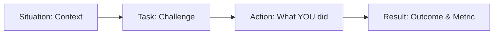

# 🎯 HR & Talent Attraction Specialist English Interview Script (60 Minutes)
**Candidate:** Dang Trong Phuc | Backend Developer (C++ / Java / High Concurrency & Microservices)

---

> [!NOTE]
> **Understanding Your Interviewer:**  
> A **Talent Attraction Specialist / HR Recruiter** evaluates 3 main dimensions:
> 1. **Communication & English Fluency:** Ability to articulate technical experience clearly, logically, and professionally in English (B1/B2 level).
> 2. **Cultural Fit & Soft Skills:** Problem-solving mindset, teamwork (with QA, DevOps, clients), accountability, and career motivation.
> 3. **CV Authenticity & Core Competencies:** Verifying that your practical experience matches job requirements (e.g., C++17, Spring Boot, microservices, system scale).

---

## 🕒 Typical 60-Minute HR Interview Breakdown

```mermaid
gantt
    title 60-Minute Talent Attraction Specialist Interview Timeline
    dateFormat  mm
    axisFormat %M min
    Warm-up & Casual Greeting             :00, 05m
    Self-Introduction & CV Summary         :05, 10m
    Deep Dive: Projects & Technical Stack  :15, 20m
    Behavioral & Situational Questions     :35, 15m
    Motivation, Compensation & Logistics  :50, 05m
    Candidate Q&A for HR                   :55, 05m
```

---

## 💬 Phase 1: Warm-up & Self-Introduction (0 - 15 mins)

### 1. Small Talk & Greetings
* **HR:** *"Hi Phuc, welcome! How are you doing today? How is your week going?"*
* **Phuc:**  
  > *"Hi [Interviewer's Name], I’m doing great, thank you! It’s a pleasure to connect with you today. My week has been quite productive, and I’ve been really looking forward to this interview."*

---

### 2. Elevator Pitch (Tell Me About Yourself)
> [!TIP]
> **Formula:** Current Role & Core Strength (30s) $\rightarrow$ Key Achievements & Technical Stack (40s) $\rightarrow$ Personal Project/Growth (20s) $\rightarrow$ Why you are here (15s).

* **HR:** *"Could you start by giving me a summary of your background and experience?"*
* **Phuc:**  
  > *"Sure! My name is **Phuc**, and I am a **Backend Developer with over 3 years of experience** specializing in high-concurrency game servers and scalable microservice architectures.*
  >
  > *Currently, I work at **Gihot Studio** where I design and build C++ 11 game server logic and Java/Spring Boot microservices. My primary focus is handling high-concurrency systems—supporting over **5,000 concurrent player sessions** with sub-50 milliseconds latency using **C++ 11, java, gRPC, Redis, RabbitMQ, MySQL, and Spring Boot**.*
  >
  > *Before Gihot, I worked at **Hahalolo**, a travel social network platform, where I built scalable REST APIs using Java and Spring Boot, optimizing database queries by **40%**.*
  >
  > *On top of my production experience, I’m deeply passionate about cloud-native engineering. Recently, I built **Financial Professional Manager**, a personal cloud-native project consisting of **10 microservices** using Java 21, Spring Cloud, Kafka, and gRPC.*
  >
  > *I'm here today because I want to bring my background in high-performance backends to your team and take on bigger distributed system challenges."*

---

## 🛠️ Phase 2: CV & Project Deep Dive (15 - 35 mins)

The HR specialist will ask you to explain your roles at **Gihot Studio**, **Hahalolo**, and your personal projects.

### Question 1: *"Can you explain your main responsibilities at Gihot Studio?"*
* **Key Talking Points:** Dual stack (C++ & Java), Game logic, Latency optimization, Team collaboration.
* **Sample Response:**
  > *"At Gihot Studio, I work in an Agile team of over 20 engineers. My responsibilities cover two main areas:*
  > 
  > 1. **Core Game Server Logic (C++17):** I engineer thread-safe matchmaking engines, player state management, and round lifecycles for real-time multiplayer mobile games. I used mutex locks and atomic operations to eliminate race conditions under heavy traffic.
  > 2. **gRPC Services & Admin Tools (Java/Spring Boot):** I designed gRPC inter-service communications using Protocol Buffers to keep latency below 50ms. I also built Spring Boot microservices for administrative GM tools and real-time monitoring.
  >
  > *One of my biggest highlights was stress-testing our backend up to **10,000 virtual concurrent users**, identifying performance bottlenecks, and achieving a **25% end-to-end latency reduction**."*

---

### Question 2: *"Why do you use both C++ and Java/Spring Boot? How do you choose between them?"*
* **Key Talking Points:** Performance vs Productivity / Ecosystem.
* **Sample Response:**
  > *"That’s a great question. We choose the right tool based on the specific requirement:*
  > - **C++17** is chosen for **ultra-low latency and raw performance** (game server loops, state synchronization) where we need direct memory management and CPU efficiency.
  > - **Java / Spring Boot** is ideal for **rapid development, business logic, microservices, and management dashboards** due to its rich ecosystem, Spring Security, and quick database integrations with JPA/Hibernate.*
  > 
  > *Having dual expertise allows me to write high-performance core modules while also building robust enterprise services around them."*

---

### Question 3: *"Tell me about your experience at Hahalolo Social Network."*
* **Key Talking Points:** Java 8, RESTful APIs, Spring Security, DB query optimization.
* **Sample Response:**
  > *"At Hahalolo, I was part of a 10+ developer backend team building a high-traffic travel social platform.
  > 
  > My core focus was building scalable **RESTful APIs** and securing them with **Spring Security and JWT role-based access control (RBAC)**. 
  > 
  > A major contribution of mine was profiling and tuning heavy SQL queries and JPA/Hibernate layers, which reduced query execution time by approximately **40%** and improved overall throughput under high production load."*

---

### Question 4: *"Can you tell me about a project you are most proud of?"*
* **Key Talking Points:** **FPM (Financial Portfolio Manager)** — Cloud-native microservices architecture.
* **Sample Response:**
  > *"I am particularly proud of my personal project called **FPM (Financial Portfolio Manager)**. It is a **10-service cloud-native microservice architecture** built with modern Java 21, Spring Cloud 2025, gRPC, Kafka, and RabbitMQ.
  > 
  > I designed a **dual-broker event-driven architecture**: using **Kafka** for high-throughput financial transaction streams and **RabbitMQ** for domain event routing (like budget alerts and wallet events).
  > 
  > I also implemented resilience patterns with **Resilience4j Circuit Breaker** and rate-limiting to protect downstream databases. It really showcases my full-stack backend capabilities—from microservice design to security and event streaming."*

---

## 🌟 Phase 3: Behavioral & Situational Questions (STAR Method) (35 - 50 mins)

> [!IMPORTANT]
> Use the **STAR Method** (Situation $\rightarrow$ Task $\rightarrow$ Action $\rightarrow$ Result) for behavioral questions. Keep technical jargon light so HR can understand your soft skills.



---

### Situation 1: Production Incident / High Pressure
* **HR:** *"Can you share an instance where you faced a production bug or heavy load issue? How did you resolve it?"*
* **Phuc (STAR Response):**
  > - **Situation:** At Gihot Studio, during stress testing at 10,000 concurrent virtual users, we noticed database CPU spikes and increased latency in player matchmaking.
  > - **Task:** My task was to identify the root cause and optimize latency to keep client-server response times within acceptable limits.
  > - **Action:** I performed systematic profiling. I identified that session data was querying MySQL directly on every request. I redesigned our caching architecture by placing a **Redis caching layer** for active player sessions and implemented **RabbitMQ async message queues** to process non-critical game events off the main thread.
  > - **Result:** This reduced database load by **30%**, lowered API response times by **20%**, and brought our end-to-end latency down by **25%** under peak load.

---

### Situation 2: Conflict Resolution / Working with Cross-Functional Teams
* **HR:** *"How do you collaborate with QA, DevOps, or Client (Frontend/Game) teams when there are disagreements?"*
* **Phuc (STAR Response):**
  > - **Situation:** During client-server integration for a real-time game, the Client team experienced sync latency and blamed the backend gRPC endpoints.
  > - **Task:** As the Backend lead for that component, I needed to clarify the bottleneck without causing friction between teams.
  > - **Action:** Instead of assuming, I suggested setting up a joint debugging session. I used **Postman** and internal logging metrics to benchmark the exact gRPC payload execution time vs network delivery latency. We realized the schema payload was uncompressed over HTTP.
  > - **Result:** We optimized our **Protobuf schema payload** together. The client response time dropped under **50ms**, and we built strong mutual trust across frontend and backend teams.

---

### Situation 3: Learning New Tech Under Tight Deadlines
* **HR:** *"How do you approach learning new technologies when required for a project?"*
* **Phuc (STAR Response):**
  > *"I am a proactive learner. When I started working with C++17 modern features and gRPC Protobuf at Gihot Studio, I didn't just read documentation. I built small prototype POCs (Proof of Concepts) to test thread-safety, mutex locks, and memory overhead before applying them to production.*
  > 
  > *I also stay updated with modern tech by building personal projects like FPM using **Java 21, Spring Boot 3.5, and Apache Kafka**."*

---

## 💰 Phase 4: Motivation, Salary & HR Logistics (50 - 55 mins)

### 1. Motivation & Leaving Reason
* **HR:** *"Why are you looking for a new job opportunity right now?"*
* **Phuc:**  
  > *"I have had a great time growing at Gihot Studio, building core game servers and learning C++ and high-concurrency logic. 
  > However, I am seeking a new challenge where I can contribute to **larger-scale distributed systems**, work in an **international/growth-oriented environment**, and further develop my career as a senior backend engineer."*

---

### 2. Why Our Company?
* **HR:** *"Why are you interested in joining our company?"*
* **Phuc:**  
  > *"I've been following [Company Name]'s products and engineering culture. I'm really impressed by your focus on [mention Company's domain, e.g., high-scale fintech, global enterprise services, SaaS]. 
  > Given my hands-on background in high-concurrency backends, low-latency microservices, and performance tuning, I believe I can make an immediate positive impact on your engineering deliverables."*

---

### 3. Career Goals (3-5 Years)
* **HR:** *"Where do you see yourself in 3 to 5 years?"*
* **Phuc:**  
  > *"In 3 to 5 years, I see myself growing into a **Senior Backend Developer / Technical Lead**. I want to deepen my expertise in system design, cloud architecture, and high-availability systems while mentoring junior developers and driving key architectural decisions."*

---

### 4. Notice Period & Salary Expectation
* **HR:** *"What is your notice period and salary expectation?"*
* **Phuc:**  
  > - **Notice Period:** *"My standard notice period at my current company is **30 days** after formal offer acceptance."*
  > - **Salary Expectation:** *"Based on my 3+ years of backend experience in C++, Java/Spring Boot microservices, high-concurrency systems, and current market benchmarks, my target compensation is around **[Insert Your Target Gross Range, e.g., 30,000,000 - 38,000,000 VND / month gross]** (or $X,XXX Gross). However, I am open to discussing the total package, including bonuses, benefits, and growth opportunities."*

---

## 🙋‍♂️ Phase 5: Smart Questions for Candidates to Ask HR (55 - 60 mins)

> [!TIP]
> Always ask 2-3 engaging questions at the end to show professionalism and strong interest.

1. **About Engineering Team & Culture:**  
   * *"Could you share a bit about the structure of the engineering team I would be joining and your current working model (Hybrid/Remote)?"*
2. **About Next Steps & Hiring Process:**  
   * *"What are the upcoming technical interview rounds after this general screening call?"*
3. **About Success Metrics:**  
   * *"From your perspective, what key attributes make a developer successful in this role and within your company culture?"*

---

## 🚀 Appendix: Fluency Cheat Sheet for B1 to B2 Transition

### 🔑 Power Verbs & Transition Phrases

| Goal | Recommended English Phrases |
| :--- | :--- |
| **Introducing a point** | *"Specifically speaking...", "In terms of my experience...", "To give you an overview..."* |
| **Highlighting Results** | *"As a direct result of this...", "This achieved a ~30% improvement in...", "This allowed the system to scale to..."* |
| **Handling hard questions** | *"That's a great question. Let me structure my response...", "In my experience..."* |
| **Expressing enthusiasm** | *"I'm particularly passionate about...", "I really enjoyed working on...", "I thrive in..."* |

---

> [!SUCCESS]
> **Pro Tip for Practice:** Read this script out loud 2–3 times before your interview. Practice pacing your speech at ~130-140 words per minute and pausing briefly between thoughts. Good luck!
