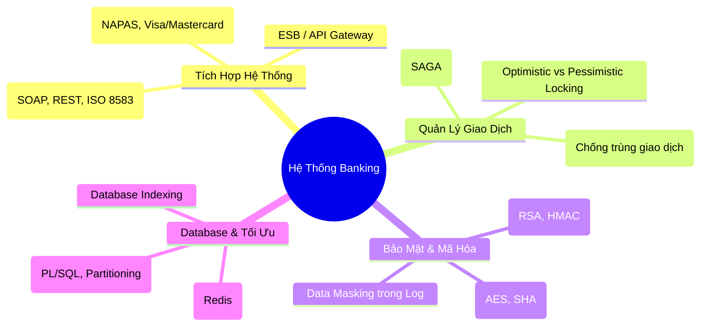

# Tài Liệu Ôn Tập Cấp Tốc - Java Developer (Banking/Fintech Project)
*Góc nhìn từ Senior Software Engineer tại VPBank dành cho ứng viên Đặng Trọng Phúc*

Chào Phúc, dưới góc nhìn của một Senior Software Engineer đã có nhiều năm làm việc trong hệ thống Core Banking và các dự án Digital Banking (như VPBank NEO) tại văn phòng Hàm Nghi, mình xin gửi tới bạn bản phân tích chi tiết về **Job Description (JD) của KAI ASIA** và cách ánh xạ nó vào **CV hiện tại của bạn**.

Dự án này tuyển Onsite tại Hàm Nghi, Quận 1 và có yêu cầu tích hợp Core Banking/Payment Gateway. Đây gần như chắc chắn là một dự án outsource/co-sourcing cho các khối công nghệ của Ngân hàng lớn (có thể là VPBank, MSB hoặc một tổ chức tài chính quanh khu vực Hàm Nghi - Bến Thành). Vì vậy, hội đồng phỏng vấn sẽ là các Tech Lead/Senior Architect của Ngân hàng trực tiếp đánh giá bạn.

---

## I. Phân Tích Sự Phù Hợp Giữa CV Của Bạn & JD

### 1. Điểm Mạnh Vượt Trội (Nên "Khoe" Trong Buổi Phỏng Vấn)
* **Kinh nghiệm Xử lý Concurrency tốt:** Kinh nghiệm làm game server C++ & Java với CCU cao (5,000 - 10,000+) là một điểm cộng cực lớn. Trong ngân hàng, bài toán tranh chấp số dư (balance race condition) khi hàng triệu người cùng giao dịch, chuyển tiền hoặc thanh toán QR code cũng có bản chất kỹ thuật tương tự như bài toán đồng bộ trạng thái phòng game.
* **Kiến thức Microservices & Asynchronous tốt:** Bạn đã làm việc với **Spring Cloud (Gateway, Eureka, Config Server)**, **gRPC**, **Kafka**, và **RabbitMQ**. Dự án Ngân hàng hiện đại đều dịch chuyển từ Monolith sang Microservices và Event-Driven Architecture. Việc bạn có dự án thực tế **FPM (Financial Portfolio Manager)** chứng minh bạn hiểu luồng đi của dòng tiền (Wallet, Transaction, Reporting).
* **Hiểu biết về Resilience Patterns:** Việc bạn đã áp dụng **Resilience4j (Circuit Breaker)**, **Rate Limiting (Token Bucket)**, **RabbitMQ retry with backoff** rất phù hợp với tiêu chuẩn hệ thống tài chính "High Availability" (luôn sẵn sàng hoạt động cao).

### 2. Các Điểm Khuyết (Gaps) Cần Bù Đắp Gấp
* **Thiếu kinh nghiệm thực tế với Core Banking & Payment Gateway:** Bạn chưa từng làm dự án tài chính/ngân hàng thực tế ở môi trường doanh nghiệp (chỉ có dự án cá nhân FPM). Người phỏng vấn sẽ hỏi sâu về các giao thức tích hợp (ISO 8583, SOAP/REST, XML/JSON), cơ chế Reconciliation (Đối soát), và luồng thanh toán quốc tế/nội địa (NAPAS, Visa/Mastercard).
* **Thiếu kinh nghiệm với Oracle Database:** JD yêu cầu Oracle, MySQL hoặc PostgreSQL. Hầu hết hệ thống Core Banking truyền thống và Data Warehouse ngân hàng đều chạy trên **Oracle DB**. Bạn có thế mạnh về MySQL/Postgres nhưng cần bổ sung kiến thức về Oracle (Partitioning, PL/SQL, Indexing, Performance Tuning trong Oracle).
* **Bảo mật Ngân hàng (Banking Security & Compliance):** Trong game hay mạng xã hội du lịch, rò rỉ dữ liệu hoặc lỗi giao dịch có thể khắc phục dễ dàng. Nhưng trong ngân hàng, sai 1 đồng là mất uy tín và dính líu pháp lý. Bạn cần chứng minh mình hiểu rõ **Data Encryption (Mã hóa đầu cuối)**, **Digital Signatures (Chữ ký số)**, **Idempotency (Tính bất biến/Chống trùng giao dịch)** và **Data Masking (Che dấu thông tin nhạy cảm trong Log)**.

---

## II. Các Chủ Đề Trọng Tâm Cần Ôn Tập Cấp Tốc

### 1. Tích Hợp Hệ Thống & Giao Thức (Integration & Protocols)
Hệ thống ngân hàng là một tổ hợp các dịch vụ cũ và mới tích hợp với nhau qua Middleware (ESB/API Gateway).
* **Core Banking Integration:** 
  * Các lõi Core Banking cũ (như Temenos T24, Oracle FLEXCUBE) thường giao tiếp qua định dạng **XML (SOAP)** hoặc các hàng đợi tin nhắn (IBM MQ, ActiveMQ). Bạn cần nắm được cách Spring Boot gọi WebService SOAP bằng cách sinh code từ WSDL (`wsdl2java`).
  * Các hệ thống Core mới hoặc các Service bọc ngoài (Wrapper) hỗ trợ RESTful API/JSON.
* **ISO 8583 Protocol:**
  * Đây là giao thức tiêu chuẩn quốc tế cho các giao dịch thẻ tài chính (rút tiền ATM, quẹt máy POS, cổng thanh toán NAPAS). Nó truyền dữ liệu dưới dạng các trường (Fields) nhị phân cố định để tối ưu hóa băng thông.
  * *Mẹo phỏng vấn:* Nếu được hỏi, hãy trả lời: *"Em hiểu ISO 8583 là tiêu chuẩn định dạng bản tin tài chính. Trong Java, chúng ta thường dùng thư viện **jPOS** để pack và unpack bản tin ISO 8583 khi tích hợp với các tổ chức chuyển mạch tài chính như NAPAS."*
* **Payment Gateway (Cổng Thanh Toán):**
  * Tích hợp qua REST API nhưng yêu cầu cực kỳ khắt khe về **Chữ ký số (Digital Signature)** bằng thuật toán đối xứng (HMAC-SHA256) hoặc bất đối xứng (RSA-SHA256) để đảm bảo tính toàn vẹn dữ liệu (Integrity) và tính không thể phủ nhận (Non-repudiation).

### 2. Quản Lý Giao Dịch & Idempotency (Transaction & Idempotency)
Đây là câu hỏi "bắt buộc phải có" khi phỏng vấn hệ thống Tài chính.
* **Distributed Transaction (Giao dịch phân tán):**
  * Trong kiến trúc Microservices, một luồng giao dịch chuyển tiền (ví dụ từ Ví sang Tài khoản thanh toán) sẽ đi qua nhiều service khác nhau. Không thể dùng `@Transactional` thông thường của Spring (nó chỉ có tác dụng trên single database).
  * Bạn cần nắm vững **Saga Pattern**:
    * **Choreography-based Saga:** Các service tự trao đổi thông qua Event (Kafka/RabbitMQ). Service A hoàn thành thì bắn event, Service B nghe thấy thì thực hiện. Nếu Service B lỗi, bắn Compensation Event để Service A thực hiện rollback dữ liệu (ví dụ: cộng lại tiền).
    * **Orchestrator-based Saga:** Có một service trung gian điều phối (Orchestrator), ra lệnh cho từng service con và ghi nhận trạng thái. Nếu bước nào lỗi, Orchestrator sẽ chủ động gọi API rollback của các dịch vụ trước đó.
* **Idempotency (Tính bất biến / Chống giao dịch trùng lặp):**
  * *Tình huống:* Khách hàng nhấn nút "Thanh toán" nhưng mạng lag, API Gateway timeout. Thiết bị tự động gửi lại request (hoặc người dùng bấm liên tục). Làm sao để ngân hàng không trừ tiền 2 lần?
  * *Giải pháp:* 
    1. **Client-Generated Request ID (Transaction ID / Correlation ID):** Mỗi giao dịch khởi tạo từ Client phải đính kèm một ID duy nhất.
    2. **Idempotent Key Check:** Ở phía backend, dùng Redis làm Distributed Lock ngắn hạn (ví dụ lock `lock:transaction:request_id` trong 10-30 giây) để chặn các request trùng lặp tức thời.
    3. **Transaction State Table:** Lưu trạng thái giao dịch vào DB với khóa chính hoặc unique index là `request_id`. Trước khi xử lý thanh toán, truy vấn DB xem `request_id` này đã xử lý chưa. Nếu trạng thái là `SUCCESS` hoặc `PROCESSING`, trả về kết quả tương ứng mà không thực hiện trừ tiền lại.

### 3. Bảo Mật Ngân Hàng & Lưu Trữ (Security & Auditing)
* **Chữ ký số (Digital Signature) trong API:**
  * Luồng giao dịch giữa Ngân hàng và Đối tác (ví dụ cổng thanh toán):
    1. Khi gọi API đối tác, ta gộp các tham số giao dịch + Client Private Key để tạo chữ ký số (Signature).
    2. Đối tác nhận request, lấy Public Key của Ngân hàng để giải mã và kiểm tra Signature. Nếu trùng khớp mới xử lý tiếp.
  * Bạn cần nắm rõ cách dùng `java.security` (KeyStore, PrivateKey, PublicKey, Signature) để ký dữ liệu.
* **Bảo mật dữ liệu nhạy cảm (Sensitive Data Encryption):**
  * Dữ liệu như Số thẻ (PAN), Số tài khoản, số dư, thông tin định danh (KYC) cần được mã hóa dưới database bằng thuật toán mã hóa đối xứng mạnh như **AES-256** (sử dụng thư viện Spring Security Crypto hoặc Vault để quản lý Key).
  * Mật khẩu đăng nhập tuyệt đối phải băm (hash) bằng **BCrypt** hoặc **PBKDF2** kèm salt.
* **Secure Logging (Data Masking):**
  * *Nguyên tắc:* Không được ghi log chứa thông tin nhạy cảm của khách hàng (như mã PIN, số CVV, số thẻ đầy đủ, mật khẩu).
  * *Cách làm trong Java:* Viết custom Logback Converter hoặc Jackson Serializer để tự động ẩn các trường nhạy cảm trước khi in ra log (ví dụ: `1234-5678-9012-3456` thành `1234-XXXX-XXXX-3456`).

### 4. Hệ Quản Trị Cơ Sở Dữ Liệu Oracle & Tối Ưu Hóa (Database & Performance)
* **Oracle Database vs MySQL/Postgres:**
  * Oracle sử dụng cơ chế MVCC (Multi-Version Concurrency Control) thông qua Undo Tablespace để đảm bảo tính nhất quán đọc (Read Consistency) mà không khóa dữ liệu.
  * Nắm vững cách tối ưu hóa câu lệnh SQL: Sử dụng **Explain Plan** để xem câu lệnh có bị Full Table Scan hay không, có đi qua Index Range Scan/Index Unique Scan hay không.
* **Locking Strategy:**
  * **Pessimistic Locking (Khóa bi quan):** Dùng `SELECT ... FOR UPDATE` trong SQL. Nó sẽ khóa (lock) dòng dữ liệu đó lại, các giao dịch khác muốn đọc/ghi phải đợi cho đến khi giao dịch hiện tại commit. Dùng cho các giao dịch có độ tranh chấp cực cao và yêu cầu tính chính xác tuyệt đối (ví dụ: trừ tiền tài khoản).
  * **Optimistic Locking (Khóa lạc quan):** Sử dụng cột `@Version` trong JPA/Hibernate. Khi cập nhật dữ liệu, hệ thống sẽ so sánh version. Nếu version ở DB khác version hiện tại (do thread khác đã update trước), JPA sẽ ném ra `OptimisticLockException`. Giao dịch hiện tại sẽ rollback và thử lại (retry). Phù hợp cho hệ thống có tỉ lệ đọc nhiều hơn ghi, tranh chấp thấp.
* **Database Partitioning:**
  * Với các bảng lưu lịch sử giao dịch (Transaction History) khổng lồ hàng trăm triệu bản ghi, ngân hàng bắt buộc phải chia nhỏ bảng theo thời gian (Partition by Range - ví dụ chia theo Tháng/Năm) để tăng tốc độ truy vấn lịch sử giao dịch của khách hàng.

### 5. Khả Năng Chịu Lỗi Hệ Thống (System Resilience)
* **Circuit Breaker (Resilience4j):** 
  * Khi service Core Banking phản hồi chậm hoặc bị lỗi, API Gateway hoặc các Backend service con phải kích hoạt Circuit Breaker chuyển sang trạng thái OPEN để chặn việc tiếp tục gửi request làm sập Core. Hệ thống sẽ trả về lỗi nhanh (fail-fast) hoặc sử dụng cơ chế Fallback (ví dụ: lấy dữ liệu từ cache tạm thời).
* **Kafka Retry & Dead Letter Queue (DLQ) Strategy:**
  * Khi tiêu thụ (consume) một tin nhắn giao dịch từ Kafka bị lỗi (ví dụ lỗi kết nối Database tạm thời), không được commit offset lập tức mà phải gửi tin nhắn đó vào **Retry Topic**.
  * Sau một số lần thử lại (ví dụ 3 lần với exponential backoff) vẫn thất bại, tin nhắn phải được đẩy vào **DLQ Topic (Dead Letter Queue)** để các kỹ sư hệ thống hoặc công cụ đối soát quét và xử lý thủ công (Manual Intervention), đảm bảo không làm mất mát bất kỳ bản tin giao dịch nào.

---

## III. Bộ Câu Hỏi Phỏng Vấn Thực Tế & Gợi Ý Trả Lời (Dành riêng cho Đặng Trọng Phúc)

Dưới đây là các câu hỏi tình huống thực tế mà mình (Senior Engineer tại VPBank) sẽ dùng để thử thách bạn dựa trên CV và JD này.

### Câu 1 (Chuyên môn Hệ thống & Concurrency):
> **Interviewer:** *"Trong CV của em có đề cập dự án game C++ & Java xử lý 5,000 - 10,000 concurrent users. Khi chuyển sang làm hệ thống Banking, giả sử có tình huống hàng nghìn yêu cầu nạp tiền cùng đổ vào một tài khoản ví tổng (Wallet) của một đối tác tại cùng một thời điểm. Em sẽ giải quyết bài toán tranh chấp số dư (balance race condition) này như thế nào để đảm bảo số dư ví chính xác và không bị nghẽn (bottleneck) hệ thống?"*

* **Cách trả lời ghi điểm:**
  * **Bước 1: Xác định bản chất vấn đề:** Đây là bài toán tranh chấp ghi (write lock contention) trên một dòng dữ liệu duy nhất (tài khoản ví tổng). Nếu dùng khóa bi quan (`SELECT FOR UPDATE`) cho toàn bộ luồng, hệ thống sẽ bị thắt nút cổ chai (bottleneck) vì các thread phải xếp hàng đợi nhau giải phóng khóa.
  * **Bước 2: Đề xuất giải pháp tăng tiến:**
    * **Giải pháp 1 (Mức Database - Phù hợp giao dịch trực tiếp):** Áp dụng cập nhật số dư bằng câu lệnh SQL tính toán nguyên tử (Atomic Update): `UPDATE wallet SET balance = balance + :amount WHERE wallet_id = :id`. Cơ sở dữ liệu sẽ tự xử lý hàng đợi khóa ở tầng thấp rất nhanh mà không cần load dữ liệu lên Java rồi tính toán.
    * **Giải pháp 2 (Mức Architecture - Asynchronous & Batching):** Đối với các giao dịch nạp tiền không yêu cầu hiển thị số dư thay đổi ngay lập tức theo thời gian thực (Real-time), ta đưa toàn bộ yêu cầu nạp tiền vào hàng đợi **Kafka**. Viết một Consumer tiêu thụ bản tin theo nhóm (Batch Consumer). Thay vì cập nhật DB từng giao dịch, ta gom 100 giao dịch nạp tiền lại, cộng tổng số tiền rồi thực hiện **một câu lệnh Update duy nhất** xuống Database. Điều này giảm số lần kết nối DB và tải khóa đi 100 lần.
    * **Giải pháp 3 (Distributed Lock với Redis):** Để chống trùng lặp giao dịch trước khi đụng vào DB, sử dụng Redis Lock (Redisson) để lock theo tổ hợp `wallet_id` và `transaction_id` duy nhất của giao dịch đó.

---

### Câu 2 (Nghiệp vụ Banking & Tích Hợp):
> **Interviewer:** *"Trong dự án cá nhân FPM (Financial Portfolio Manager), em đã thiết kế hệ thống gồm 10 service liên kết với nhau qua Kafka và RabbitMQ. Giả sử service Wallet của em gọi sang API của một bên thứ ba (ví dụ Cổng thanh toán NAPAS) để trừ tiền khách hàng. Response trả về bị timeout (không xác định được thành công hay thất bại). Em xử lý tình huống này thế nào để bảo vệ quyền lợi khách hàng và tính chính xác của dữ liệu?"*

* **Cách trả lời ghi điểm:**
  * **Bước 1: Nêu quy tắc an toàn tài chính tối thượng:** *"Trong banking, khi gặp Timeout từ hệ thống thanh toán bên thứ ba, chúng ta **tuyệt đối không được tự ý coi đó là giao dịch thất bại để hoàn tiền**, cũng **không được coi là thành công để tiếp tục luồng**. Trạng thái lúc này là **PENDING/UNKNOWN**."*
  * **Bước 2: Trình bày quy trình xử lý lỗi kỹ thuật:**
    1. **Đánh dấu trạng thái giao dịch:** Ngay lập tức cập nhật giao dịch nội bộ thành `PENDING_VERIFICATION` (Chờ đối soát/Xác minh).
    2. **Gửi lệnh truy vấn trạng thái (Query Transaction API):** Viết một worker chạy định kỳ (hoặc gửi tin nhắn trễ qua RabbitMQ/Kafka với Delay Queue) để gọi API truy vấn trạng thái của NAPAS bằng `Transaction ID` ban đầu.
    3. **Nhận kết quả xác thực:**
       * Nếu đối tác trả về `SUCCESS` -> Cập nhật hệ thống thành công.
       * Nếu đối tác trả về `FAILED` -> Thực hiện rollback và hoàn tiền/hủy dịch vụ.
       * Nếu đối tác trả về không tìm thấy giao dịch -> Có nghĩa bản tin ban đầu chưa tới được họ, ta có thể an toàn đánh dấu thất bại hoặc thử gửi lại (retry) nếu nghiệp vụ cho phép.
    4. **Cơ chế Reconcile (Đối soát cuối ngày):** Cuối ngày ngân hàng và đối tác luôn có file đối soát giao dịch (Reconciliation File). Hệ thống sẽ quét lại toàn bộ các giao dịch có trạng thái `PENDING` hoặc lệch trạng thái để tự động khớp lệnh hoặc chuyển sang luồng xử lý thủ công (Manual Ops).

---

### Câu 3 (Kỹ thuật Database Oracle):
> **Interviewer:** *"Hệ thống của bọn anh chạy chính trên Oracle DB. Em đã quen dùng MySQL và PostgreSQL, em có biết sự khác nhau cơ bản giữa MySQL và Oracle DB về cách quản lý giao dịch không? Và làm thế nào em tối ưu hóa một câu lệnh truy vấn lịch sử giao dịch đang bị chậm trong Oracle?"*

* **Cách trả lời ghi điểm:**
  * **So sánh:** Oracle quản lý Concurrency tốt hơn nhờ cơ chế Multi-Version Read Consistency thông qua vùng đệm Undo, nghĩa là người đọc (Reader) không bao giờ bị block bởi người ghi (Writer) và ngược lại (trong MySQL/InnoDB đôi khi vẫn có thể bị lock nếu dùng sai Transaction Isolation Level).
  * **Tối ưu hóa câu lệnh chậm trong Oracle:**
    1. **Sử dụng `EXPLAIN PLAN`:** Kiểm tra đường đi của dữ liệu (Execution Path). Xem chi phí (Cost), CPU, I/O của câu lệnh. Tìm xem có bước nào đang thực hiện `TABLE ACCESS FULL` trên bảng lớn hay không.
    2. **Đánh Index phù hợp:** Đánh Index cho các cột nằm trong điều kiện `WHERE`, `JOIN` và `ORDER BY`. Trong Oracle, ưu tiên sử dụng **Composite Index** (Index tổ hợp) nếu thường xuyên truy vấn theo cụm điều kiện (ví dụ: `account_id` + `transaction_date`).
    3. **Partitioning:** Bảng lịch sử giao dịch thường cực kỳ lớn. Hỏi xem bảng đã được Partition theo thời gian chưa. Nếu có, hãy đảm bảo câu lệnh SQL có chứa điều kiện lọc thời gian để Oracle áp dụng cơ chế **Partition Pruning** (chỉ tìm kiếm trên phân vùng cụm dữ liệu chứa tháng/năm đó, bỏ qua các phân vùng khác).
    4. **Tránh biến đổi cột trong WHERE:** Tránh viết `WHERE TRUNC(transaction_date) = :date` vì hàm `TRUNC` sẽ vô hiệu hóa Index thông thường trên cột `transaction_date`. Thay vào đó, dùng khoảng: `WHERE transaction_date >= :startDate AND transaction_date < :endDate`.

---

### Câu 4 (Bảo mật & Mã hóa):
> **Interviewer:** *"Làm sao em bảo vệ các thông tin nhạy cảm của khách hàng (như số tài khoản, số dư, thông tin định danh cá nhân) khi truyền nhận qua REST APIs và khi ghi vết Log hệ thống?"*

* **Cách trả lời ghi điểm:**
  * **Truyền nhận qua REST APIs:**
    * Bắt buộc sử dụng **HTTPS (TLS 1.2/1.3)** mã hóa toàn bộ đường truyền.
    * Áp dụng cơ chế ký số các API nhạy cảm (giao dịch tiền) bằng **HMAC** hoặc chữ ký số cặp khóa **RSA** để chống giả mạo request (Tampering) giữa client và server.
    * Sử dụng **Spring Security + JWT/OAuth2** để phân quyền chặt chẽ (RBAC) đến từng API endpoint. Triển khai Row-level Security (đảm bảo User A chỉ được xem số dư của User A, chống lỗ hổng IDOR - Insecure Direct Object References).
  * **Ghi vết Log (Secure Logging):**
    * Dùng cấu hình Logback/Log4j2 để tự động filter và che giấu (masking) thông tin nhạy cảm.
    * Tạo một Regex Filter định dạng số thẻ (16 chữ số), số tài khoản, số điện thoại để ghi đè (replace) các ký tự ở giữa bằng dấu `*`.
    * Ví dụ: `credit_card: "4111-XXXX-XXXX-1111"`.

---

## IV. Lộ Trình Học Ôn Cấp Tốc Trong 3 Ngày

Để chuẩn bị tốt nhất trước khi bước vào phỏng vấn, Phúc hãy phân bổ thời gian học ôn như sau:

### Ngày 1: Nghiệp Vụ Tích Hợp & Quản Lý Giao Dịch
1. **Tìm hiểu chi tiết về SAGA Pattern:** Đọc và hiểu sâu cách hoạt động của Orchestrator vs Choreography. Vẽ thử sơ đồ SAGA cho luồng thanh toán giao dịch tài chính từ ví FPM của bạn.
2. **Nghiên cứu về Idempotent API:** Cách thiết kế API chống trùng lặp. Đọc kỹ cách dùng Redis Distributed Lock kết hợp với Unique Key trong DB.
3. **Tìm hiểu quy trình thanh toán:** Luồng thanh toán qua cổng NAPAS, Visa/Mastercard (luồng Auth & Capture, luồng thanh toán trực tiếp qua cổng Redirect).

### Ngày 2: Bảo Mật Hệ Thống & Cơ Sở Dữ Liệu
1. **Mã hóa và Ký số (Cryptography in Java):** Code thử một ví dụ nhỏ sử dụng `java.security.Signature` với thuật toán `SHA256withRSA` để ký và xác thực một chuỗi dữ liệu.
2. **Oracle Database Core:**
   * Cách hoạt động của Index (B-Tree Index, Bitmap Index).
   * Sự khác biệt giữa `Optimistic Locking` và `Pessimistic Locking` trong JPA (đọc cách dùng `@Version` và `@Lock(LockModeType.PESSIMISTIC_WRITE)`).
3. **Ghi log an toàn (Log Masking):** Tìm hiểu cách viết custom Logback Pattern Layout để tự động replace các ký tự nhạy cảm.

### Ngày 3: System Resilience & Thực Hành Trả Lời Phỏng Vấn (Mock)
1. **Hệ thống chịu tải & Khả năng chịu lỗi:**
   * Cơ chế Circuit Breaker của Resilience4j (trạng thái CLOSED, OPEN, HALF-OPEN cấu hình ra sao).
   * Luồng xử lý lỗi của Kafka Consumer: Retry Topic và Dead Letter Queue (DLQ). Làm sao bảo toàn thứ tự bản tin (Order Partitioning) trong Kafka khi có lỗi xảy ra.
2. **Mock Interview:** Hãy đứng trước gương hoặc tự ghi âm trả lời 4 câu hỏi tình huống ở phần III. Tập trung vào phong thái tự tin, mạch lạc, giải thích vấn đề theo mô hình **STAR** (Situation - Task - Action - Result).

---

> [!TIP]
> **Lời khuyên từ Senior VPBank:**
> Trong buổi phỏng vấn, đừng cố giấu việc mình chưa có kinh nghiệm làm việc trực tiếp tại ngân hàng. Thay vào đó, hãy thành thật thừa nhận và lập tức kéo sự chú ý của người phỏng vấn về **thế mạnh xử lý concurrency cao trong game** và **kiến trúc dự án FPM** của bạn. Hãy nói:
> *"Em chưa trực tiếp triển khai hệ thống Core Banking ở môi trường Production lớn, nhưng em có nền tảng rất vững về tối ưu hóa concurrency từ mảng Game Server, thiết kế kiến trúc phân tán microservices hướng sự kiện qua dự án FPM có các domain tài chính tương tự. Em tin rằng những tư duy xử lý lock, tối ưu SQL, xử lý hàng đợi và cơ chế phục hồi lỗi này hoàn toàn tương thích và giúp em nhanh chóng nắm bắt công việc tại ngân hàng."*

Chúc Phúc ôn tập tốt và chinh phục thành công buổi phỏng vấn! Nếu cần giải thích sâu hơn về bất kỳ phần kiến trúc nào ở trên, cứ nói mình nhé.
