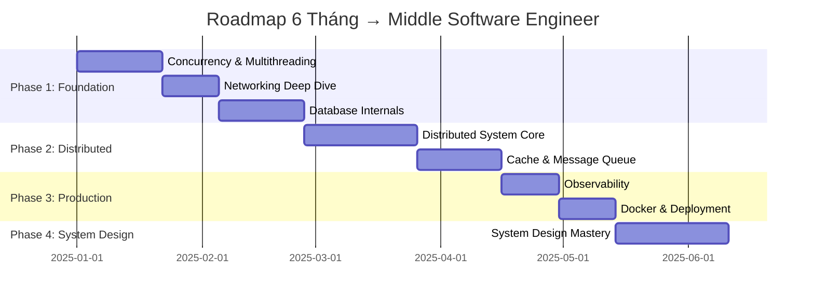

# 🎯 MIDDLE SOFTWARE ENGINEER — Learning & Execution Package

> **For**: Backend Game Developer (C++, RPC, server-authoritative, event-driven)  
> **Goal**: Đạt chuẩn Middle Software Engineer trong 6 tháng  
> **Start Date**: _______ | **Target Date**: _______

---

## I. ĐỊNH NGHĨA MỤC TIÊU

> [!IMPORTANT]
> Middle Engineer ≠ Code nhiều hơn. Middle = **Tư duy hệ thống + Ra quyết định có căn cứ**.

### Middle Engineer phải làm được gì?

| Năng lực | Junior | Middle | Ví dụ cụ thể |
|----------|--------|--------|---------------|
| **System understanding** | Biết module mình code | Hiểu end-to-end flow | Trace được request từ client → load balancer → service → DB → response |
| **Module design** | Code theo spec | Tự thiết kế module + API | Design matchmaking service với clear interface, error handling, scaling plan |
| **Performance** | "Code chạy được" | Benchmark → Optimize → Prove | So sánh `std::map` vs `std::unordered_map` với benchmarks, giải thích WHY |
| **Production debug** | Đọc log, tìm bug | Correlate metrics + traces + logs | Phát hiện memory leak qua Prometheus metrics + heap dump analysis |
| **Code review** | Nhận review | Cho review có chất lượng | Chỉ ra race condition, suggest lock-free alternative, explain trade-off |
| **Trade-off analysis** | Không biết | Phân tích rõ ràng | "Redis cluster sẽ tăng throughput 3x nhưng tăng cost 2x và thêm operational complexity" |

---

## II. NỀN TẢNG HIỆN TẠI — Gap Analysis

```
                     ┌─────────────────────────────────────────┐
                     │         KỸ NĂNG HIỆN TẠI (STRONG)       │
                     │  ✅ C++ game logic                      │
                     │  ✅ RPC flow                            │
                     │  ✅ Server-authoritative model          │
                     │  ✅ Event-driven thinking               │
                     └─────────────────────────────────────────┘
                                      │
                     ┌────────────────┴────────────────┐
                     │         GAP CẦN BÙ              │
                     │  ❌ Distributed system bài bản   │
                     │  ❌ Database internals           │
                     │  ❌ Concurrency sâu              │
                     │  ❌ Cloud / DevOps               │
                     │  ❌ Observability                │
                     │  ❌ System design interview      │
                     └─────────────────────────────────┘
```

### Priority Matrix

| Gap | Impact cho Middle | Độ khó | Thời gian cần | Priority |
|-----|-------------------|--------|----------------|----------|
| Concurrency sâu | 🔴 Critical | Hard | 3-4 tuần | **P0** |
| Distributed system | 🔴 Critical | Hard | 4-5 tuần | **P0** |
| Database internals | 🟡 High | Medium | 2-3 tuần | **P1** |
| Observability | 🟡 High | Medium | 2 tuần | **P1** |
| Cloud/DevOps | 🟢 Medium | Medium | 2-3 tuần | **P2** |
| System design | 🔴 Critical | Hard | 4 tuần ongoing | **P0** |

---

## III. ROADMAP TỔNG QUAN 6 THÁNG



### Mỗi Phase gồm:
1. 📖 **Lý thuyết cô đọng** — Chỉ core concepts, production-relevant
2. ✅ **Checklist kiến thức** — Tick từng item khi hiểu
3. 🔨 **Project thực hành** — Build real system
4. 🎯 **Milestone** — Bài test kiểm tra năng lực
5. 📊 **KPI** — Đo tiến bộ bằng số liệu cụ thể

---

## IV. CẤU TRÚC TÀI LIỆU

| File | Nội dung |
|------|----------|
| [01-phase1-concurrency.md](file:///d:/WorkSpace/Improve%20Knowledge/01-phase1-concurrency.md) | Concurrency & Multithreading |
| [02-phase1-networking.md](file:///d:/WorkSpace/Improve%20Knowledge/02-phase1-networking.md) | Networking & Protocol Deep Dive |
| [03-phase1-database.md](file:///d:/WorkSpace/Improve%20Knowledge/03-phase1-database.md) | Database Internals |
| [04-phase2-distributed.md](file:///d:/WorkSpace/Improve%20Knowledge/04-phase2-distributed.md) | Distributed System Core |
| [05-phase2-cache-mq.md](file:///d:/WorkSpace/Improve%20Knowledge/05-phase2-cache-mq.md) | Cache & Message Queue |
| [06-phase3-observability.md](file:///d:/WorkSpace/Improve%20Knowledge/06-phase3-observability.md) | Observability |
| [07-phase3-deployment.md](file:///d:/WorkSpace/Improve%20Knowledge/07-phase3-deployment.md) | Docker & Deployment |
| [08-phase4-system-design.md](file:///d:/WorkSpace/Improve%20Knowledge/08-phase4-system-design.md) | System Design Mastery |
| [09-checklist.md](file:///d:/WorkSpace/Improve%20Knowledge/09-checklist.md) | Middle Engineer Checklist |
| [10-career-paths.md](file:///d:/WorkSpace/Improve%20Knowledge/10-career-paths.md) | Career Path Analysis |
| [11-cafepho-upgrade.md](file:///d:/WorkSpace/Improve%20Knowledge/11-cafepho-upgrade.md) | CafePho Upgrade Plan |
| [12-reading-kpi.md](file:///d:/WorkSpace/Improve%20Knowledge/12-reading-kpi.md) | Reading List & KPI Assessment |

---

## V. CÁCH SỬ DỤNG PACKAGE NÀY

### Weekly Schedule (đề xuất)

| Ngày | Hoạt động | Thời gian |
|------|-----------|-----------|
| **Thứ 2-4** | Học lý thuyết + đọc tài liệu | 1.5-2h/ngày |
| **Thứ 5-6** | Code project thực hành | 2-3h/ngày |
| **Thứ 7** | Review + benchmark + viết notes | 2h |
| **Chủ nhật** | Mock interview / System design practice | 1.5h |

### Cam kết tối thiểu
- ⏰ **10-15 giờ/tuần** dành cho self-study
- 📝 **Viết TIL** (Today I Learned) mỗi ngày
- 🔨 **1 mini-project xong** mỗi 2 tuần
- 📊 **Benchmark** mỗi project
- 🎯 **Test đánh giá** cuối mỗi phase

> [!TIP]
> Bắt đầu bằng bài **Pre-Assessment Test** trong file [12-reading-kpi.md](file:///d:/WorkSpace/Improve%20Knowledge/12-reading-kpi.md) để biết bạn đang ở đâu.
