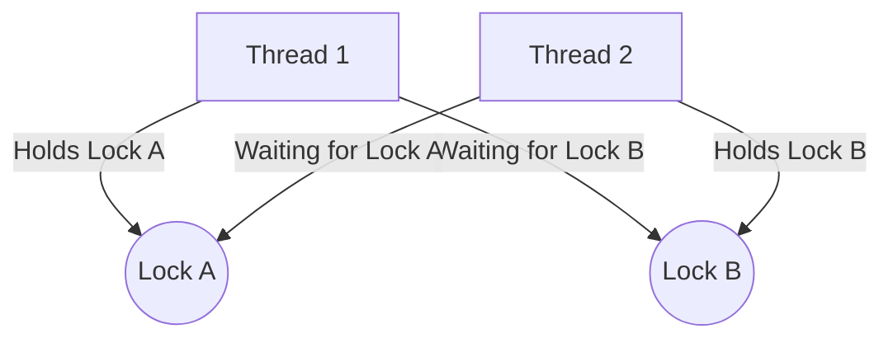

# PHẦN 2: MULTI-THREADING (TRÁI TIM CỦA GAME SERVER)

Trong Game Server, Multi-threading là "con dao hai lưỡi". Dùng đúng thì server mượt mà, dùng sai thì Deadlock khiến hàng nghìn player văng ra khỏi game.

---

## 1. Thread Pools Deep Dive: ThreadPoolExecutor & Executors

### Nó là gì?
- **Thread Pool**: Là một tập hợp các công nhân (Thread) đã được tạo sẵn. Thay vì mỗi lần có việc là gọi một công nhân mới (tốn tiền, tốn thời gian), ta thuê sẵn một đội và giao việc cho họ làm xoay vòng.
- **Executors**: Là một "Nhà máy" (Factory class) giúp bạn tạo ra các đội công nhân (Thread Pool) một cách nhanh chóng bằng các lệnh có sẵn.

### Các loại đội công nhân (Thread Pool) phổ biến:

#### a. `Executors.newFixedThreadPool(n)`
- **Ý nghĩa**: Tạo một đội có đúng `n` công nhân. Không thừa, không thiếu.
- **Cách hoạt động**: Nếu có 10 việc mà chỉ có 3 công nhân, 3 người sẽ làm, 7 việc còn lại nằm trong hàng đợi (Queue). Làm xong việc này mới bắt tay vào việc kia.
- **Dùng khi nào?**: Khi bạn biết rõ server mình chịu tải được bao nhiêu thread (ví dụ: Pool xử lý DB, Pool xử lý logic trận đấu).

#### b. `Executors.newCachedThreadPool()`
- **Ý nghĩa**: Đội công nhân linh hoạt. Cần bao nhiêu có bấy nhiêu.
- **Cách hoạt động**: Nếu có việc mới mà mọi công nhân đều đang bận, nó sẽ tạo thêm công nhân mới ngay lập tức. Nếu công nhân rảnh quá lâu (60s), nó sẽ "đuổi việc" để tiết kiệm RAM.
- **DANGER**: Cực kỳ nguy hiểm nếu server bị DOS. Số thread có thể tăng lên hàng nghìn, gây sập server.
- **Dùng khi nào?**: Cho các tác vụ ngắn, nhanh, và không dồn dập.

#### c. `Executors.newSingleThreadExecutor()`
- **Ý nghĩa**: Chỉ có duy nhất 1 công nhân.
- **Dùng khi nào?**: Khi bạn muốn các công việc phải chạy **tuần tự** (FIFO - cái nào đến trước làm trước) và đảm bảo không có tranh chấp dữ liệu.

### Tại sao không dùng `new Thread()` thủ công?
Trong Game Server, việc tạo một Thread cực kỳ tốn kém (~1MB bộ nhớ cho Stack và thời gian cấp phát từ OS). Nếu 1,000 player cùng lúc làm hành động gì đó và bạn `new Thread()`, server sẽ treo ngay lập tức vì **Context Switching** (CPU quá tải vì phải đổi luồng liên tục).

### Thông số "vàng" của ThreadPoolExecutor (Dưới nắp máy)
Nếu bạn muốn tự build đội công nhân "xịn" hơn `Executors`, bạn dùng `ThreadPoolExecutor`:
```java
ThreadPoolExecutor executor = new ThreadPoolExecutor(
    corePoolSize,    // Số công nhân "biên chế" (luôn có mặt)
    maximumPoolSize, // Số công nhân tối đa (kể cả thời vụ)
    keepAliveTime,   // Thời gian công nhân thời vụ được ở lại sau khi hết việc
    TimeUnit.SECONDS,
    new LinkedBlockingQueue<>(capacity) // Hàng đợi có giới hạn (CỰC KỲ QUAN TRỌNG)
);
```
- **DANGER**: Các lệnh `Executors.newFixedThreadPool()` dùng Queue **vô hạn**. Nếu công nhân làm chậm, hàng đợi sẽ phình to cho đến khi server cháy sạch RAM (**OOM Error**).
- **Best Practice**: Luôn dùng **Bounded Queue** (hàng đợi có giới hạn). Nếu hàng đợi đầy, hãy xác định **Rejection Policy** (ví dụ: thông báo lỗi cho player hoặc bỏ qua request cũ).

---


## 2. Java Memory Model (JMM) & Visibility

Đây là lý do chính khiến code multi-thread chạy sai dù logic có vẻ đúng.

### Cache Coherence & Memory Barriers
Mỗi CPU Core có L1, L2 cache riêng. Khi Thread A thay đổi biến `hp = 0`, nó có thể chỉ ghi vào L1 Cache của Core 1. Thread B chạy trên Core 2 đọc từ L1 Cache của nó vẫn thấy `hp = 100`. Đây là lỗi **Visibility**.

### Volatile & Happens-Before
- **Volatile**: Ép CPU đọc/ghi trực tiếp từ Main Memory (RAM), đồng thời ngăn cản việc **Instruction Reordering** (sắp xếp lại lệnh của Compiler/CPU).
- **Happens-Before**: Một quy tắc ngầm định trong Java. Ví dụ: Việc giải phóng một Lock (unlock) luôn xảy ra TRƯỚC việc chiếm Lock đó (lock) bởi thread khác, đảm bảo thread sau thấy hết dữ liệu thread trước đã làm.

> [!TIP]
> Trong Game, các flag như `isServerRunning`, `isMatchEnded` nên dùng `volatile`. Nhưng với các biến thay đổi dựa trên giá trị cũ (như `hp = hp - 1`), `volatile` là **KHÔNG ĐỦ**, bạn cần Atomic hoặc Lock.

---


## 3. Race Condition & Deadlock: Case Study

### Race Condition: "Dupe Item"
Xảy ra khi nhiều thread cùng đọc-ghi một shared data mà không có đồng bộ.

**Ví dụ logic lỗi:**
1. Thread A đọc `count = 10`.
2. Thread B đọc `count = 10`.
3. Thread A thực hiện `count = count - 1` (9) và ghi lại.
4. Thread B thực hiện `count = count - 1` (9) và ghi lại.
=> Kết quả là `9` thay vì `8`. Trong game, điều này dẫn đến việc 2 người cùng nhặt 1 item.

### Deadlock: "The Deadly Embrace"
Xảy ra khi có sự phụ thuộc vòng lặp giữa các khóa (Locks).



**Case Study: Giao dịch giữa 2 Player (Deadlock)**
```java
public void transferGold(Player from, Player to, int amount) {
    synchronized (from) { // Lock người gửi
        synchronized (to) { // Lock người nhận
            if (from.getGold() >= amount) {
                from.addGold(-amount);
                to.addGold(amount);
            }
        }
    }
}
```
- **Kịch bản chết**: Player A chuyển tiền cho Player B, cùng lúc Player B chuyển cho Player A.
- Thread 1: Lock A -> Chờ B.
- Thread 2: Lock B -> Chờ A.
=> **SERVER FREEZE**.

### Giải pháp Senior: Lock Ordering
Luôn lock các đối tượng theo một thứ tự cố định (ví dụ theo ID tăng dần).

```java
public void transferGoldFixed(Player p1, Player p2, int amount) {
    Player first = p1.getId() < p2.getId() ? p1 : p2;
    Player second = p1.getId() < p2.getId() ? p2 : p1;

    synchronized (first) {
        synchronized (second) {
            // Thực hiện giao dịch an toàn 100% không bao giờ deadlock
        }
    }
}
```

---


## 4. Lock vs Synchronized vs Atomic

### Synchronized (Pessimistic Locking)
- **Cơ chế**: Dùng Monitor Lock (nội bộ JVM). 
- **Ưu điểm**: Dễ dùng, an toàn tuyệt đối.
- **Nhược điểm**: Nặng. Nếu Thread bị block, nó sẽ chuyển sang trạng thái `WAITING` (tốn Context Switch).

### Atomic (Optimistic Locking - CAS)
- **CAS (Compare-And-Swap)**: Không dùng Lock. Nó thực hiện vòng lặp `while(!compareAndSet(expected, newValue))`. 
- **Performance**: Nhanh hơn Lock 10-20 lần nếu **độ tranh chấp thấp**. 
- **ABA Problem**: Nếu một biến đổi từ A -> B -> A, CAS có thể không nhận ra sự thay đổi. Khắc phục bằng `AtomicStampedReference`.

### LongAdder vs AtomicLong
- **AtomicLong**: Tất cả các thread cùng "đâm" vào 1 biến. Khi có hàng nghìn thread, CAS sẽ bị thất bại liên tục (High Contention CPU overhead).
- **LongAdder**: Chia nhỏ biến thành một mảng các `Cell`. Mỗi thread cộng vào một cell riêng. Khi đọc kết quả mới cộng dồn lại: `sum = base + cells`.
- **Game Hint**: Dùng `LongAdder` cho các chỉ số Global như `TotalServerGold`, `TotalPlayersEver`.

---


## 5. Game Context: Xử lý Match Battle & Tick Loop

### Tick Game Loop
Game server không chạy tự do. Nó chạy theo nhịp (Tick). Ví dụ: 1 giây có 20 Tick (50ms/tick).

```java
ScheduledExecutorService gameLoop = Executors.newSingleThreadScheduledExecutor();
gameLoop.scheduleAtFixedRate(() -> {
    long startTime = System.currentTimeMillis();
    updatePhysics(); // Xử lý va chạm
    updateAI();      // Logic quái vật
    syncToClients(); // Gửi gói tin cập nhật cho player
    long duration = System.currentTimeMillis() - startTime;
    if (duration > 50) {
        // SERVER LAGGING!
    }
}, 0, 50, TimeUnit.MILLISECONDS);
```

### Advanced: Single-threaded Room Pattern (Actor-like)
Để xử lý 10,000 Player, ta không dùng lock cho từng player. Thay vào đó:
1. **Chia nhỏ**: Player được chia vào các `Room` (Trận đấu).
2. **Assign Thread**: Mỗi Room được gán cho một Thread duy nhất từ Thread Pool (Ví dụ dựa trên `roomId % threadCount`).
3. **Queue**: Tất cả request từ player gửi về Room đó được đẩy vào một `Internal Queue`.
4. **Execution**: Thread quản lý Room đó sẽ lấy từng request ra xử lý tuần tự.

**Lợi ích cực lớn**:
- Bên trong Room, logic chạy **đơn luồng** (Single-threaded).
- **KHÔNG CẦN DÙNG LOCK** cho các thao tác HP, Mana, Item...
- Tránh hoàn toàn Race Condition và Deadlock nội bộ.
- CPU Cache Hit rate rất cao vì dữ liệu Room nằm sẵn trong L1/L2 cache của thread đó.

---

## 6. Thread Lifecycle & Interruption: Nền tảng cốt lõi

### Nó là gì?
- **Thread Lifecycle**: Các trạng thái mà một thread trải qua từ lúc sinh ra đến lúc chết.
- **Interruption**: Cơ chế lịch sự để yêu cầu một thread dừng lại.

### Các trạng thái của Thread (CƠ BẢN CẦN NHỚ):
1. **NEW**: Vừa `new Thread()`, chưa gọi `start()`.
2. **RUNNABLE**: Đang chạy hoặc đang đợi CPU cấp phát thời gian.
3. **BLOCKED**: Đang đợi chiếm Lock (đợi vào vùng `synchronized`).
4. **WAITING**: Đợi vô hạn cho đến khi thread khác gọi `notify()` hoặc `signal()`.
5. **TIMED_WAITING**: Đợi có thời hạn (như `Thread.sleep(1000)`).
6. **TERMINATED**: Đã chạy xong hoặc bị Exception văng ra.

### Cơ chế Interruption (Senior Mindset):
Đừng bao giờ dùng `thread.stop()` (vì nó cực kỳ nguy hiểm, làm data bị korrupt). Hãy dùng `thread.interrupt()`. 
- Thread con phải tự kiểm tra `Thread.interrupted()` và dọn dẹp tài nguyên trước khi thoát. 
- Nếu thread đang ở trạng thái `sleep` hoặc `wait`, nó sẽ ném ra `InterruptedException`. Bạn phải xử lý lỗi này thay vì nuốt nó (`catch and do nothing`).

---


### 1. Tại sao "False Sharing" có thể làm giảm hiệu năng của game server?
- **Answer**: CPU đọc dữ liệu theo Cache Line (thường là 64 bytes). Nếu hai biến (ví dụ `hp` và `mana`) nằm cạnh nhau trong bộ nhớ và thuộc cùng một Cache Line, khi Core 1 update `hp`, nó sẽ làm mất hiệu lực (invalidate) toàn bộ Cache Line đó ở Core 2 (đang giữ `mana`). Core 2 buộc phải nạp lại từ RAM dù `mana` không đổi. 
- **Solution**: Dùng `@Contended` (Java 8+) để thêm padding, tách các biến ra các Cache Line khác nhau.

### 2. Phân biệt `ReentrantLock` và `synchronized`. Khi nào nên dùng cái nào?
- **Answer**:
    - `synchronized`: Cực kỳ tối ưu trong JVM hiện đại (Biased Locking, Lock Coarsening). Dùng khi logic đơn giản.
    - `ReentrantLock`: Cung cấp `tryLock()` (tránh chờ vô hạn), `lockInterruptibly()`, và multiple `Condition` (await/signal). Dùng khi cần logic điều kiện phức tạp hoặc muốn tránh Deadlock bằng timeout.

### 3. Làm thế nào để xử lý Race Condition mà KHÔNG dùng Lock?
- **Answer**: 
    1. **Immutable Objects**: Dữ liệu không đổi thì không cần lock.
    2. **ThreadLocal**: Mỗi thread một bản sao dữ liệu (ví dụ: `Random`, `StringBuilder`).
    3. **CAS (Compare And Swap)**: Dùng các lớp Atomic.
    4. **Disruptor Pattern / Ring Buffer**: Dùng trong LMAX Architecture, cực nhanh cho IO game.

### 4. `ThreadLocal` có nguy cơ gây Memory Leak không?
- **Answer**: Có, đặc biệt là trong Thread Pool. Giá trị trong `ThreadLocal` được giữ bởi dối tượng `Thread`. Vì thread trong pool không bao giờ chết, dữ liệu sẽ không bao giờ được GC nếu không gọi `remove()` thủ công.

### 5. Giải thích ForkJoinPool và tại sao nó quan trọng từ Java 8?
- **Answer**: Dùng thuật toán **Work-Stealing**. Nếu một thread rảnh, nó sẽ "ăn trộm" task từ đuôi queue của thread bận khác. `parallelStream()` và `CompletableFuture` dùng pool này làm mặc định. Nó cực kỳ hiệu quả cho các task "chia để trị" (Recursive tasks).

---


## BÀI TẬP THỰC HÀNH
**Đề bài:** Thiết kế hệ thống "Chuyển tiền" (Gold Transfer) giữa 2 Player đảm bảo:
1. Không bị Race Condition (không bị mất tiền hoặc nhân bản tiền).
2. Không bị Deadlock (ngay cả khi 2 người cùng chuyển cho nhau cùng lúc).
3. Hiệu năng cao.

**Gợi ý mindset Senior**: Sắp xếp thứ tự ID của 2 player trước khi Lock. Luôn lock người có ID nhỏ trước.
