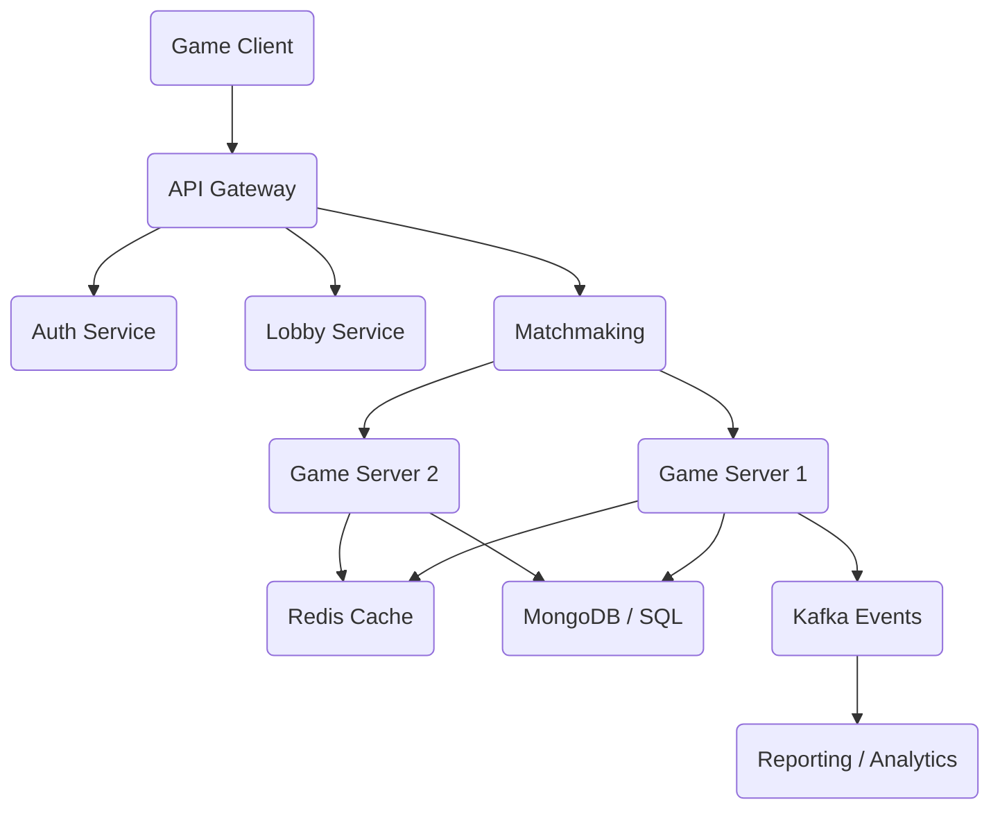

# PHẦN 4: MICROSERVICES & SYSTEM DESIGN TRONG GAME

Tại sao các game lớn như Liên Minh Huyền Thoại hay PUBG không chạy trên 1 server duy nhất? Câu trả lời là để **Scale** và **Isolate** (cô lập lỗi).

---

## 1. Monolith vs Microservices: Khi nào nên chuyển?

### Monolith (Đơn khối)
- **Ưu**: Phát triển nhanh, deploy dễ, gọi hàm trực tiếp.
- **Dùng khi**: Game nhỏ, startup mới bắt đầu, số lượng player dự kiến < 50,000.

### Microservices (Vi dịch vụ)
- **Ưu**: Mỗi team code 1 service, chết service Rank không ảnh hưởng service Battle, scale từng phần độc lập.
- **Dùng khi**: Game lớn, hệ thống phức tạp, cần phục vụ hàng triệu user.

---

## 2. Service Breakdown (Chia nhỏ game thế nào?)

Trong một hệ thống Game Backend hiện đại, chúng ta thường chia thành các phần sau:

1.  **Gateway Service**: Cổng đón khách. Xử lý Auth, Rate Limit, chuyển hướng packet.
2.  **Auth / Identity Service**: Đăng nhập, quản lý account, token.
3.  **Lobby / Social Service**: Chat, Bạn bè, Bang hội, Mailbox.
4.  **Matchmaking Service**: Chờ ghép trận. Logic cực kỳ quan trọng để đảm bảo trình độ cân bằng.
5.  **Game Server (Battle)**: Nơi thực sự diễn ra trận đấu. Đây là service có trạng thái (Stateful), tốn CPU/RAM nhất.
6.  **Leaderboard Service**: Quản lý xếp hạng (thường dùng Redis ZSet).
7.  **Payment / IAP Service**: Mua bán vật phẩm, kết nối Apple/Google Store.

---

## 3. Communication: API Design (REST vs gRPC)

### REST (HTTP/JSON)
- Dùng cho các hành động không cần tốc độ quá cao: Đăng ký account, xem tin tức, xem BXH.
- Ưu: Dễ test bằng trình duyệt/Postman.

### gRPC / Thrift
- Dùng để các service gọi lẫn nhau (Internal communication).
- Ví dụ: Game Server báo cho Matchmaking là trận đấu đã kết thúc.
- Ưu: Tốc độ cực nhanh (trên nền HTTP/2 & Protobuf), ít trễ.

---

## 4. Kiến trúc Hệ thống Game Online

---

## 5. Flow từ Login -> Matchmaking -> Vào trận

1.  **Login**: Client gửi ID/Pass qua HTTP -> Auth Service trả về JWT.
2.  **Lobby**: Client kết nối WebSocket vào Lobby Service để nhận tin nhắn/mời chơi.
3.  **Queue**: Client gọi Matchmaking Service để xếp hàng. MM Service lưu thông tin người chơi vào Redis.
4.  **Matched**: MM Service tìm đủ 10 người, cấp một `RoomId` và gán cho `Game Server A` đang trống.
5.  **Battle**: MM Service gửi về cho Client IP của `Game Server A`. Client ngắt kết nối Lobby (hoặc giữ) và kết nối trực tiếp vào `Game Server A` qua UDP/TCP để đánh nhau.

---

## CÂU HỎI PHỎNG VẤN

### Mid
- **Q**: Tại sao Game Battle Server (Trận đấu) thường là **Stateful** (có trạng thái) thay vì Stateless như Web server?
- **A**: Vì battle server phải giữ toàn bộ biến trạng thái của trận đấu (máu, vị trí, thời gian) trong bộ nhớ để tính toán realtime cực nhanh. Nếu làm stateless (gửi lên DB mỗi lần tick) thì không thể đáp ứng tốc độ 50-100ms.

- **Q**: Nếu Game Server crash giữa chừng, bạn xử lý thế nào?
- **A**: 
    1. Dùng **External State Storage** (Redis) để backup state định kỳ.
    2. Cơ chế **Reconnection**: Client kết nối lại và server gửi "Snapshot data" mới nhất để client vẽ lại trận đấu.

### Senior
- **Q**: Bạn sẽ thiết kế hệ thống Matchmaking thế nào để xử lý 1 triệu người xếp hàng cùng lúc mà không bị nghẽn?
- **A**: 
    1. **Sharding theo Rank**: Chia nhỏ pool người xếp hàng (Vàng đánh với Vàng, Đồng đánh với Đồng).
    2. **Worker Pool**: MM Service không quét toàn bộ DB. Nó dùng Redis (ZSet/List) và các Worker chạy định kỳ để nhặt cặp.
    3. **Elastic Scaling**: Tự động spin up thêm Game Server khi số người xếp hàng tăng quá cao.

---

## BÀI TẬP THỰC HÀNH
**Đề bài:** Hãy vẽ sơ đồ tuần tự (Sequence Diagram) mô tả flow: Player A mời Player B vào trận đấu. (Bao gồm các bước check online, gửi thông báo, nhận chấp nhận, tạo phòng).
