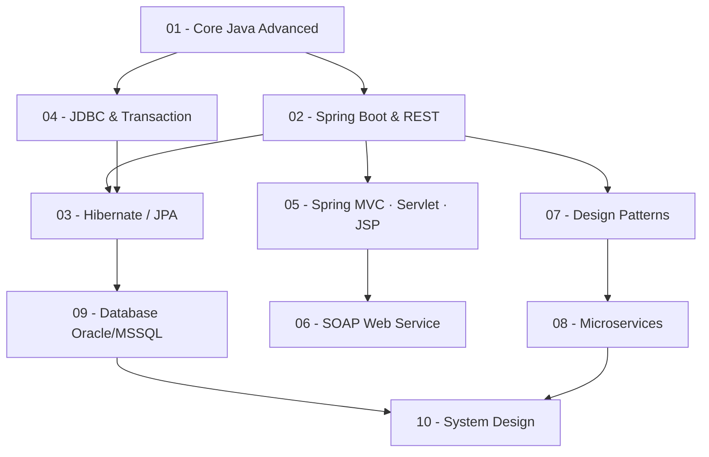

# 🎯 Java Backend Interview — Bộ Ôn Luyện Chuyển Việc

## Mục tiêu

Bộ tài liệu này được thiết kế để **ôn luyện 2 tháng**, chuẩn bị phỏng vấn vị trí **Java Backend Developer** tại các công ty **Bank / Enterprise**.

> **Background:** ~3 năm C++ & Java thuần + pet project Spring Boot/JDBC  
> **Target stack:** Spring Boot · Hibernate/JPA · JDBC · SOAP · Microservices · Oracle/MSSQL

---

## 🗺️ Roadmap Học Tập



---

## 📁 Cấu Trúc Thư Mục

| # | Chủ đề | Thư mục | Ưu tiên |
|---|--------|---------|---------|
| 01 | Core Java Advanced | `01-core-java/` | 🔴 Cao |
| 02 | Spring Boot & REST API | `02-spring-boot/` | 🔴 Cao |
| 03 | Hibernate / JPA | `03-hibernate-jpa/` | 🔴 Cao |
| 04 | JDBC & Transaction | `04-jdbc-transaction/` | 🔴 Cao |
| 05 | Spring MVC · Servlet · JSP | `05-spring-mvc-servlet-jsp/` | 🟡 Trung bình |
| 06 | SOAP Web Service | `06-soap-webservice/` | 🟡 Trung bình |
| 07 | Design Patterns | `07-design-patterns/` | 🟡 Trung bình |
| 08 | Microservices | `08-microservices/` | 🟡 Trung bình |
| 09 | Database Oracle/MSSQL | `09-database-oracle-mssql/` | 🔴 Cao (Bank) |
| 10 | System Design | `10-system-design/` | 🟢 Thấp |

---

## 🎯 Cách Sử Dụng

1. **Đọc `theory.md`** của mỗi topic để nắm lý thuyết + code snippet
2. **Tự trả lời** các câu hỏi trong `interview_qa.md` trước khi xem đáp án
3. **Học theo thứ tự** ưu tiên 🔴 → 🟡 → 🟢
4. **Cuối tuần:** Ôn lại tất cả câu hỏi của tuần

---

## ⏰ Lịch Ôn Luyện 8 Tuần

| Tuần | Topics | Files |
|------|--------|-------|
| 1 | Core Java Advanced | `01-core-java/` |
| 2 | Spring Boot & REST | `02-spring-boot/` |
| 3 | Hibernate/JPA + JDBC | `03-hibernate-jpa/`, `04-jdbc-transaction/` |
| 4 | Spring MVC + Servlet/JSP + SOAP | `05-`, `06-` |
| 5 | Design Patterns | `07-design-patterns/` |
| 6 | Microservices | `08-microservices/` |
| 7 | Oracle/MSSQL + System Design | `09-`, `10-` |
| 8 | Mock interview toàn bộ | Tất cả `interview_qa.md` |

---

## 📐 Cấu Trúc Mỗi Topic

```
topic-name/
├── theory.md        ← Lý thuyết tóm tắt + code snippet Java
└── interview_qa.md  ← 25-35 câu hỏi phỏng vấn + đáp án chi tiết
```

---

## 🏦 Lưu Ý Cho Bank/Enterprise

Khi phỏng vấn vào ngân hàng, đặc biệt chú ý:
- **Transaction & ACID** — câu hỏi rất phổ biến
- **Oracle SQL** — Stored Procedure, PL/SQL cơ bản
- **SOAP/WSDL** — legacy integration
- **Security:** SQL Injection, XSS prevention
- **Concurrency** — deadlock, race condition trong banking transaction
- **Audit Log** — tracking mọi thay đổi dữ liệu
