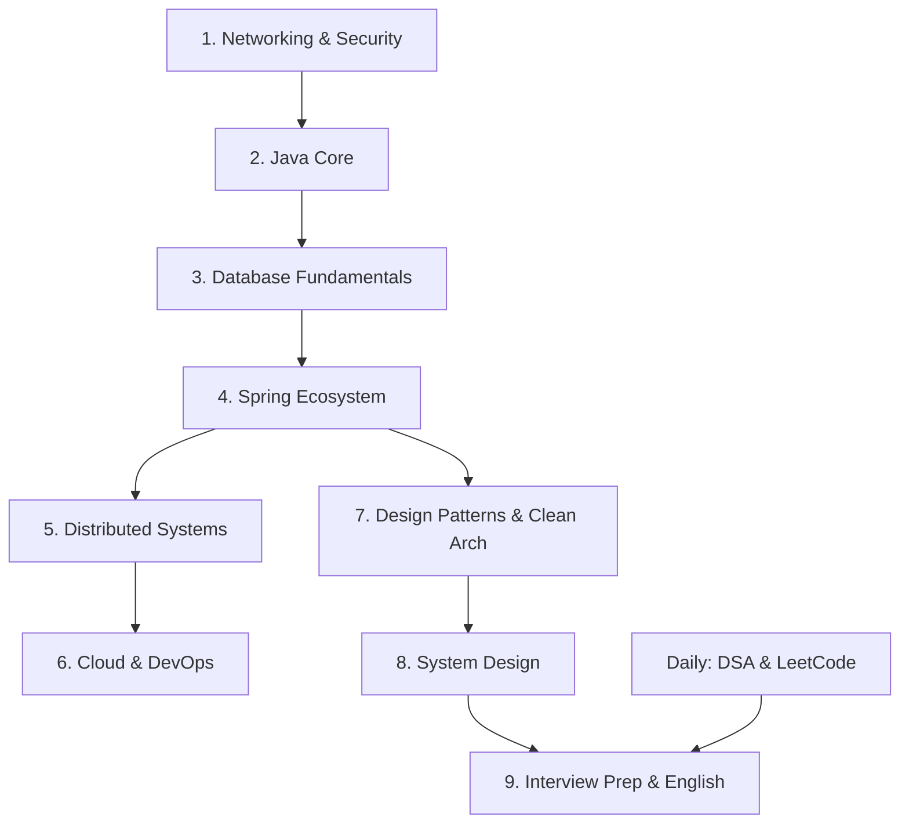

# 🗺️ Lộ Trình Học Tập (Learning Path) — Backend Developer

Tài liệu này hướng dẫn chi tiết thứ tự đọc và học các tài liệu trong workspace để tối ưu hóa việc tiếp thu kiến thức, đi từ nền tảng (Foundation) lên nâng cao (Deep Dive), giúp bạn chuẩn bị tốt nhất cho phỏng vấn cty Product Tier 1 & Tier 2.

---

## 📌 Lộ Trình Tổng Quan Các Module (Study Roadmap)

Để học hiệu quả, bạn nên đi theo thứ tự phụ thuộc (dependencies) của các module kiến thức sau:

---

## 🗂️ Thứ Tự Chi Tiết Từng Module

### 1. 🌐 Networking & Security (`08-Networking-Security`)
*Tại sao học đầu tiên?* Mọi giao tiếp backend đều qua network. Hiểu giao thức giúp bạn thiết kế API và bảo mật tốt hơn.
1.  [tcp_ip.md](file:///d:/WorkSpace/Document/Improve-Knowledge/08-Networking-Security/tcp_ip.md) — Nền tảng truyền tải dữ liệu.
2.  [dns.md](file:///d:/WorkSpace/Document/Improve-Knowledge/08-Networking-Security/dns.md) — Cơ chế phân giải tên miền.
3.  [http.md](file:///d:/WorkSpace/Document/Improve-Knowledge/08-Networking-Security/http.md) — Giao thức chính của Web API.
4.  [rest.md](file:///d:/WorkSpace/Document/Improve-Knowledge/08-Networking-Security/rest.md) ➡️ [grpc.md](file:///d:/WorkSpace/Document/Improve-Knowledge/08-Networking-Security/grpc.md) ➡️ [graphql.md](file:///d:/WorkSpace/Document/Improve-Knowledge/08-Networking-Security/graphql.md) — Các chuẩn thiết kế API từ truyền thống đến hiện đại.
5.  [session.md](file:///d:/WorkSpace/Document/Improve-Knowledge/08-Networking-Security/session.md) ➡️ [jwt.md](file:///d:/WorkSpace/Document/Improve-Knowledge/08-Networking-Security/jwt.md) ➡️ [oauth.md](file:///d:/WorkSpace/Document/Improve-Knowledge/08-Networking-Security/oauth.md) — Các cơ chế Authentication và Authorization.

---

### 2. ☕ Java Core (`02-Java-Core`)
*Tại sao?* Ngôn ngữ lập trình cốt lõi của bạn. Cần vững cơ chế chạy, quản lý bộ nhớ trước khi dùng framework.
1.  [Theory.md](file:///d:/WorkSpace/Document/Improve-Knowledge/02-Java-Core/Theory.md) — Ôn tập OOP, Collections, Generics, Concurrency cơ bản.
2.  [Practice-Exercises.md](file:///d:/WorkSpace/Document/Improve-Knowledge/02-Java-Core/Practice-Exercises.md) — Viết code thực hành để quen tay.
3.  [07-java17-21-features.md](file:///d:/WorkSpace/Document/Improve-Knowledge/02-Java-Core/07-java17-21-features.md) — Cực kỳ quan trọng! Các tính năng hiện đại như Sealed classes, Records, đặc biệt là **Virtual Threads (Java 21)**.
4.  [Interview-QA.md](file:///d:/WorkSpace/Document/Improve-Knowledge/02-Java-Core/Interview-QA.md) — Ôn luyện các câu hỏi lý thuyết hay gặp.

---

### 3. 🗄️ Database (`04-Database`)
*Tại sao?* Trái tim của mọi hệ thống backend. Tốc độ ứng dụng phụ thuộc 80% vào việc tối ưu DB.
1.  [joins.md](file:///d:/WorkSpace/Document/Improve-Knowledge/04-Database/joins.md) — Hiểu các phép nối và cơ chế JOIN vật lý của DB engine.
2.  [indexes.md](file:///d:/WorkSpace/Document/Improve-Knowledge/04-Database/indexes.md) — Cơ chế cây B-Tree và tối ưu hóa tốc độ tìm kiếm.
3.  [transactions.md](file:///d:/WorkSpace/Document/Improve-Knowledge/04-Database/transactions.md) — Thuộc tính ACID, các mức Isolation và cơ chế MVCC.
4.  [02-postgresql-advanced.md](file:///d:/WorkSpace/Document/Improve-Knowledge/04-Database/02-postgresql-advanced.md) — Window functions, CTE đệ quy, Table Partitioning và JSONB.
5.  [redis.md](file:///d:/WorkSpace/Document/Improve-Knowledge/04-Database/redis.md) ➡️ [redis-production-game.md](file:///d:/WorkSpace/Document/Improve-Knowledge/04-Database/redis-production-game.md) — Cơ chế Caching trong RAM, cấu trúc dữ liệu Redis, và các lỗi cache ở production.
6.  [mongodb.md](file:///d:/WorkSpace/Document/Improve-Knowledge/04-Database/mongodb.md) — Tìm hiểu NoSQL Document store khi schema thay đổi liên tục.

---

### 4. 🍃 Spring Boot Ecosystem (`03-Spring-Ecosystem`)
*Tại sao?* Framework chuẩn công nghiệp cho Enterprise/Product Java Backend.
1.  [Theory.md](file:///d:/WorkSpace/Document/Improve-Knowledge/03-Spring-Ecosystem/Theory.md) — Cơ chế IOC/DI, Spring Bean Lifecycle, Spring Boot Auto-configuration.
2.  [02-spring-security-deep.md](file:///d:/WorkSpace/Document/Improve-Knowledge/03-Spring-Ecosystem/02-spring-security-deep.md) — Bảo mật REST API bằng JWT, Filter Chain và phân quyền RBAC/ABAC.
3.  [04-spring-cloud.md](file:///d:/WorkSpace/Document/Improve-Knowledge/03-Spring-Ecosystem/04-spring-cloud.md) — Xây dựng kiến trúc Microservices (Gateway, Service Discovery, Config Server).
4.  [05-spring-testing.md](file:///d:/WorkSpace/Document/Improve-Knowledge/03-Spring-Ecosystem/05-spring-testing.md) — JUnit 5, Mockito, MockMvc và tích hợp TestContainers.
5.  [Interview-QA.md](file:///d:/WorkSpace/Document/Improve-Knowledge/03-Spring-Ecosystem/Interview-QA.md) — Tổng hợp câu hỏi phỏng vấn Spring Boot.

---

### 5. 🔄 Distributed Systems (`06-Distributed-Systems`)
*Tại sao?* Cần thiết khi ứng dụng scale lên hàng triệu người dùng, một server đơn lẻ không gánh nổi.
1.  [distributed_systems.md](file:///d:/WorkSpace/Document/Improve-Knowledge/06-Distributed-Systems/distributed_systems.md) — Khái niệm cơ bản về hệ phân tán.
2.  [cap-consistency-models.md](file:///d:/WorkSpace/Document/Improve-Knowledge/06-Distributed-Systems/cap-consistency-models.md) — Định lý CAP và các mô hình nhất quán dữ liệu.
3.  [sharding.md](file:///d:/WorkSpace/Document/Improve-Knowledge/06-Distributed-Systems/sharding.md) — Phân mảnh cơ sở dữ liệu theo chiều ngang.
4.  [kafka-deep-dive-game.md](file:///d:/WorkSpace/Document/Improve-Knowledge/06-Distributed-Systems/kafka-deep-dive-game.md) — Cơ chế Event-driven với Message Broker hiệu năng cao.
5.  [02-distributed-transactions-resilience.md](file:///d:/WorkSpace/Document/Improve-Knowledge/06-Distributed-Systems/02-distributed-transactions-resilience.md) — Giải quyết giao dịch phân tán (Saga, Outbox) và các mô hình phòng thủ lỗi (Circuit Breaker, Rate Limiter).

---

### 6. 🐳 Cloud & DevOps (`07-Cloud-DevOps`)
*Tại sao?* Đóng gói, triển khai ứng dụng lên môi trường production.
1.  [docker/docker_basics.md](file:///d:/WorkSpace/Document/Improve-Knowledge/07-Cloud-DevOps/docker/docker_basics.md) — Containerization ứng dụng.
2.  [ci_cd.md](file:///d:/WorkSpace/Document/Improve-Knowledge/07-Cloud-DevOps/ci_cd.md) — Tự động hóa build, test, deploy.
3.  [01-aws-core-services.md](file:///d:/WorkSpace/Document/Improve-Knowledge/07-Cloud-DevOps/01-aws-core-services.md) — Sử dụng các dịch vụ cloud cốt lõi của AWS (EC2, S3, RDS, Lambda).

---

### 7. 📐 Design Patterns & Clean Architecture (`09-Design-Patterns`)
*Tại sao?* Viết code dễ mở rộng, dễ thay đổi framework/DB trong tương lai mà không phải viết lại từ đầu.
1.  [01-solid-clean-architecture.md](file:///d:/WorkSpace/Document/Improve-Knowledge/09-Design-Patterns/01-solid-clean-architecture.md) — 5 nguyên lý SOLID và kiến trúc lục giác (Hexagonal Architecture).
2.  [Theory.md](file:///d:/WorkSpace/Document/Improve-Knowledge/09-Design-Patterns/Theory.md) — Các mẫu thiết kế GoF (Singleton, Factory, Observer, Builder,...).
3.  [Practice-Exercises.md](file:///d:/WorkSpace/Document/Improve-Knowledge/09-Design-Patterns/Practice-Exercises.md) ➡️ [Interview-QA.md](file:///d:/WorkSpace/Document/Improve-Knowledge/09-Design-Patterns/Interview-QA.md) — Thực hành và câu hỏi phỏng vấn.

---

### 8. 🏗️ System Design (`05-System-Design`)
*Tại sao?* Đánh giá năng lực thiết kế kiến trúc vĩ mô ở mức Senior.
1.  [system-design-methodology.md](file:///d:/WorkSpace/Document/Improve-Knowledge/05-System-Design/system-design-methodology.md) — Nắm vững khung sườn giải bài phỏng vấn **RESHADED**.
2.  [00-problems-overview.md](file:///d:/WorkSpace/Document/Improve-Knowledge/05-System-Design/00-problems-overview.md) — Xem qua 10 bài toán kinh điển (URL Shortener, Chat System, Rate Limiter,...).

---

### 9. 🎤 Interview Prep & English (`10-Interview-Prep`)
*Tại sao?* Kỹ năng thể hiện bản thân trong vòng phỏng vấn để chốt deal lương cao.
1.  [english-practice.md](file:///d:/WorkSpace/Document/Improve-Knowledge/10-Interview-Prep/english-practice.md) — Shadowing và luyện nói tiếng Anh hàng ngày.
2.  [star-stories.md](file:///d:/WorkSpace/Document/Improve-Knowledge/10-Interview-Prep/star-stories.md) — Chuẩn bị sẵn 6 câu chuyện dự án theo khung STAR.
3.  [behavioral-common-qa.md](file:///d:/WorkSpace/Document/Improve-Knowledge/10-Interview-Prep/behavioral-common-qa.md) — Top 30 câu hỏi hành vi phổ biến nhất.
4.  [mock-interview-guide.md](file:///d:/WorkSpace/Document/Improve-Knowledge/10-Interview-Prep/mock-interview-guide.md) — Tự tập luyện phỏng vấn thử.

---

## 💡 Hướng Dẫn Ôn Luyện Hàng Ngày (Study Tips)

*   **Sáng sớm (05:00 - 06:45)**: Hãy mở các file lý thuyết sâu (như PostgreSQL, Distributed Systems, Spring Boot Internals) ra đọc. Đầu óc lúc này tỉnh táo nhất để tiếp thu cơ chế phức tạp.
*   **Tối (19:30 - 22:00)**: Tập trung giải thuật [01-DSA](file:///d:/WorkSpace/Document/Improve-Knowledge/01-DSA/00-overview.md) và code LeetCode. Đây là thời gian rèn luyện phản xạ viết code thực chiến.
*   **Spaced Repetition**: Dành 30 phút cuối ngày (22:00 - 22:30) xem lại sơ bộ các kiến thức đã học buổi sáng để não bộ ghi nhớ lâu hơn.
