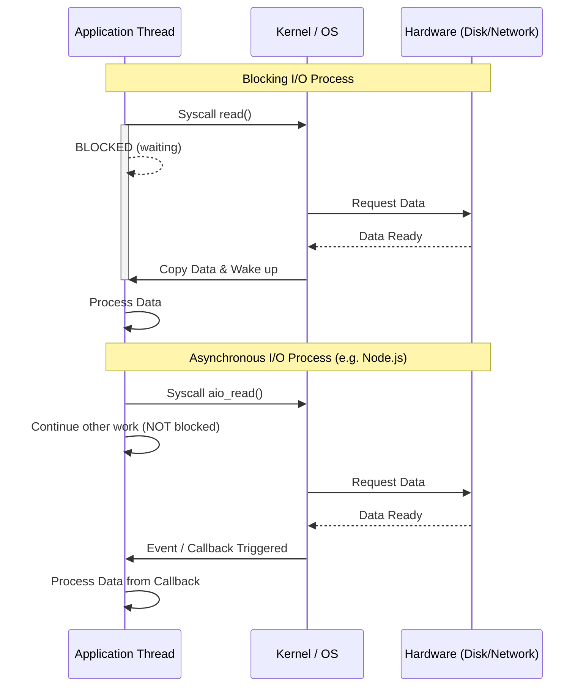

# I/O (Input/Output) Management
# Quản lý I/O (Đầu vào/Đầu ra)

## Concept Explanation
## Giải thích khái niệm
I/O Management is how the Operating System bridges the gap between the CPU/Memory and external hardware devices (Disk drives, network cards, keyboards). CPU speeds are gigahertz (ns); I/O speeds are comparatively very slow (ms). Therefore, managing I/O efficiently is critical for system performance.
Quản lý I/O là cách Hệ điều hành thu hẹp khoảng cách giữa CPU/Bộ nhớ và các thiết bị phần cứng bên ngoài (ổ đĩa, card mạng, bàn phím). Tốc độ CPU là gigahertz (ns); tốc độ I/O tương đối rất chậm (ms). Do đó, quản lý I/O hiệu quả là rất quan trọng đối với hiệu suất hệ thống.

### Types of I/O operations
### Các loại hoạt động I/O
1. **Blocking I/O (Synchronous)**
1. **I/O chặn (Đồng bộ)**
   - The thread invokes an I/O syscall (like `read()`) and is blocked. The OS puts the thread to sleep.
   - Luồng gọi một lệnh gọi hệ thống I/O (như `read()`) và bị chặn. Hệ điều hành đặt luồng vào trạng thái ngủ.
   - Only when the Data is copied from kernel space to user space does the thread wake up.
   - Chỉ khi Dữ liệu được sao chép từ không gian hạt nhân sang không gian người dùng, luồng mới thức dậy.
2. **Non-Blocking I/O**
2. **I/O không chặn**
   - The thread invokes an I/O syscall. If data isn't ready, it returns an error immediately instead of sleeping. The thread must constantly "poll" to check if it's ready.
   - Luồng gọi một lệnh gọi hệ thống I/O. Nếu dữ liệu chưa sẵn sàng, nó sẽ trả về lỗi ngay lập tức thay vì ngủ. Luồng phải liên tục "thăm dò" để kiểm tra xem nó đã sẵn sàng chưa.
3. **Asynchronous I/O**
3. **I/O bất đồng bộ**
   - The thread invokes an I/O syscall and immediately continues executing. 
   - Luồng gọi một lệnh gọi hệ thống I/O và ngay lập tức tiếp tục thực thi.
   - The OS performs the I/O in the background and signals the thread (via event/callback) when the data is fully copied in user space.
   - Hệ điều hành thực hiện I/O trong nền và báo hiệu cho luồng (thông qua sự kiện/lệnh gọi lại) khi dữ liệu được sao chép đầy đủ trong không gian người dùng.

### Kernel Space vs User Space
### Không gian hạt nhân và không gian người dùng
- Disk/Network operations occur in Kernel space for security. 
- Các hoạt động đĩa/mạng xảy ra trong không gian Hạt nhân để bảo mật.
- Application code runs in User space.
- Mã ứng dụng chạy trong không gian Người dùng.
- Reading a file involves copying data from Disk -> Kernel Buffer -> User Buffer.
- Đọc một tệp bao gồm sao chép dữ liệu từ Đĩa -> Bộ đệm hạt nhân -> Bộ đệm người dùng.

## System Design Diagram: Blocking I/O vs Async I/O
## Sơ đồ thiết kế hệ thống: I/O chặn và I/O bất đồng bộ



## Practical Example: Java NIO (Non-blocking I/O)
## Ví dụ thực tế: Java NIO (I/O không chặn)

```java
import java.io.IOException;
import java.nio.ByteBuffer;
import java.nio.channels.AsynchronousFileChannel;
import java.nio.channels.CompletionHandler;
import java.nio.file.Path;
import java.nio.file.Paths;
import java.nio.file.StandardOpenOption;

public class AsyncFileRead {
    public static void main(String[] args) throws IOException, InterruptedException {
        Path path = Paths.get("example.txt");
        // Ensure you create an example.txt holding some text.
        // Đảm bảo bạn tạo một tệp example.txt chứa một số văn bản.
        
        try (AsynchronousFileChannel channel = AsynchronousFileChannel.open(path, StandardOpenOption.READ)) {
            ByteBuffer buffer = ByteBuffer.allocate(1024);
            long position = 0;

            System.out.println("Initiating async read...");
            
            // Initiate the read, passing a CompletionHandler
            // Bắt đầu đọc, chuyển một CompletionHandler
            channel.read(buffer, position, buffer, new CompletionHandler<Integer, ByteBuffer>() {
                @Override
                public void completed(Integer result, ByteBuffer attachment) {
                    System.out.println("Bytes read: " + result);
                    attachment.flip();
                    System.out.println("Data: " + new String(attachment.array()).trim());
                }

                @Override
                public void failed(Throwable exc, ByteBuffer attachment) {
                    System.err.println("Read failed!");
                }
            });

            System.out.println("Main thread is free to do other work here!");
            // Sleep to allow the background read thread to finish before the program exists
            // Ngủ để cho phép luồng đọc nền hoàn thành trước khi chương trình tồn tại
            Thread.sleep(2000);
        } catch(Exception e) {
            System.err.println("File not found for testing.");
        }
    }
}
```

## Exercises
## Bài tập
1. What is an I/O Bound operation compared to a CPU Bound operation? Given a web server serving static image files, is it I/O bound or CPU bound?
1. Hoạt động liên kết I/O so với hoạt động liên kết CPU là gì? Cho một máy chủ web phục vụ các tệp hình ảnh tĩnh, nó bị ràng buộc I/O hay CPU?
2. Explain the concept of Zero Copy. Why does Kafka use it to achieve high throughput?
2. Giải thích khái niệm Sao chép không. Tại sao Kafka sử dụng nó để đạt được thông lượng cao?
3. Implement a simple Node.js script using the `fs` module to copy a large file from one location to another using Streams (`fs.createReadStream` and `fs.createWriteStream`). Why is this better than `fs.readFile` for large files?
3. Triển khai một tập lệnh Node.js đơn giản bằng mô-đun `fs` để sao chép một tệp lớn từ vị trí này sang vị trí khác bằng cách sử dụng Luồng (`fs.createReadStream` và `fs.createWriteStream`). Tại sao điều này tốt hơn `fs.readFile` đối với các tệp lớn?

## Interview Preparation Notes
## Ghi chú chuẩn bị phỏng vấn
- Understand the epoll (Linux) or kqueue (Mac) mechanisms which are the foundations of Node.js / Nginx event loops.
- Hiểu các cơ chế epoll (Linux) hoặc kqueue (Mac) là nền tảng của các vòng lặp sự kiện Node.js / Nginx.
- Explain the concept of multiplexing I/O.
- Giải thích khái niệm ghép kênh I/O.
- Recognize that multithreading is great for CPU-bound tasks, but Event-loops/Async-I/O are generally better for heavily I/O-bound tasks in microservices.
- Nhận ra rằng đa luồng rất phù hợp cho các tác vụ ràng buộc CPU, nhưng Vòng lặp sự kiện/I/O bất đồng bộ thường tốt hơn cho các tác vụ bị ràng buộc nhiều I/O trong các vi dịch vụ.
