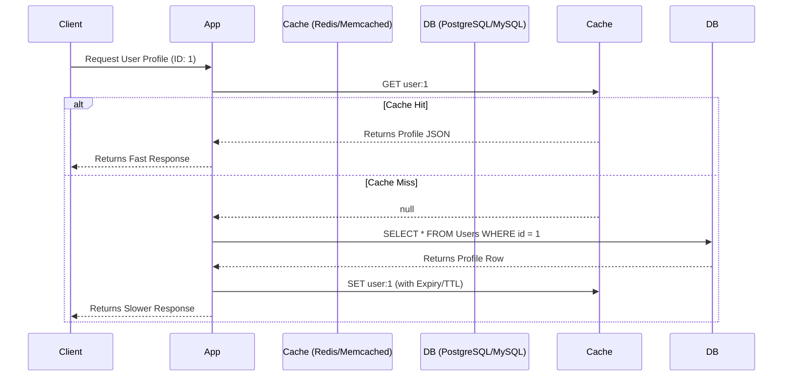

# Caching Strategies
# Chiến lược lưu vào bộ nhớ đệm

## Concept Explanation
## Giải thích khái niệm
Caching is the technique of storing copies of frequently accessed data in a fast, temporary storage layer (usually RAM) to reduce the latency of future requests and offload pressure from primary databases.
Lưu vào bộ nhớ đệm là kỹ thuật lưu trữ các bản sao của dữ liệu được truy cập thường xuyên trong một lớp lưu trữ tạm thời, nhanh chóng (thường là RAM) để giảm độ trễ của các yêu cầu trong tương lai và giảm áp lực từ các cơ sở dữ liệu chính.

### Standard Caching Strategies
### Các chiến lược lưu vào bộ nhớ đệm tiêu chuẩn

1. **Cache-Aside (Lazy Loading)**:
1. **Bên cạnh bộ đệm (Tải lười)**:
   - Application checks the cache for data.
   - Ứng dụng kiểm tra bộ đệm để tìm dữ liệu.
   - If present (Cache Hit), return data.
   - Nếu có (Truy cập bộ đệm), trả về dữ liệu.
   - If absent (Cache Miss), app queries the DB, writes the result to the cache, and returns data.
   - Nếu không có (Bỏ lỡ bộ đệm), ứng dụng truy vấn DB, ghi kết quả vào bộ đệm và trả về dữ liệu.
   - *Best for*: General purpose read-heavy workloads.
   - *Tốt nhất cho*: Các khối lượng công việc đọc nhiều mục đích chung.
   - *Drawback*: Initial miss causes high latency; data can become stale.
   - *Nhược điểm*: Việc bỏ lỡ ban đầu gây ra độ trễ cao; dữ liệu có thể trở nên lỗi thời.

2. **Write-Through**:
2. **Ghi qua**:
   - Application writes data directly to the cache.
   - Ứng dụng ghi dữ liệu trực tiếp vào bộ đệm.
   - The cache immediately writes the data to the DB synchronously.
   - Bộ đệm ngay lập tức ghi dữ liệu vào DB một cách đồng bộ.
   - *Best for*: Heavy read/write workloads where data consistency is absolutely critical.
   - *Tốt nhất cho*: Các khối lượng công việc đọc/ghi nặng trong đó tính nhất quán của dữ liệu là hoàn toàn quan trọng.
   - *Drawback*: Higher write latency because every write hits both Cache and DB before returning success.
   - *Nhược điểm*: Độ trễ ghi cao hơn vì mỗi lần ghi đều truy cập cả Bộ đệm và DB trước khi trả về thành công.

3. **Write-Behind (Write-Back)**:
3. **Ghi lại sau (Ghi lại sau)**:
   - Application writes data to the cache only.
   - Ứng dụng chỉ ghi dữ liệu vào bộ đệm.
   - The cache asynchronously queues and writes data to the DB in the background.
   - Bộ đệm xếp hàng không đồng bộ và ghi dữ liệu vào DB trong nền.
   - *Best for*: Extremely write-heavy workloads where fast writes are critical.
   - *Tốt nhất cho*: Các khối lượng công việc ghi cực nặng trong đó việc ghi nhanh là rất quan trọng.
   - *Drawback*: Risk of data loss if the cache node crashes before the async write to DB completes.
   - *Nhược điểm*: Rủi ro mất dữ liệu nếu nút bộ đệm bị lỗi trước khi quá trình ghi không đồng bộ vào DB hoàn tất.

## System Design Diagram (Cache Aside)
## Sơ đồ thiết kế hệ thống (Bên cạnh bộ đệm)

## Exercises
## Bài tập
1. What is a TTL (Time to Live) and why is it crucial for caching?
1. TTL (Thời gian tồn tại) là gì và tại sao nó lại quan trọng đối với việc lưu vào bộ nhớ đệm?
2. Explain "Cache Eviction Policies" like LRU (Least Recently Used) and LFU (Least Frequently Used).
2. Giải thích "Chính sách loại bỏ bộ đệm" như LRU (Được sử dụng gần đây nhất) và LFU (Ít được sử dụng thường xuyên nhất).
3. System Design scenario: You run Twitter. Should you cache the home timeline configuration for a user with Cache-Aside or Write-Through? Why?
3. Kịch bản thiết kế hệ thống: Bạn điều hành Twitter. Bạn có nên lưu vào bộ nhớ đệm cấu hình dòng thời gian chính cho người dùng bằng Cache-Aside hay Write-Through không? Tại sao?

## Interview Preparation Notes
## Ghi chú chuẩn bị phỏng vấn
- There are only two hard things in Computer Science: cache invalidation and naming things. Be prepared to talk about how you invalidate stale cache data.
- Chỉ có hai điều khó trong Khoa học máy tính: vô hiệu hóa bộ đệm và đặt tên cho mọi thứ. Hãy chuẩn bị để nói về cách bạn vô hiệu hóa dữ liệu bộ đệm cũ.
- Understand the concept of "Cache Stampede" (or Thundering Herd problem) and how techniques like probabilistic early expiration or mutex locks solve it.
- Hiểu khái niệm "Dồn dập bộ đệm" (hoặc vấn đề Đàn gia súc ầm ĩ) và cách các kỹ thuật như hết hạn sớm theo xác suất hoặc khóa mutex giải quyết nó.
