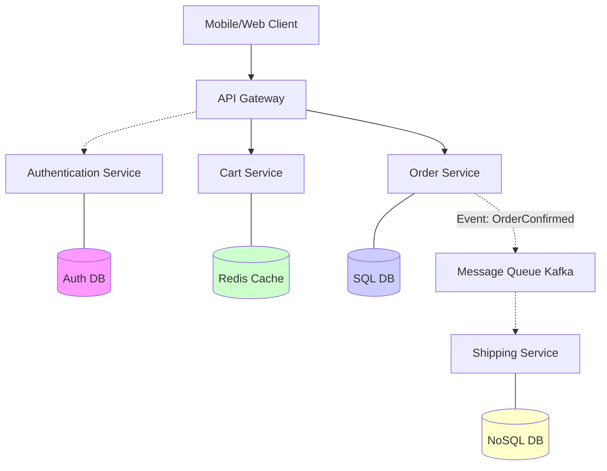

# Microservices Architecture
# Kiến trúc vi dịch vụ

## Concept Explanation
## Giải thích khái niệm
Microservices architecture is a design approach to build a single application as a suite of small services. Each service runs in its own process and communicates with other services using lightweight mechanisms, often an HTTP resource API or message queues.
Kiến trúc vi dịch vụ là một phương pháp thiết kế để xây dựng một ứng dụng duy nhất dưới dạng một bộ các dịch vụ nhỏ. Mỗi dịch vụ chạy trong quy trình riêng của nó và giao tiếp với các dịch vụ khác bằng các cơ chế nhẹ, thường là API tài nguyên HTTP hoặc hàng đợi tin nhắn.

### Monolithic vs Microservices
### Nguyên khối và vi dịch vụ
- **Monolith**: A single, indivisible unit. The UI, business logic, and database access are packaged together. Easy to develop initially, but hard to scale, deploy, and understand as the system grows.
- **Nguyên khối**: Một đơn vị duy nhất, không thể phân chia. Giao diện người dùng, logic nghiệp vụ và quyền truy cập cơ sở dữ liệu được đóng gói cùng nhau. Dễ phát triển ban đầu, nhưng khó mở rộng, triển khai và hiểu khi hệ thống phát triển.
- **Microservices**: Each service handles a specific business domain (e.g., Inventory, Billing, Shipping). They can be written in different languages, scaled independently, and deployed separately.
- **Vi dịch vụ**: Mỗi dịch vụ xử lý một lĩnh vực kinh doanh cụ thể (ví dụ: Hàng tồn kho, Thanh toán, Vận chuyển). Chúng có thể được viết bằng các ngôn ngữ khác nhau, được mở rộng độc lập và được triển khai riêng biệt.

### Microservices Principles
### Nguyên tắc vi dịch vụ
1. **Single Responsibility**: Do one thing well based on a bounded context.
1. **Trách nhiệm duy nhất**: Làm tốt một việc dựa trên một bối cảnh bị ràng buộc.
2. **Decentralized Data**: Each microservice manages its own database. Services NEVER share a database directly; they must request data via APIs.
2. **Dữ liệu phi tập trung**: Mỗi vi dịch vụ quản lý cơ sở dữ liệu riêng của mình. Các dịch vụ KHÔNG BAO GIỜ chia sẻ cơ sở dữ liệu trực tiếp; chúng phải yêu cầu dữ liệu qua các API.
3. **Independent Deployment**: A team can update the Inventory service without redeploying the Billing service.
3. **Triển khai độc lập**: Một nhóm có thể cập nhật dịch vụ Hàng tồn kho mà không cần triển khai lại dịch vụ Thanh toán.
4. **Fault Tolerance**: If the Search service goes down, the Checkout service should ideally still function.
4. **Khả năng chịu lỗi**: Nếu dịch vụ Tìm kiếm ngừng hoạt động, dịch vụ Thanh toán lý tưởng vẫn sẽ hoạt động.

## System Design Diagram
## Sơ đồ thiết kế hệ thống

## Challenges in Microservices
## Thách thức trong vi dịch vụ
While powerful, microservices introduce distributed system complexities:
Mặc dù mạnh mẽ, các vi dịch vụ lại mang đến những sự phức tạp của hệ thống phân tán:
1. **Network Latency**: Calling a method locally in a monolith takes 1ms; a network hop taking 50ms greatly impacts performance.
1. **Độ trễ mạng**: Gọi một phương thức cục bộ trong một khối nguyên khối mất 1 mili giây; một bước nhảy mạng mất 50 mili giây ảnh hưởng lớn đến hiệu suất.
2. **Distributed Data / Consistency**: How do you maintain consistency when one transaction spans three different databases? (Saga Pattern / 2-Phase Commit).
2. **Dữ liệu phân tán / Tính nhất quán**: Làm thế nào để bạn duy trì tính nhất quán khi một giao dịch kéo dài trên ba cơ sở dữ liệu khác nhau? (Mẫu Saga / Cam kết 2 pha).
3. **Tracing and Debugging**: A request might hop through 5 services. Without Correlation IDs and centralized logging (e.g., ELK stack, Jaeger), debugging is extremely difficult.
3. **Theo dõi và gỡ lỗi**: Một yêu cầu có thể chuyển qua 5 dịch vụ. Nếu không có ID tương quan và ghi nhật ký tập trung (ví dụ: ngăn xếp ELK, Jaeger), việc gỡ lỗi sẽ cực kỳ khó khăn.
4. **Service Discovery**: How does Order Service find where Shipping Service is hosted? (Docker Swarm / Kubernetes / Eureka).
4. **Khám phá dịch vụ**: Dịch vụ đặt hàng tìm thấy Dịch vụ vận chuyển được lưu trữ ở đâu như thế nào? (Docker Swarm / Kubernetes / Eureka).

## Exercises
## Bài tập
1. Define the "API Gateway Pattern". Why sit a gateway in front of your 50 microservices instead of having the frontend call them directly?
1. Xác định "Mẫu cổng API". Tại sao lại đặt một cổng trước 50 vi dịch vụ của bạn thay vì để frontend gọi chúng trực tiếp?
2. What is the "Strangler Fig Pattern"? How is it used to migrate from a Monolith to Microservices?
2. "Mẫu cây sung bóp nghẹt" là gì? Nó được sử dụng để di chuyển từ một khối nguyên khối sang các vi dịch vụ như thế nào?
3. Draw out a hypothetical architecture for an "Uber" clone using microservices. What bounded contexts (services) would exist?
3. Vẽ ra một kiến trúc giả định cho một bản sao "Uber" sử dụng các vi dịch vụ. Những bối cảnh bị ràng buộc (dịch vụ) nào sẽ tồn tại?

## Interview Preparation Notes
## Ghi chú chuẩn bị phỏng vấn
- "Why use microservices?" is a common question. Be prepared to argue *against* them as well (Conway's Law, operational overhead).
- "Tại sao lại sử dụng các vi dịch vụ?" là một câu hỏi phổ biến. Hãy chuẩn bị để tranh luận *chống lại* chúng (Định luật Conway, chi phí vận hành).
- Understand how the CAP Theorem applies to distributed databases used by microservices.
- Hiểu định lý CAP áp dụng cho các cơ sở dữ liệu phân tán được sử dụng bởi các vi dịch vụ như thế nào.
